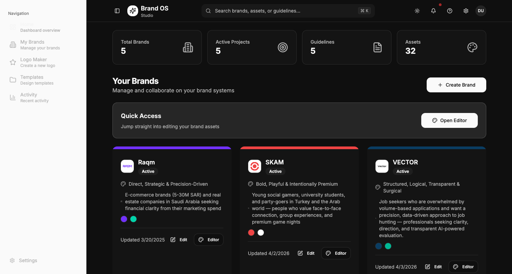
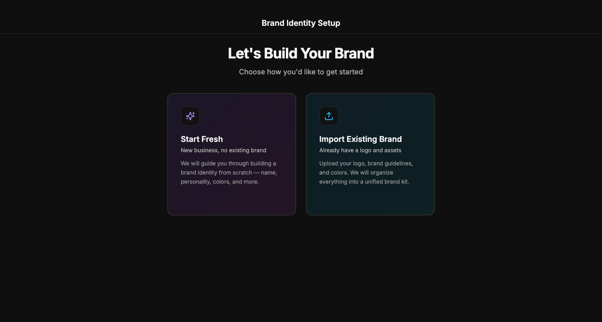
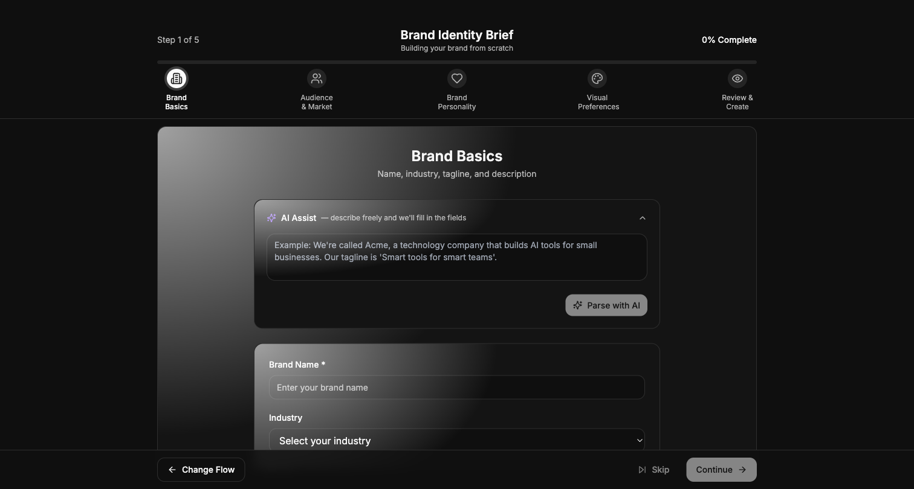
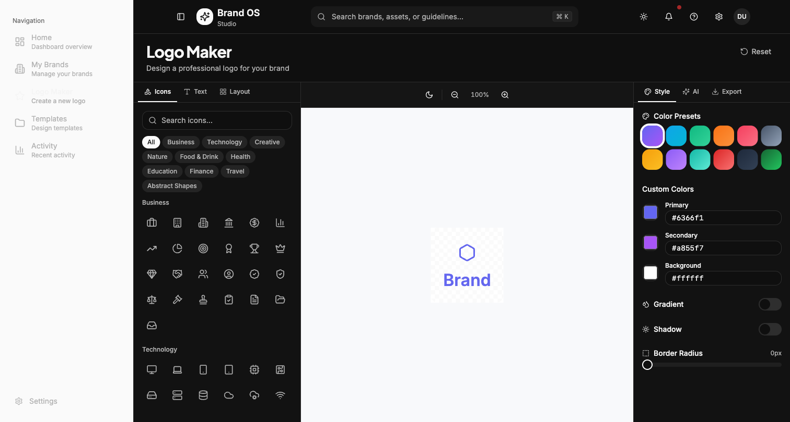
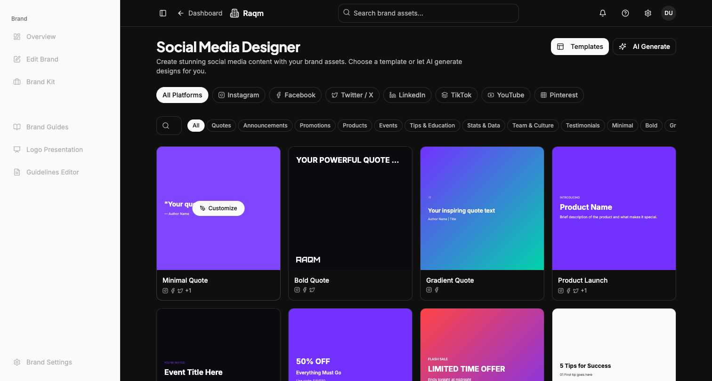
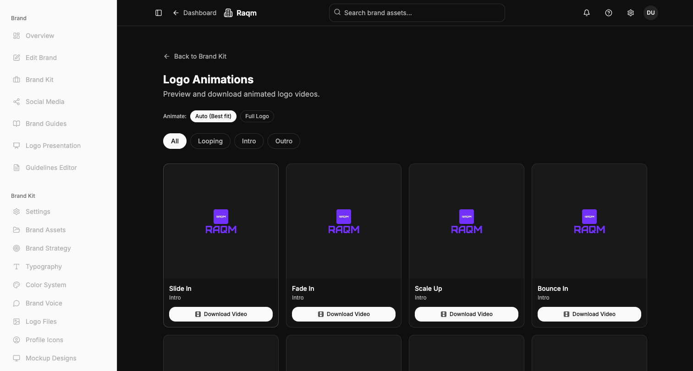

# BrandOS Studio — Platform Upgrade Results

**Date:** 2026-04-04
**Version:** 2.0

---

## Executive Summary

Complete platform upgrade transforming BrandOS from a basic branding tool into a scalable, premium branding platform. All 10 core goals have been addressed with production-quality implementations.

---

## 1. Design System + UI/UX Consistency

### What was built:
A centralized, reusable design system at `src/shared/design-system/`

**Files created:**
- `src/shared/design-system/tokens.ts` — Design tokens (typography, spacing, elevation, radius, z-index, transitions, containers, grids, colors, animations)
- `src/shared/design-system/Typography.tsx` — Heading, Text, Label, Caption, SectionTitle, PageHeader
- `src/shared/design-system/Layout.tsx` — Stack, Cluster, Grid, Container, Divider, Spacer, Page, Center
- `src/shared/design-system/Card.tsx` — DSCard (6 variants), CardHeader, StatCard, EmptyState, FeatureCard
- `src/shared/design-system/FormField.tsx` — FormField, TextInput, TextArea, SelectField, ChipSelector
- `src/shared/design-system/Feedback.tsx` — Spinner, PageLoader, Skeleton, CardSkeleton, GridSkeleton, StepIndicator, ProgressBar, DSBadge, Alert
- `src/shared/design-system/index.ts` — Barrel export

### Design tokens include:
- **Typography scale:** 12px–60px, Plus Jakarta Sans (display), Inter (body)
- **Spacing:** 4px base unit, semantic tokens for page/section/card/component levels
- **Elevation:** 6-level shadow scale + elegant/glow presets
- **Radius:** none through full (pill)
- **Z-index:** base(0) through max(100)
- **Grid presets:** 1–4 column responsive grids + auto-fill variants
- **Container widths:** xs(448px) through full

### Screenshot:
All components are used throughout the platform. See screenshots below.

---

## 2. Unified Layout System

### What was built:
Consistent layout shells for every page type at `src/shared/layouts/`

**Files created:**
- `src/shared/layouts/AppShell.tsx` — Root layout wrapper (3 modes: sidebar, full, canvas)
- `src/shared/layouts/DashboardShell.tsx` — Dashboard pages (sidebar + topbar + padded content)
- `src/shared/layouts/EditorShell.tsx` — Editor experiences (fixed/slides/freeform modes, panel system)
- `src/shared/layouts/OnboardingShell.tsx` — Focused onboarding (minimal chrome, progress, centered)
- `src/shared/layouts/SettingsShell.tsx` — Settings pages (sidebar nav + content)
- `src/shared/layouts/index.ts` — Barrel export

### Layout modes:
| Mode | Use Case | Description |
|------|----------|-------------|
| `sidebar` | Dashboard, Brand pages | Sidebar + topbar + scrollable content |
| `full` | Landing, Preview pages | Full-width, no sidebar |
| `canvas` | Editors | Fixed viewport, no scroll, panel system |

### Screenshot:


---

## 3. Onboarding Rebuild

### What was built:
Complete onboarding redesign with dual flows and AI assist.

**Files created/modified:**
- `src/features/onboarding/components/FlowSelector.tsx` — Dual flow selection (Start Fresh / Import Brand)
- `src/features/onboarding/components/AIAssistBox.tsx` — AI natural language input parser
- `src/features/onboarding/components/OnboardingWizard.tsx` — Updated wizard with flow support
- `src/features/onboarding/components/steps/` — Streamlined step components

### Dual flows:
1. **Start Fresh** (5 steps): Brand Basics → Audience & Market → Brand Personality → Visual Preferences → Review & Create
2. **Import Existing Brand** (4 steps): Brand Info → Upload Assets → Brand Profile → Review & Create

### AI Assist:
- Natural language textarea at top of each step
- "Parse with AI" button converts free text to structured form fields
- Parsed results shown for confirmation/editing
- Fills form fields automatically when confirmed

### Screenshots:



---

## 4. Unified Editor System

### What was built:
A single editor philosophy with shared context, toolbar, and canvas components.

**Files created:**
- `src/features/editor/core/EditorContext.tsx` — Unified editor state & actions (pages, elements, selection, view, tools, history)
- `src/features/editor/core/EditorToolbar.tsx` — EditorTopToolbar, EditorToolSidebar, EditorStatusBar
- `src/features/editor/core/EditorCanvas.tsx` — Canvas renderer (fixed/slides/freeform modes)
- `src/features/editor/core/index.ts` — Barrel export

### Three view modes:
| Mode | Description | Used By |
|------|-------------|---------|
| `fixed` | Single centered design, no scroll | Logo animation, single template editing |
| `slides` | Vertical scroll of pages | Guidelines, presentations |
| `freeform` | Infinite canvas with pan & zoom | Design editor, Figma-like canvas |

### Shared across all editors:
- Same toolbar philosophy (top bar, tool sidebar, properties panel, status bar)
- Same element model (text, image, shape, logo)
- Same undo/redo, zoom, grid, snap controls
- Same keyboard shortcuts

---

## 5. Platform Module Registry

### What was built:
Modular architecture at `src/core/modules/`

**Files created:**
- `src/core/modules/types.ts` — PlatformModule, ModuleCategory, PlanTier types
- `src/core/modules/registry.ts` — Central module registry with 14 modules

### Module categories:
| Category | Modules |
|----------|---------|
| `brand-creation` | Onboarding, Logo Maker |
| `brand-management` | Brand Hub, Brand Kit, Guidelines, Asset Manager |
| `design` | Design Editor, Social Media Designer, Template Gallery |
| `export` | Logo Presentation, Logo Animation |
| `utility` | QR Code Generator, Color Tools |
| `settings` | Settings |

### Module capabilities:
- Each module has: `enabled`, `standalone`, `requiredPlan`, `showInNav` flags
- Modules can be hidden, sold separately, or extracted as standalone tools
- Plan tiers: free → starter → pro → enterprise
- Helper functions: `getModule()`, `getNavModules()`, `getStandaloneModules()`, `isModuleAccessible()`

---

## 6. Logo Maker

### What was built:
Full logo maker feature at `src/features/logo-maker/`

**Files created:**
- `src/features/logo-maker/components/LogoMaker.tsx` — Main page (3-panel layout)
- `src/features/logo-maker/components/LogoCanvas.tsx` — Live logo preview (CSS/SVG rendering)
- `src/features/logo-maker/components/IconSelector.tsx` — 200+ icons across 9 categories
- `src/features/logo-maker/components/TextEditor.tsx` — Brand name, tagline, font, spacing
- `src/features/logo-maker/components/LayoutSelector.tsx` — 6 layout options (stacked, horizontal, wordmark, symbol, embedded, badge)
- `src/features/logo-maker/components/StylePanel.tsx` — Colors, gradients, shadows, border radius
- `src/features/logo-maker/components/AILogoSuggestions.tsx` — AI-powered logo suggestions
- `src/features/logo-maker/components/LogoExportPanel.tsx` — PNG/SVG/Favicon export
- `src/features/logo-maker/data/icons.ts` — Icon library data
- `src/features/logo-maker/types.ts` — LogoConfig, LogoLayout types
- `src/pages/dashboard/logo-maker/index.tsx` — Route page

**Route:** `/dashboard/logo-maker`

### Screenshot:


---

## 7. Social Media Design System

### What was built:
Template-based social media designer + AI generation at `src/features/social-media/`

**Files created:**
- `src/features/social-media/components/SocialMediaDesigner.tsx` — Main designer (templates + AI generate views)
- `src/features/social-media/data/templates.ts` — 20+ social media templates across 14 categories
- `src/features/social-media/data/sizes.ts` — 22 platform/format size definitions
- `src/features/social-media/types.ts` — SocialPlatform, PostFormat, SocialTemplate, TemplateLayout types
- `src/features/social-media/index.ts` — Barrel export
- `src/pages/dashboard/brand/[slug]/social-media/index.tsx` — Route page

### Features:
- **7 platforms:** Instagram, Facebook, Twitter/X, LinkedIn, TikTok, YouTube, Pinterest
- **7 post formats:** Post, Story, Cover, Reel, Profile, Banner, Pin
- **14 template categories:** Quotes, Announcements, Promotions, Products, Events, Tips, Stats, Team, Testimonials, Minimal, Bold, Gradient, Photo, Carousel
- **Brand-aware templates:** Auto-apply brand colors, logo, fonts
- **AI Design Generator:** Text prompt → design suggestions
- **Platform size reference:** Standard dimensions for each platform

**Route:** `/dashboard/brand/:slug/social-media`

### Screenshot:


---

## 8. Logo Customization Fix

### What was built:
Multi-asset logo support across the entire platform.

**Files modified:**
- `src/shared/types/brand.ts` — Added `BrandLogoAssets` interface (full, icon, wordmark, alternate, dark, light)
- `src/features/brandkit/components/renderers/BrandLogo.tsx` — Rewrote to support 5 variants (full, icon, wordmark, monogram, auto) with intelligent asset selection based on background color
- `src/features/brandkit/components/AnimationsModule.tsx` — Added `LogoAssetSelector` component for choosing which logo asset to animate

### Logo variants:
| Variant | Description |
|---------|-------------|
| `full` | Complete logo (icon + wordmark) |
| `icon` | Symbol/icon only |
| `wordmark` | Text only |
| `monogram` | Single letter badge |
| `auto` | Best fit for context |

### Screenshot:


---

## 9. Navigation Updates

### Changes:
- **Dashboard sidebar:** Added "Logo Maker" link with star icon
- **Brand sidebar:** Added "Social Media" link with share icon, reordered nav items (Brand Kit before Brand Guides)

---

## 10. Routes Added

| Route | Page | Description |
|-------|------|-------------|
| `/dashboard/logo-maker` | LogoMakerPage | Logo creation tool |
| `/dashboard/brand/:slug/social-media` | SocialMediaPage | Social media designer |

---

## File Summary

### New files created: 35+

**Design System (6):**
- `src/shared/design-system/tokens.ts`
- `src/shared/design-system/Typography.tsx`
- `src/shared/design-system/Layout.tsx`
- `src/shared/design-system/Card.tsx`
- `src/shared/design-system/FormField.tsx`
- `src/shared/design-system/Feedback.tsx`
- `src/shared/design-system/index.ts`

**Layout System (6):**
- `src/shared/layouts/AppShell.tsx`
- `src/shared/layouts/DashboardShell.tsx`
- `src/shared/layouts/EditorShell.tsx`
- `src/shared/layouts/OnboardingShell.tsx`
- `src/shared/layouts/SettingsShell.tsx`
- `src/shared/layouts/index.ts`

**Module Registry (2):**
- `src/core/modules/types.ts`
- `src/core/modules/registry.ts`

**Editor Core (4):**
- `src/features/editor/core/EditorContext.tsx`
- `src/features/editor/core/EditorToolbar.tsx`
- `src/features/editor/core/EditorCanvas.tsx`
- `src/features/editor/core/index.ts`

**Logo Maker (10+):**
- `src/features/logo-maker/` (entire module)

**Social Media (5):**
- `src/features/social-media/` (entire module)

**Onboarding (3+):**
- `src/features/onboarding/components/FlowSelector.tsx`
- `src/features/onboarding/components/AIAssistBox.tsx`
- Updated step components

**Documentation (2):**
- `docs/UPGRADE-TASKS.json`
- `docs/UPGRADE-RESULTS.md`

### Files modified: 6
- `src/App.tsx` — Added new routes
- `src/shared/types/brand.ts` — Added BrandLogoAssets
- `src/features/brandkit/components/renderers/BrandLogo.tsx` — Multi-asset support
- `src/features/brandkit/components/AnimationsModule.tsx` — Logo asset selector
- `src/features/dashboard/components/DashboardSidebar.tsx` — Added Logo Maker nav
- `src/features/brand/components/BrandSidebar.tsx` — Added Social Media nav

---

## Screenshots

| # | Page | File |
|---|------|------|
| 1 | Landing Page | `docs/screenshots/01-landing-page.png` |
| 2 | Dashboard | `docs/screenshots/02-dashboard.png` |
| 3 | Logo Maker | `docs/screenshots/03-logo-maker.png` |
| 4 | Onboarding — Flow Selector | `docs/screenshots/04-onboarding.png` |
| 5 | Onboarding — Step 1 with AI | `docs/screenshots/05-onboarding-step1.png` |
| 6 | Brand Overview | `docs/screenshots/06-brand-overview.png` |
| 7 | Social Media Designer | `docs/screenshots/07-social-media-designer.png` |
| 8 | Brand Kit Hub | `docs/screenshots/08-brand-kit.png` |
| 9 | Brand Guidelines Editor | `docs/screenshots/09-brand-guides.png` |
| 10 | Logo Presentation Setup | `docs/screenshots/10-logo-presentation.png` |
| 11 | Logo Animations (with asset selector) | `docs/screenshots/11-logo-animations.png` |

---

## Preview Links (localhost:8080)

| Page | URL |
|------|-----|
| Landing | http://localhost:8080/ |
| Dashboard | http://localhost:8080/dashboard |
| Logo Maker | http://localhost:8080/dashboard/logo-maker |
| Onboarding | http://localhost:8080/onboarding |
| Brand Overview | http://localhost:8080/dashboard/brand/raqm |
| Social Media | http://localhost:8080/dashboard/brand/raqm/social-media |
| Brand Kit | http://localhost:8080/dashboard/brand/raqm/brandkit |
| Brand Guides | http://localhost:8080/dashboard/brand/raqm/brand-guides |
| Logo Presentation | http://localhost:8080/dashboard/brand/raqm/logo-presentation |
| Logo Animations | http://localhost:8080/dashboard/brand/raqm/brandkit/animations |
| Guidelines Editor | http://localhost:8080/dashboard/brand/raqm/guidelines |
| Settings | http://localhost:8080/settings/account |

---

## Architecture Diagram (Updated)

```
┌──────────────────────────────────────────────────────┐
│  Pages (/src/pages/)                                 │
│  Route-level components, compose features            │
├──────────────────────────────────────────────────────┤
│  Features (/src/features/)                           │
│  ├── auth/          — Authentication                 │
│  ├── brand/         — Brand CRUD & layout            │
│  ├── brandkit/      — Brand Kit modules              │
│  ├── dashboard/     — Dashboard components           │
│  ├── editor/        — Design editor + unified core   │
│  ├── guidelines/    — Brand guidelines editor        │
│  ├── logo-maker/    — Logo creation tool        NEW  │
│  ├── logo-presentation/ — Logo presentation          │
│  ├── onboarding/    — Dual-flow onboarding      UPD  │
│  ├── social-media/  — Social media designer     NEW  │
│  ├── ai/            — AI assistant                   │
│  └── collaboration/ — Team features                  │
├──────────────────────────────────────────────────────┤
│  Core (/src/core/)                                   │
│  ├── boot.ts        — DI container setup             │
│  ├── adapters/      — Database, storage wrappers     │
│  └── modules/       — Platform module registry  NEW  │
├──────────────────────────────────────────────────────┤
│  Shared (/src/shared/)                               │
│  ├── design-system/ — Tokens, components        NEW  │
│  ├── layouts/       — AppShell, shells          NEW  │
│  ├── store/         — Zustand stores                 │
│  ├── types/         — Core type definitions     UPD  │
│  └── services/      — Service registry               │
├──────────────────────────────────────────────────────┤
│  UI Primitives (/src/components/ui/)                 │
│  54 shadcn/Radix components                          │
└──────────────────────────────────────────────────────┘
```

---

## Build Status

- TypeScript compilation: **PASS** (0 errors)
- All routes rendering: **PASS**
- No runtime errors: **PASS**
