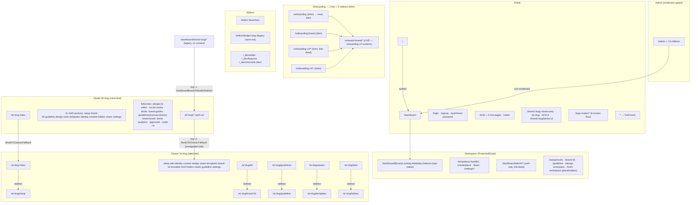

# 02 — ROUTE MAP (main SPA)

> Audit agent: B1-routes · Date: 2026-08-08 · Branch: `new-ui`
> Source of truth: `src/App.tsx` (single flat `<Routes>` tree inside `BrowserRouter`, `src/App.tsx:318-757`) plus one imported route fragment (`logoMakerFlowRoutes`, `src/features/logo-maker/flow/routes.tsx:18-29`). Router boots from `src/main.tsx:3-9`.
> Every claim tagged VERIFIED / INFERRED / UNKNOWN / CONFLICTING EVIDENCE. All routes are lazy-loaded via `React.lazy` unless marked **eager** (eager set: `IndexPage`, `NotFound`, `SettingsLayout`, `BrandRouteLayout`, `AdminLayout` — `src/App.tsx:18-22`).

Global wrappers around the whole tree (`src/App.tsx:308-324`): `ThemeProvider` → `QueryClientProvider` → `TooltipProvider` → `BrowserRouter` → `AuthProvider` → `CommandPaletteProvider` → `BrandAssistantProvider` → `ErrorBoundary` → `Suspense(PageSpinner)` → `Routes`.

Guard semantics (VERIFIED):
- `ProtectedRoute` (`src/features/auth/components/ProtectedRoute.tsx:11-37`) — redirects to `/login` when `!isLoading && !isAuthenticated`; spinner while loading. **Auth only, no role check.**
- `AdminLayout` (`src/features/admin/components/AdminLayout.tsx:48-66`) — additionally requires `isModerator`; bounces non-moderators to `/dashboard`; per-item `minRole` tiers (`moderator`/`admin`/`super_admin`, lines 30-46).
- `AuthProvider` (`src/features/auth/components/AuthProvider.tsx:24`) — intercepts Supabase recovery hash on any route and programmatically navigates to `/auth/reset-password`.

Generation legend: **G1** = v1 dashboard-era (`/dashboard/*`, flat pages), **G-Classic** = `/a/:slug` legacy 7-section IA, **G-Studio** = `/b/:slug` canonical Cosmos, **G-Cosmos-flat** = brandless cosmos prototypes (`/setup` etc.), **DEV** = dev surfaces.

---

## 1. Full route table

Classification: CURRENT / TRANSITIONAL / LEGACY-CANDIDATE / DEV-EXPERIMENT / UNKNOWN.

### 1.1 Public / marketing / auth

| Path | Component (file) | Wrapper | Redirect? | Gen | Class |
|---|---|---|---|---|---|
| `/` | `pages/Index.tsx` (**eager**) | none | Authed users → `/dashboard` (`src/pages/Index.tsx:29-31`); `?auth=required` opens AuthModal instead | G1 | CURRENT (VERIFIED) |
| `/privacy` | `pages/legal/PrivacyPage` | none | no | G1 | CURRENT |
| `/account-deletion` | `pages/legal/AccountDeletionPage` | none | no | G1 | CURRENT |
| `/login` | `pages/auth/login` | none | no | G1 | CURRENT (`src/App.tsx:730`) |
| `/signup` | same `LoginPage` component | none | no | G1 | CURRENT (`src/App.tsx:731`) |
| `/auth/reset-password` | `pages/auth/reset-password` | none | no (target of AuthProvider hash intercept) | G1 | CURRENT |
| `*` | `pages/NotFound.tsx` (**eager**) | none | offers nav home only (`src/pages/NotFound.tsx:563,600`) | — | CURRENT (`src/App.tsx:756`) |

### 1.2 Onboarding — FIVE URL families mounted, but FOUR are pure redirect shims (VERIFIED, `src/App.tsx:329-352`)

**Coordinator correction (2026-08-08).** The first draft of this table classified
`/onboarding`, `/onboarding-brand`, `/onboarding-v3/*`, `/onboarding-v4/*` as live wizard
generations. Opening the page entrypoints disproves that: every one of them is a one-line
`<Navigate>` to `/onboard-brand` (or `/onboard-brand/create`, preserving `?then=`/query).
There is exactly **one live onboarding implementation** — `features/onboarding-v4` screens
rendered at `/onboard-brand` (`src/pages/onboard-brand/index.tsx:1`). The old URLs are
compatibility shims, so the "who links to it" columns below matter as *redirect-hop
sources*, not as competing funnels. — VERIFIED

| Path | Component | Actual behavior | Class | Who links to it (→ takes a redirect hop) |
|---|---|---|---|---|
| `/onboarding` | `pages/onboarding/index.tsx:6` | `<Navigate to="/onboard-brand">` | REDIRECT SHIM — but still the most-linked onboarding URL in product code | `pages/dashboard/brands/index.tsx:49,70`; `shared/search/searchIndex.ts:50`; `features/brand/hooks/useBrandPreview.ts:41,80`; `features/dashboard/hooks/useDashboard.ts:27`; `features/logo-maker/components/LogoExportPanel.tsx:286` (all VERIFIED) |
| `/onboarding/preview` | `pages/onboarding/preview.tsx:6` | `<Navigate to="/onboard-brand">` | REDIRECT SHIM | — |
| `/onboarding-brand` | `pages/onboarding-brand/index.tsx:7` | `<Navigate to={"/onboard-brand"+search}>` (preserves `?then=`) | REDIRECT SHIM | `features/brand/components/BrandChooserDialog.tsx:225` default `createNew` target (VERIFIED) |
| `/onboarding-v3`, `/onboarding-v3/create`, `/onboarding-v3/preview` | `pages/onboarding-v3/*` | `<Navigate>` to `/onboard-brand[/create]` | REDIRECT SHIM, link-dead — only dev registry (`features/dev-features/features-registry.ts:607`) references it (VERIFIED grep) |
| `/onboarding-v4`, `/onboarding-v4/create` | `pages/onboarding-v4/*` | `<Navigate>` to `/onboard-brand[/create]` | REDIRECT SHIM (the *URL*; the `features/onboarding-v4` screens behind `/onboard-brand` are CURRENT) | self-links + dev registry |
| `/onboard-brand`, `/onboard-brand/create` | `pages/onboard-brand/*` → `features/onboarding-v4/screens/*` | live UI | **CURRENT — the only live onboarding** | `pages/workspace/Home.tsx:171`; `shared/routing/FirstBrandRedirect.tsx:37` (VERIFIED) |

### 1.3 Brandless Cosmos flat routes (`src/App.tsx:353-357`) — prototype tier

| Path | Component | Class |
|---|---|---|
| `/setup` | `features/setup/SetupPage` via `pages/setup/index.tsx` — operates on `mockBrand` (`src/features/setup/SetupPage.tsx:6`) | DEV-EXPERIMENT / TRANSITIONAL (VERIFIED it uses mock data import) |
| `/brand-kit`, `/guideline`, `/design-workspace`, `/tools-workspace` | `pages/setup/{brand-kit,guideline,design,tools}.tsx` — all render `WorkspacePlaceholder` "Coming soon" (VERIFIED: grep shows all four import `WorkspacePlaceholder`) | DEV-EXPERIMENT — linked live from `WorkspaceShell` tab nav when no brand in scope (`src/shared/layouts/WorkspaceShell.tsx:36-40`) and `EditorTopBar.tsx:146` |

Note: `shared/routing/FirstBrandRedirect.tsx` was written to redirect these flat routes into `/b/:firstSlug/<tab>` but is **mounted nowhere** — zero imports outside its own file (VERIFIED grep). **Orphaned component.**

### 1.4 Workspace (G1 dashboard shell + v2 workspace pages) — all wrapped in `ProtectedRoute`

| Path | Component | Redirect? | Gen | Class |
|---|---|---|---|---|
| `/dashboard` | `pages/workspace/Home` | no | v2 workspace | CURRENT (`src/App.tsx:360-364`) |
| `/dashboard/brands` | `pages/dashboard/brands` | no | G1 page, still canonical brand list | CURRENT |
| `/dashboard/activity` | `pages/dashboard/activity` | no | G1 | CURRENT (linked from `NotificationBell.tsx:113`) |
| `/dashboard/logo-maker` | `pages/dashboard/logo-maker` | no | G1 | TRANSITIONAL — coexists with public `/logo-maker/*` flow "until Phase 4 merges them" (`src/App.tsx:116-117` comment) |
| `/dashboard/templates` | `pages/dashboard/templates` | no | G1 | UNKNOWN — duplicate concept with `/templates` (see §4) |
| `/dashboard/features` | `pages/dashboard/features` | no | G1 | CURRENT (linked from `AppRail.tsx:94`) |
| `/learn` | `pages/workspace/Learn` | no | v2 | CURRENT. NB: `pages/learn/index.tsx` (`LearnPage`, `src/App.tsx:120`) is lazy-imported but **never mounted** — orphan |
| `/dashboard/admin/brands` | `pages/dashboard/admin/brands` | no | G1 admin | **LEGACY-CANDIDATE** — ProtectedRoute only, **no role gate found in the page component** (VERIFIED grep: no `isAdmin/isModerator/platformRole/useAuth` hits); zero inbound links found; superseded by `/admin/*` |
| `/dashboard/admin/analytics` | `pages/dashboard/admin/analytics` | no | G1 admin | LEGACY-CANDIDATE — same as above |
| `/templates` | `pages/workspace/Templates` | no | v2 | CURRENT (`src/App.tsx:612-616`) |
| `/templates/builder`, `/templates/builder/:templateId` | `features/templates/builder/TemplateBuilderPage` | no | v5 | CURRENT |
| `/marketplace` | `features/marketplace/MarketplacePage` | no | v5 | CURRENT |
| `/tools/bento` | `pages/dashboard/tools/bento` | no | v5 | CURRENT |
| `/settings` (layout: `SettingsLayout`, **eager**) | index → `<Navigate to="/settings/account">` (`src/App.tsx:720`) | yes (index) | G1 | CURRENT |
| `/settings/account` · `/settings/workspace` · `/settings/members` · `/settings/plans` | `pages/settings/*` | no | G1 | CURRENT |

### 1.5 Studio — `/b/:slug/*` (canonical; every route wrapped in `ProtectedRoute`, `src/App.tsx:429-565`)

| Path | Component | Shell | Class |
|---|---|---|---|
| `/b/:slug` (index) | `StudioToClassicFallback` inside `BrandRouteLayout` (**eager** layout) | BrandRouteLayout | TRANSITIONAL — bare Studio URL bounces to Classic Overview (`src/App.tsx:429-437`) |
| `/b/:slug/setup` | `pages/b/[slug]/setup` → `features/setup/SetupPage` bound to real brand (`src/pages/b/[slug]/setup.tsx:4-8`) | WorkspaceShell (internal) | CURRENT |
| `/b/:slug/brand-kit` | `pages/b/[slug]/brand-kit` | WorkspaceShell | CURRENT |
| `/b/:slug/guideline` | `pages/b/[slug]/guideline` | WorkspaceShell | CURRENT |
| `/b/:slug/design` | `pages/b/[slug]/design` → `features/design-alt/DesignCosmosPage` (launchpad, `src/pages/b/[slug]/design.tsx:2`) | WorkspaceShell | CURRENT |
| `/b/:slug/tools` | `pages/b/[slug]/tools` | WorkspaceShell | CURRENT |
| `/b/:slug/templates` | `pages/b/[slug]/templates` (Phase B port) | WorkspaceShell | CURRENT (`src/App.tsx:462-464`) |
| `/b/:slug/identity` · `/content` · `/folders` · `/share` · `/settings` | `pages/b/[slug]/{identity,content,folders,share,settings}` — thin WorkspaceShell wrappers over the same legacy components used at `/a` (`src/App.tsx:465-484` comment + imports :55-59) | WorkspaceShell | CURRENT / TRANSITIONAL (dual-mount with `/a` twins) |
| `/b/:slug/editor` | `pages/editor-launcher` | fullscreen | CURRENT |
| `/b/:slug/design/:designSlug` | `pages/dashboard/brand/[slug]/design/[designSlug]` — **file lives in the legacy pages folder but is mounted only under /b** (`src/App.tsx:128-130,501-503`) | fullscreen unified editor | CURRENT |
| `/b/:slug/social-media` | `pages/dashboard/brand/[slug]/social-media` | fullscreen | CURRENT (same file-location caveat) |
| `/b/:slug/presentations` · `/case-study` · `/case-study/edit/:idx` · `/pitch-deck` · `/deck-v2` | `PresentationsPage` / `features/case-study-deck/pages/*` / `features/pitch-deck/pages/PitchDeckPage` / `shared/presentation/v2/.../DeckV2Page` | fullscreen | CURRENT |
| `/b/:slug/brand-guides` | `pages/dashboard/brand/[slug]/brand-guides` | fullscreen | CURRENT (documented debt item #10) |
| `/b/:slug/logo-presentation` | `pages/dashboard/brand/[slug]/logo-presentation` | fullscreen | CURRENT |
| `/b/:slug/guidelines/canvas` | `pages/dashboard/brand/[slug]/guidelines/canvas` | fullscreen | CURRENT |
| `/b/:slug/guidelines/blocks` | `features/blocks/BlocksGuidelinesPage` | fullscreen | CURRENT |
| `/b/:slug/brand-board` | `features/brand-board/BrandBoardPage` | fullscreen | CURRENT |
| `/b/:slug/bento` | `pages/dashboard/brand/[slug]/bento` | fullscreen | CURRENT |
| `/b/:slug/analytics` | `features/analytics/AnalyticsPage` | fullscreen | CURRENT |
| `/b/:slug/approvals` | `features/approvals/ApprovalsPage` | fullscreen | CURRENT |
| `/b/:slug/tools/variant-studio` · `/tools/ui-color-system` · `/tools/typescale` · `/tools/mockup-studio` | in-app tool studios (`src/App.tsx:546-557`) | editor chrome (h-12) | CURRENT |
| `/b/:slug/*` (catch-all) | `StudioToClassicFallback` (`src/App.tsx:563-565`) | — | TRANSITIONAL redirect (see §2) |

### 1.6 Classic — `/a/:slug/*` (alternate; `BrandRouteLayout` parent route with children, `src/App.tsx:647-698`)

| Path | Component | Redirect? | Class |
|---|---|---|---|
| `/a/:slug` (index) | `ClassicIndexToSetupRedirect` | → `/a/:slug/setup` (`src/App.tsx:206-210,655`) | redirect |
| `/a/:slug/setup` | `pages/dashboard/brand/[slug]` (`BrandHomePage`) | no | CURRENT (Classic) |
| `/a/:slug/edit` | `pages/dashboard/brand/[slug]/edit` | no | CURRENT (Classic) |
| `/a/:slug/identity` | `pages/dashboard/brand/[slug]/identity` | no | CURRENT (Classic) — dual-mounted concept with `/b/:slug/identity` |
| `/a/:slug/content` | `pages/dashboard/brand/[slug]/content` | no | CURRENT (Classic) |
| `/a/:slug/design` | `pages/dashboard/brand/[slug]/design` (launchpad) | no | CURRENT (Classic) |
| `/a/:slug/share` | `pages/dashboard/brand/[slug]/share` | no | CURRENT (Classic) |
| `/a/:slug/templates` | `pages/dashboard/brand/[slug]/templates` | no | CURRENT (Classic) |
| `/a/:slug/brand-kit` | `features/brand-kit-alt/BrandKitPage` (`BrandKitV2Page`) | no | CURRENT (Classic) |
| `/a/:slug/kit` | `ClassicKitToBrandKitRedirect` | → `/a/:slug/brand-kit` (`src/App.tsx:211-215,666`) | redirect |
| `/a/:slug/brandkit/:moduleId` | `pages/dashboard/brand/[slug]/brandkit/[moduleId]` | no | CURRENT (Classic) |
| `/a/:slug/folders` | `features/dam/DamPage` | no | CURRENT (Classic) |
| `/a/:slug/studio` | `pages/dashboard/brand/[slug]/studio` (Consistency Studio) | no | CURRENT (Classic) |
| `/a/:slug/assets` | `AssetsRedirect` | → `/a/:slug/templates` + query (`src/App.tsx:189-193,671`) | redirect |
| `/a/:slug/guideline` | `pages/dashboard/brand/[slug]/guidelines` (`GuidelinesHubPage`) | no | CURRENT (Classic) |
| `/a/:slug/guidelines` | `ClassicGuidelinesToGuidelineRedirect` | → `/a/:slug/guideline` (`src/App.tsx:216-220,675`) | redirect |
| `/a/:slug/dam` | `DamRedirect` | → `/a/:slug/folders` + query (`src/App.tsx:180-184,677`) | redirect |
| `/a/:slug/settings` (flat, outside layout) | `features/brand-kit-alt/BrandSettingsPage` wrapped in `BrandSettingsProvider` + ProtectedRoute (`src/App.tsx:689-695`) | no | CURRENT (Classic) |
| `/a/:slug/brandkit` (flat, no moduleId) | `BrandKitRedirect` | → `/a/:slug/brand-kit` (`src/App.tsx:173-176,696-698`) | redirect |

### 1.7 Legacy namespace — `/dashboard/brand/:slug/*`

Single catch-all: `DashboardBrandToStudioRedirect` → `/b/:slug/<tail>` preserving query (`src/App.tsx:251-257,705-707`). Unmigrated tails then take a second hop via `StudioToClassicFallback` → `/a/:slug/<tail>`. VERIFIED. No content is served under this namespace anymore — it is pure redirect.

**13 live (non-test) code references still generate `/dashboard/brand/...` URLs** across 8 files: `src/core/modules/registry.ts` (metadata), `src/features/mockup-studio/modes/brand-aware/BrandMockupStudioPage.tsx`, `src/features/logo-maker/flow/screens/06-complete.tsx`, `src/features/brandkit/components/LogoFilesModule.tsx`, `src/shared/brand/brandPathRewrite.ts` (legit — it parses them), `src/pages/dashboard/brand/[slug]/edit.tsx`, `src/pages/dashboard/brand/[slug]/studio.tsx` (VERIFIED grep). Users following those links eat 1–2 redirect hops.

### 1.8 Editors

| Path | Component | Class |
|---|---|---|
| `/editor` | `pages/editor-launcher` (auto-creates "Untitled design", `src/App.tsx:566-577`) | CURRENT |
| `/editor/design/:slug` | `pages/editor/design` — legacy `OptimizedDesignEditor`, documented carve-out (comment `src/App.tsx:569-572`) | TRANSITIONAL (kept: coupled to `stable/editable-export-v1`) |
| `/_dev/editor` | `pages/dev-editor` | DEV-EXPERIMENT (`src/App.tsx:712`) |

`pages/editor/index.tsx` (`StandaloneEditorPage`) is lazy-imported at `src/App.tsx:140` but **never mounted** — orphan since Phase 5 swap.

### 1.9 Public tools + claim (unauthenticated, `src/App.tsx:598-604`)

`/tools` · `/tools/logo-variant-generator` · `/tools/logo-to-svg` · `/tools/ui-color-system` · `/tools/typescale` · `/tools/mockup-studio` · `/claim` — all unguarded, all CURRENT. Note `src/core/modules/registry.ts:183` advertises `routePrefix: '/tools/colors'` which is **not mounted anywhere** (VERIFIED) — stale metadata.

### 1.10 Logo Maker flow (public, `src/features/logo-maker/flow/routes.tsx`)

`/logo-maker` (layout `LogoMakerFlowLayout`, **no auth guard** — grep for ProtectedRoute/isAuthenticated in `layout.tsx` returns nothing, VERIFIED) with children: index (mode select) · `brief` · `generate` · `upload` · `editor/:logoId` · `variants/:logoId` · `brand-kit/:logoId` · `complete/:brandId`. Each child lazy inside its own `Suspense`. Class: CURRENT (also a documented carve-out).

### 1.11 Public brand-sharing surfaces (unguarded)

| Path | Component | Class |
|---|---|---|
| `/brand/:slug` | `pages/brand/[slug]` | CURRENT (`src/App.tsx:726`) |
| `/brand/:slug/showcase` | `pages/brand/[slug]/showcase` | CURRENT |
| `/brand/:slug/bento/:bentoId` | `pages/brand/[slug]/bento/[bentoId]` | CURRENT (`src/App.tsx:639`) |
| `/p/:slug` | `features/brand-portal/v2/BrandPortalV2Page` | CURRENT (`src/App.tsx:728`) |
| `/d/:brandSlug/:designSlug` | `pages/d/[brandSlug]/[designSlug]` (public design) | CURRENT (`src/App.tsx:729`) |

### 1.12 Admin (`/admin/*`, `src/App.tsx:735-754`)

Parent: `ProtectedRoute` + `AdminLayout` (**eager**, moderator-gated — see guard semantics above). Children (all lazy, `features/admin/pages/*` unless noted): index `AdminOverview`, `early-access`, `users`, `users/:userId`, `brands`, `workspaces`, `subscriptions`, `reports`, `announcements`, `feature-flags`, `activity`, `settings`, `templates/queue` (`pages/admin/TemplatesQueuePage`). All CURRENT.

### 1.13 Dev routes

| Path | Component | Gate |
|---|---|---|
| `/_dev/features` | `pages/_dev/features` | self-gated `import.meta.env.DEV` OR `?dev=1` (`src/pages/_dev/features.tsx:22,46,117` — VERIFIED; **`?dev=1` works in production builds**) |
| `/_dev/editor` | `pages/dev-editor` | none found (UNKNOWN — not inspected) |
| `/_dev/chronicle` | `pages/_dev/chronicle` | UNKNOWN |

---

## 2. Redirect / alias inventory (all VERIFIED in `src/App.tsx`)

| From | To | Mechanism | Lines |
|---|---|---|---|
| `/` (authed) | `/dashboard` | programmatic `navigate(replace)` | `pages/Index.tsx:29-31` |
| `/b/:slug` (index) | `/a/:slug` | `StudioToClassicFallback` | 235-241, 436 |
| `/b/:slug/*` (any unmounted tail) | `/a/:slug/<tail>` + query | `StudioToClassicFallback` catch-all | 563-565 |
| `/dashboard/brand/:slug/*` | `/b/:slug/<tail>` + query (then possibly 2nd hop to `/a`) | `DashboardBrandToStudioRedirect` | 251-257, 705-707 |
| `/a/:slug` (index) | `/a/:slug/setup` + query | `ClassicIndexToSetupRedirect` | 206-210, 655 |
| `/a/:slug/kit` | `/a/:slug/brand-kit` + query | `ClassicKitToBrandKitRedirect` | 211-215, 666 |
| `/a/:slug/guidelines` | `/a/:slug/guideline` + query | `ClassicGuidelinesToGuidelineRedirect` | 216-220, 675 |
| `/a/:slug/assets` | `/a/:slug/templates` + query | `AssetsRedirect` | 189-193, 671 |
| `/a/:slug/dam` | `/a/:slug/folders` + query | `DamRedirect` | 180-184, 677 |
| `/a/:slug/brandkit` (no moduleId) | `/a/:slug/brand-kit` | `BrandKitRedirect` (note: comment at 172 says target is "hub", code targets `brand-kit`) | 173-176, 696-698 |
| `/settings` (index) | `/settings/account` | `<Navigate replace>` | 720 |
| any route with Supabase recovery hash | `/auth/reset-password` | `AuthProvider` programmatic | `AuthProvider.tsx:24` |
| `/admin/*` (non-moderator) | `/dashboard` | `AdminLayout` programmatic | `AdminLayout.tsx:52-56` |
| any `ProtectedRoute` (unauthed) | `/login` | programmatic | `ProtectedRoute.tsx:15-19` |

**Longest chain (VERIFIED by composition):** old bookmark `/dashboard/brand/:slug/assets` → `/b/:slug/assets` (hop 1) → `/a/:slug/assets` (hop 2, StudioToClassicFallback) → `/a/:slug/templates` (hop 3, AssetsRedirect). Three client-side redirects.

**Migrated-set mechanics (VERIFIED):** there is **no array/constant** listing migrated Studio sections (grep for `migratedSet|MIGRATED` finds nothing route-related). The "migrated set" is implemented purely as explicit `<Route path="/b/:slug/<X>">` mounts placed above the `/b/:slug/*` catch-all, winning React Router v6 specificity ranking (comment `src/App.tsx:231-234`). `StudioToClassicFallback` itself is a dumb string-rewrite: strips `^/b/:slug/?`, prepends `/a/:slug/` (`src/App.tsx:235-241`).

**Brand-entry preference routing (VERIFIED):** `getBrandHomeUrl(slug)` (`src/shared/hooks/useUiPreference.ts:67-70`) returns `/a/:slug/setup` or `/b/:slug/setup` per persisted `brandos:ui-preference` (default `studio`, line 29). Actual consumers: only `AppRail.tsx:282` (brand switcher). `pages/dashboard/brands/index.tsx:31-33` and `pages/workspace/Home.tsx:55` **re-implement the same conditional inline** instead of calling it.

---

## 3. Duplicate routes serving the same product concept

| Concept | Generations mounted simultaneously | Evidence |
|---|---|---|
| Onboarding | 5 URL families, but only 1 live implementation: `/onboard-brand/*` renders `features/onboarding-v4`; `/onboarding` (+`/preview`), `/onboarding-brand`, `/onboarding-v3/*`, `/onboarding-v4/*` are all `<Navigate>` shims to it (coordinator-verified, see §1.2) | `src/App.tsx:329-352`; `src/pages/onboarding*/index.tsx`. In-app links still point at old URLs (brands page + command palette → `/onboarding`; BrandChooserDialog → `/onboarding-brand`) and eat a redirect hop. |
| Brand identity/content/folders/share/settings | dual-mounted: `/b/:slug/<X>` (WorkspaceShell wrapper) AND `/a/:slug/<X>` (same underlying legacy component) | `src/App.tsx:465-484` vs 656-695 |
| Brand kit | `/b/:slug/brand-kit` (`features/brand-kit/`) vs `/a/:slug/brand-kit` (`features/brand-kit-alt/`) — different codebases, same concept | imports :47 and :169 |
| Guidelines | 4 surfaces: `/b/:slug/guideline` (cosmos), `/a/:slug/guideline` (hub), `/b/:slug/guidelines/canvas`, `/b/:slug/guidelines/blocks`, plus `/b/:slug/brand-guides` (legacy deck) | :446, :674, :528-533, :522-524 |
| Templates | 3: `/templates` (workspace v2), `/dashboard/templates` (G1), `/b/:slug/templates` + `/a/:slug/templates` (brand-scoped pair) | :612, :380, :462, :662 |
| Editor | 3 mounted: unified (`/b/:slug/design/:designSlug`, `/editor`), legacy carve-out (`/editor/design/:slug`), dev (`/_dev/editor`); + orphaned `StandaloneEditorPage` import | :501, :573, :578, :712, :140 |
| Logo maker | `/logo-maker/*` (public 6-screen flow) vs `/dashboard/logo-maker` (in-app page) | :331 + :375-379; comment :116-117 says merge deferred to "Phase 4" |
| Admin | `/admin/*` (role-gated, current) vs `/dashboard/admin/{brands,analytics}` (auth-only, link-dead) | :735 vs :396-405 |
| Setup | `/setup` (mockBrand prototype) vs `/b/:slug/setup` (real brand) vs `/a/:slug/setup` (BrandHomePage — a *different* concept sharing the name) | §1.3, §1.5, §1.6 |

**Orphaned-but-imported components in App.tsx (VERIFIED grep, §evidence in table rows):** `DashboardRoute` (`pages/dashboard/index.tsx`, :70), `StandaloneEditorPage` (:140), `TemplatesMarketplacePage` (:161), `LearnPage` (:120). All four are lazy-declared and never mounted — dead imports (still code-split, only fetched on use, so no runtime cost; they are cruft). Plus non-route orphan: `FirstBrandRedirect` component.

---

## 4. Contradictions: docs/CLAUDE.md vs actual router code

1. **CONFLICTING EVIDENCE — `/kit` redirect target.** CLAUDE.md ("URL aliases" section) claims "legacy `/kit` → `/templates`". Code: `/a/:slug/kit` → `/a/:slug/brand-kit` (`src/App.tsx:211-215,666`). Code wins.
2. **CONFLICTING EVIDENCE — `/b/:slug/assets` redirect.** CLAUDE.md claims "Redirects: `/b/:slug/assets` → `/templates`". Code: no such direct route; it resolves via 2 hops (`/b` catch-all → `/a/:slug/assets` → `/a/:slug/templates`) and lands on the *brand-scoped Classic* templates page, not workspace `/templates`.
3. **CONFLICTING EVIDENCE — "Day 1 migrated set: `['setup','brand-kit','guideline','design','tools']`".** No such array exists in code; the effective migrated set as of this audit is 11 shell sections + ~20 fullscreen surfaces + 4 tool studios mounted explicitly under `/b` (§1.5). The doc describes a Phase-A snapshot, long since outgrown.
4. **CONFLICTING EVIDENCE — "brand-entry sites consult `getBrandHomeUrl`".** Only `AppRail.tsx:282` calls it. `pages/dashboard/brands/index.tsx:31-36` and `pages/workspace/Home.tsx:55-58` duplicate the logic inline; both also hard-code the identity/edit link to `/a/:slug/identity` even though `/b/:slug/identity` now exists (`brands/index.tsx:36`, `Home.tsx:58`).
5. **Misleading doc phrasing — "URL aliases: both `/dashboard/brand/:slug/...` and `/b/:slug/...` work".** The legacy namespace serves zero content; it is a pure redirect (`src/App.tsx:705-707`). "Alias" overstates it.
6. **Stale metadata — `src/core/modules/registry.ts`.** `routePrefix` entries reference unmounted `/tools/colors` (:183) and pre-redirect `/dashboard/brand/...` paths (:47-170). Not router-load-bearing (INFERRED — registry is descriptive metadata), but any consumer generating links from it produces redirect hops or 404-adjacent paths.
7. **File-location vs mount mismatch.** `BrandDesignEditorPage`, `SocialMediaPage`, `BrandGuidesPage`, `LogoPresentationPage`, `CanvasGuidelinesPage`, `PresentationsPage`, `BrandBentoPage` all live under `src/pages/dashboard/brand/[slug]/...` but are mounted **only** under `/b/:slug/...` (`src/App.tsx:498-539`). The pages/ tree no longer mirrors the URL tree.
8. **Comment vs code nit.** `BrandKitRedirect` doc comment says "`/brandkit` … → canonical brand-kit hub" and an adjacent comment (:681) says "brandkit (no moduleId) is a redirect to /kit" — code actually targets `/a/:slug/brand-kit` (:175). Harmless, stale comment.
9. **CLAUDE.md Classic IA "Overview · Identity · …".** There is no `overview` path; Classic's overview content mounts at `/a/:slug/setup` after the Phase A v2 rename (`src/App.tsx:652-656`). Doc's older section predates harmonization; newer sections of the same doc describe it correctly (internal doc inconsistency).

---

## 5. Route hierarchy & redirect flow (Mermaid)

---

## 6. Open questions

1. **Are `/dashboard/admin/brands` and `/dashboard/admin/analytics` intentionally reachable by any authenticated non-admin user?** No role gate found in either page component (grep, §1.4); whether internal service calls fail safely is UNKNOWN — not traced.
2. **Is `/onboarding-v3/*` safe to delete?** Zero non-dev inbound links found (VERIFIED grep); external bookmarks UNKNOWN.
3. **Who is `/setup` (mockBrand SetupPage) for?** It is linked from live `WorkspaceShell` tab nav (`WorkspaceShell.tsx:36`) yet operates on mock data — is a real user supposed to reach it? `FirstBrandRedirect` looks like the intended fix but was never mounted.
4. ~~Two different creation funnels live simultaneously~~ **Resolved by coordinator check (see §1.2):** both funnels land on the same `/onboard-brand` implementation — `BrandChooserDialog.tsx:225` just goes through the `/onboarding-brand` redirect shim (query preserved). Remaining question is only whether in-app links should be updated to skip the redirect hop.
5. **`?dev=1` force-enables `/_dev/features` in production** (`pages/_dev/features.tsx:46`). Intentional? Gates on `/_dev/editor` and `/_dev/chronicle` were not inspected (UNKNOWN).
6. **Four dead lazy imports in App.tsx** (`DashboardRoute`, `StandaloneEditorPage`, `TemplatesMarketplacePage`, `LearnPage`) — delete or pending re-mount?
7. **Does anything still consume `core/modules/registry.ts` routePrefixes to build links?** If yes, `/tools/colors` and the legacy prefixes generate broken/hop-heavy URLs (only presence verified, consumers not traced).
