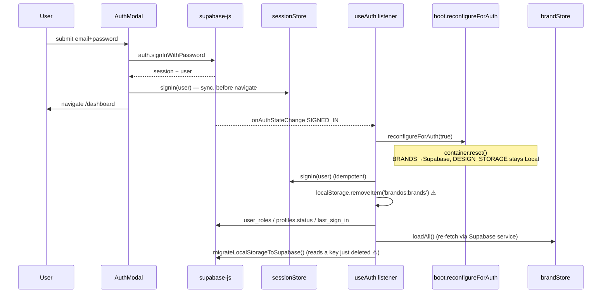
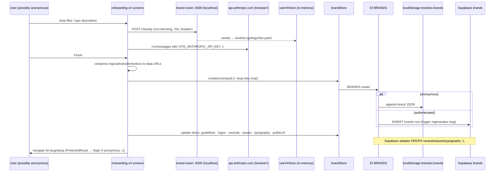
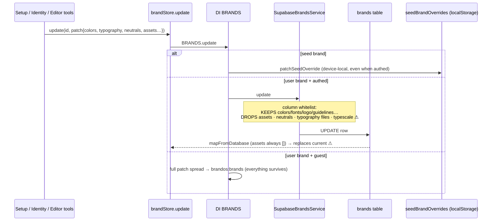
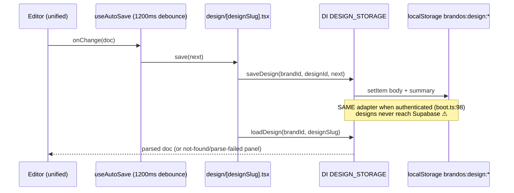

# 04 — DATA FLOWS (end-to-end action traces)

> Agent: B2-dataflows · Date: 2026-08-08 · Branch: `new-ui` @ `46ffb41` · READ-ONLY audit.
> Method: UI → hook/store → DI service (`src/core/boot.ts`) → adapter → Supabase/localStorage, traced per action.
> Tags: **VERIFIED** (path:line) / **INFERRED** / **UNKNOWN** / **CONFLICTING EVIDENCE**.

## 0. The DI layer as it actually operates (read this first)

`bootServices()` registers everything **Local** at startup; `reconfigureForAuth(true)` resets the
container and re-registers on login (`src/core/boot.ts:34-107`). What actually changes on login —
VERIFIED:

| SERVICE_KEY | Guest impl | Authed impl | Consumed via DI by |
|---|---|---|---|
| BRANDS | LocalBrandsService (`brandos:brands` + seed merge) | **SupabaseBrandsService** (`brands` table) | `brandStore` (`src/shared/store/brandStore.ts:15-17`) — the only swap that matters |
| WORKSPACES | — (not registered for guests) | SupabaseWorkspaceService | `workspaceStore.ts:14` |
| DESIGN_STORAGE | LocalDesignStorage | **LocalDesignStorage — still local when authed** (`boot.ts:98`) | editor page + editor v2 buttons |
| UPLOAD | LocalUploadService | **LocalUploadService — still local** (`boot.ts:99`) | (data-URL uploads) |
| ASSETS / COMMENTS / APPROVALS / NOTIFICATIONS / ACTIVITY | — | Supabase* adapters registered (`boot.ts:93-97`) | **ZERO consumers.** Grep for `SERVICE_KEYS.ASSETS|COMMENTS|APPROVALS|NOTIFICATIONS|ACTIVITY` outside boot/types/tests → 0 hits. VERIFIED |

**Consequence (VERIFIED):** five of the seven Supabase adapters swapped in at login are dead
registrations. The features they were written for run on direct singletons or zustand-persist
localStorage stores instead (see §9). Designs and file uploads never leave the browser even for
authenticated users.

The old `services.brands.*` bridge (`src/shared/services/registry.ts:21-25`) resolves through the
same container — it is not a bypass. VERIFIED.

---

## 1. Sign in (email + password)

**Trace — VERIFIED:**

1. `AuthModal` submit → `supabase.auth.signInWithPassword` (`src/features/auth/components/AuthModal.tsx:70-73`) — direct client call, not via any service.
2. On success, AuthModal seeds `sessionStore.signIn(user)` **synchronously** before navigating (`AuthModal.tsx:90-98`, comment explains the guard race) → `navigate('/dashboard')` (`:102`). CLAUDE.md's "seed synchronously before navigate" gotcha is still true.
3. `sessionStore.signIn` sets `isAuthenticated:true` + `isLoading:false` atomically (`src/shared/store/sessionStore.ts:35-47`). CLAUDE.md claim still true.
4. Supabase fires `SIGNED_IN` → the singleton listener in `useAuth` (mounted once by `AuthProvider`, guard at `src/features/auth/hooks/useAuth.ts:64,154-155`) runs (`useAuth.ts:291-307`), in order:
   - `reconfigureForAuth(true)` (`:293`) → container reset + Supabase registrations (`boot.ts:86-102`)
   - `signIn(mappedUser)` (`:294`)
   - **`localStorage.removeItem('brandos:brands')` (`:296`)** — see the data-loss finding in §3
   - `checkPlatformRole` → `user_roles` table, 3s abort (`:87-108`); `checkAccountStatus` → `profiles.status` suspended/banned (`:111-137`, non-blocking, **after** signIn — CLAUDE.md order claim still true); `updateLastSignIn` → `profiles.last_sign_in` (`:140-149`)
   - **Store fan-out:** `workspaceStore.loadAll()` (`:304`), `useBrandStore.getState().loadAll()` (`:305`), `onboardingStore.syncToSupabase()` (`:306`), `migrateLocalStorageToSupabase()` (`:307`)
5. Page-reload path (INITIAL_SESSION): `onSignedInUser` (`useAuth.ts:179-197`) does the same fan-out minus the removeItem, plus `loadFromSupabase()`.
6. SIGNED_OUT: `reconfigureForAuth(false)` → `bootServices()` re-registers Local; `workspaceStore.reset()`; `useBrandStore.loadAll()` re-fetches from localStorage (`:316-321`).

**Fan-out verification:** CLAUDE.md's claim "useAuth calls `useBrandStore.loadAll()` after each
`reconfigureForAuth` (initial-session, SIGNED_IN, SIGNED_OUT)" is **VERIFIED** at
`useAuth.ts:194, :305, :320`.

**CONFLICTING with CLAUDE.md:** "safety timeout in useAuth (15s)". Reality: an **8s** safety
timeout (`useAuth.ts:274-281`) plus a **5s** `getSession()` race (`:176,199-224`). Both still obey
the "never overwrite a live session" rule.

**Dev-bypass login (commit 10218f1) — VERIFIED compile-time gated:**
- `DEV_AUTH_BYPASS = import.meta.env.DEV && VITE_DEV_BYPASS_AUTH === 'true'` (`useAuth.ts:35-36`). `import.meta.env.DEV` is statically false in prod builds → dead-code-eliminated; cannot ship enabled.
- Button rendered only when `DEV_AUTH_BYPASS && mode === 'login'` (`AuthModal.tsx:228-236`); click sets `brandos:dev-bypass=1`, seeds `DEV_BYPASS_USER` (plan `agency`), role `super_admin`, navigates to /dashboard (`AuthModal.tsx:50-55`, `useAuth.ts:43-50`).
- Reload restore honors the flag only while `DEV_AUTH_BYPASS` is true (`useAuth.ts:161-167`); logout clears it (`:379-385`). Bypass sessions never touch Supabase.
- Open question 7 in 01-PRODUCT-SURFACE ("confirm it cannot ship enabled") → **answered: it cannot.**

---

## 2. Load brands / load one brand by slug

**Trace — VERIFIED:**

- `brandStore.loadAll()` (`src/shared/store/brandStore.ts:197-205`) → `container.get(BRANDS).list()`.
- **Guest:** `LocalBrandsService.list()` (`src/features/brand/services/brands.local.ts:51-53`) — reads `brandos:brands`, merges 5 seed brands (Raqm, SKAM, Vector, Uniex, demo — `:25`) that aren't shadowed by user brands (`:40-49`), with `applySeedOverride` applied, then `migrateBrands`.
- **Authed:** `SupabaseBrandsService.list()` (`src/shared/services/brands.supabase.ts:20-42`) — `brands` table select ordered by `created_at`, `mapFromDatabase` per row, then appends the same 5 seeds (`:38-41`). Seeds are present for every user regardless of DB state.
- **By slug:** `useBrandFromSlug` (`src/shared/hooks/useBrandFromSlug.ts:27-48`) — returns `store.current` if slug matches; else a **synchronous seed-registry fallback** (`getSeedBrandBySlug`, fixes first-paint flash); effect kicks `loadBySlug` → `getBySlug`.
- `SupabaseBrandsService.getBySlug` checks the seed list **before** the DB (`brands.supabase.ts:59-62`) — a user brand can never win a slug collision against a seed. Same for `getById`. INFERRED risk: a user who names a brand so the slug trigger yields `raqm` etc. gets shadowed (low likelihood; DB trigger regenerates slugs from names).
- **Seed-brand edits** (both modes) persist as a diff in the `seedBrandOverrides` localStorage layer, never to the DB (`brands.local.ts:95-98`, `brands.supabase.ts:118-124`) — so an authed user's edits to Raqm/SKAM/etc. are **device-local and non-syncing**. VERIFIED.

---

## 3. Create brand via live onboarding (/onboard-brand)

Route is **not auth-guarded** (App.tsx:351-352, per 02-ROUTES). Two exits: `CreateScreen`
(from-scratch) and `SetUpScreen` (upload existing brand). The v4 store (`useV4Store`,
`src/features/onboarding-v4/store/onboardingV4Store.ts:85`) is plain zustand — **in-memory only,
no persist middleware**; a mid-flow refresh loses the wizard state. VERIFIED.

**brand-vision classifier — VERIFIED:**
- Every queued image is POSTed (non-blocking) to `${VITE_BRAND_VISION_URL || 'http://localhost:8300'}/classify` with `engine=${VITE_BRAND_VISION_ENGINE || 'custom'}` (`src/features/onboarding-v4/services/brandVision.ts:15-17,44-56`). 25s timeout; 60s circuit-breaker on failure (`:38,58-60`); silent fallback to filename/alpha heuristics.
- Verdict → `verdictToPatch` patches the store asset's `kind/isLogo/logoSlot` (promote-only: never demotes an existing logo, `brandVision.ts:66-80`).
- This is a browser → localhost call. In production (no local FastAPI) it fails fast and the heuristics carry the flow. INFERRED: intentional dev-only enrichment.

**Description parse — VERIFIED, security-relevant:** `parseDescriptionToSections` calls
`https://api.anthropic.com/v1/messages` **directly from the browser** with
`VITE_ANTHROPIC_API_KEY` and the `anthropic-dangerous-direct-browser-access` header
(`src/features/onboarding-v4/services/parseDescription.ts:12,45,301-308`); heuristic fallback when
no key. CLAUDE.md's "MUST move behind a proxy before launch" constraint is not only unresolved —
the frontier feature added a **new** client-side call site.

**What gets written, at which step (SetUpScreen submit) — VERIFIED
(`src/features/onboarding-v4/screens/SetUpScreen.tsx:200-590`):**
1. Assets are shrunk to fit the persistence budget: logo slots → data URLs at 380px/60KB (`:252-275`), photos compressed, docs ≤ 400KB else skipped (`:342-349`), font files data-URL'd under a byte budget (`:386-411`). All sized for the ~5MB localStorage quota — the payload is identical when going to Supabase.
2. Extra palette swatches are mirrored into `guidelines.colorPalette` **because the code knows the DB drops them**: "Mirror the palette into guidelines so every swatch survives on Supabase, where there are no accent_color / neutrals columns" (`:203-209`).
3. Layered persistence: `tryCreate(coreInput)` → `useBrandStore.create` → DI BRANDS (`:439-466,486-502`). Slug-collision retry loop renames "Kaafex"→"Kaafex 2" because the DB `BEFORE INSERT set_brand_slug` trigger regenerates slugs under caller RLS and collides globally (`:430-437` — a server-side business rule documented only in a client comment). Storage-full retry frees disposable keys (`:448-452`).
4. Enrichment slices applied via `brandStore.update` one at a time: guidelines, logos, extra colors (`neutrals`), links+photos (`assets`), font files (`typography`), website (`publicUrl`) (`:530-556`). **For authed users, the `neutrals`, `assets`, and `typography` slices are silently discarded by `SupabaseBrandsService.update`'s column whitelist** — see §4.
5. `navigate(then ?? '/b/{slug}/setup')` (`:587`). CreateScreen equivalent: builds input, `useBrandStore.getState().create` (`CreateScreen.tsx:91-108`).

**Anonymous users — the flow dead-ends and later destroys data. VERIFIED chain:**
1. Anonymous → BRANDS = LocalBrandsService → brand lands in `brandos:brands`.
2. `navigate('/b/{slug}/setup')` → every `/b/*` route is ProtectedRoute-wrapped → bounced to `/login`. The just-created brand is invisible until sign-in.
3. On fresh sign-in, the `SIGNED_IN` handler deletes `brandos:brands` (`useAuth.ts:296`) **before** `migrateLocalStorageToSupabase()` runs (`:307`), and the migration's first read is exactly that key (`src/shared/utils/localStorage-migration.ts:46`). removeItem is synchronous; the migration cannot see the data. **Anonymous onboarding output is destroyed on first interactive login.** Migration only works on the INITIAL_SESSION reload path (`useAuth.ts:196`), which doesn't delete first.
4. The `/claim` flow does **not** cover onboarding: it materializes only `brandos:tool-session:*` payloads from the public tools (`src/features/tools/core/claim.ts:38-43`, `src/pages/tools/claim.tsx:45-56`). There is no claim path for an anonymous onboarding brand.

Minor: `localStorage-migration.ts:73` hardcodes a 4-entry seed-ID list that omits
`uniex-brand-001` (`src/data/brands/uniex.ts:28`) — stale duplicate of the seed registry (benign
today because seeds are never stored in `brandos:brands`).

---

## 4. Update brand fields (color / typography / logo)

**Canonical write path — VERIFIED:** every live edit surface funnels into
`brandStore.update(id, patch)` (`src/shared/store/brandStore.ts:132-158`), which calls the DI
service, **replaces** `list`/`current` with the service's returned (re-migrated) row, and re-applies
fonts/CSS tokens when visual fields changed (`:145-147`).

Surfaces that persist today — all VERIFIED:
- **Studio Setup** `/b/:slug/setup`: `SetupPage onPersist` → `mockBrandToPatch(next, brand)` → `update` (`src/pages/b/[slug]/setup.tsx:36-50`). The patch writer prefers canonical slots and emits `primaryColor/secondaryColor/neutrals/typography/guidelines/logo/logoAssets` (`src/features/setup/data/mockBrandToPatch.ts:44-130`).
- **Identity tabs** (Classic + Studio wrapper): `useBrandStore((s) => s.update)` (`src/pages/dashboard/brand/[slug]/identity/index.tsx:17,55`).
- **Unified-editor brand tools**: `useBrandUpdate` hook (toast wrapper over `store.update`, `src/shared/hooks/useBrandUpdate.ts`) consumed by `FontTool`, `LogoTool`, `ColorPaletteTool`, `BrandInfoTool` (grep VERIFIED).
- **Typescale tool**: `setTypescale` persists **font families only**; scale/ratio/leading are deliberately draft-only (`brandStore.ts:161-181`).

**The silent column-whitelist drop — the most important update finding. VERIFIED:**
`SupabaseBrandsService.update` maps only: name, logo, logoAssets, primaryColor, secondaryColor,
fonts, tone, audience, strategy, guidelines, isPublic, publicUrl, customDomain
(`src/shared/services/brands.supabase.ts:126-140`). Fields **silently discarded for authed DB
brands**: `assets`, `neutrals`, `typography` (uploaded font files), `accentColor`, `typescale`,
`colorSystem`. And `mapFromDatabase` hardcodes `assets: []` (`:183`) — so the store's in-memory
copy loses them **immediately on the next save**, not just on reload. A patch containing only
dropped fields produces `updateData = {}` → supabase-js `.update({})` (behavior at PostgREST layer
UNKNOWN — likely an error surfaced as a failed toast, or a no-op). LocalBrandsService, by
contrast, spreads the whole patch (`brands.local.ts:90`) — **anonymous/local brands persist MORE
of the schema than authenticated ones.** CONFLICTING EVIDENCE against the "Supabase swap is
equivalent" assumption implicit in boot.ts.

**Session-only surfaces — CLAUDE.md claims re-verified, still true:**
- Brand-kit inline color/icon adds: `iconsOverride` / `colorAddsOverride` are `useState`
  (`src/features/brand-kit/BrandKitCosmosPage.tsx:236,246-290`) — composed into `effectiveBrand`,
  never written to the store. VERIFIED.
- Brand-kit card editor save: page passes `onSave={(t) => toast('Saved …')}`
  (`BrandKitCosmosPage.tsx:824-825`; editor invokes it at
  `components/BrandKitCardEditor.tsx:1538`). Toast-only. VERIFIED.
- Seed brands (all modes): updates land in the `seedBrandOverrides` localStorage layer, never the DB (§2).

---

## 5. Upload an asset (AssetSourcePopover + DAM)

- **AssetSourcePopover** (`src/shared/upload/AssetSourcePopover.tsx`) is a *picker*, not a
  persister: it lists `currentBrand.assets` images + a device-file input and emits
  `onPick({kind:'file'|'asset'})` (`:51,82-87`); persistence is the caller's job. Consumers:
  editor `InsertPanel`, brand-board `LogosPanel` (grep VERIFIED).
- **DAM** (`/a/:slug/folders` → `src/features/dam/DamPage.tsx`), the real upload surface — VERIFIED:
  1. `handleUpload` → `storageService.uploadAsset(brandId, file, uuid-name)` (`DamPage.tsx:183-196`) — **direct import of the `storage.supabase` singleton (`:20`), bypassing both DI UPLOAD and DI ASSETS.**
  2. Storage target: bucket **`brand-assets`**, path `${brandId}/assets/${uuid}-${name}`, `upsert: true` (`src/shared/services/storage.supabase.ts:9,46-58`). Dedup: **none** — every upload gets a fresh UUID prefix; same file twice = two objects.
  3. On storage failure → silent fallback to a data URL (`DamPage.tsx:196-198`).
  4. Metadata → `brandStore.update(current.id, { assets: [...] })` (`:216`) → **dropped by the Supabase whitelist (§4)**. Net effect for an authed user: file bytes land in the bucket, but the asset row/metadata is never persisted; after reload the DAM is empty and the storage object is orphaned. For guest/seed brands it persists (localStorage). CONFLICTING EVIDENCE vs. the DAM's own header comment promising Supabase persistence.
- The purpose-built **`SupabaseAssetsService`** (writes an `assets` table + cleans up storage,
  `src/core/adapters/database/SupabaseAssetsService.ts:32-92`) is registered at `boot.ts:93` and
  **consumed by nothing** (§0). The DAM predates or ignores it.

---

## 6. Save a design in the unified editor / load it back

**Trace — VERIFIED:**
1. Route `/b/:slug/design/:designSlug` → `src/pages/dashboard/brand/[slug]/design/[designSlug].tsx`; `useService(SERVICE_KEYS.DESIGN_STORAGE)` (`:51`).
2. Load: `designStorage.loadDesign(brand.id, designSlug)` (`:75`) with inline 404/parse-failed panels.
3. Save: `<Editor save={next => designStorage.saveDesign(brand.id, doc.id, next)}>` (`:161-163`). Inside the editor, `useAutoSave` debounces (default 1200ms) and drives the save-state machine (`src/features/editor/core/useAutoSave.ts:36,53-71`).
4. Adapter: `LocalDesignStorage` — body at `brandos:design:{brandId}:{designId}`, summary sibling key (`src/core/adapters/storage/LocalDesignStorage.ts:13-18,27,40`).
5. Variants / duplicate / family export buttons all resolve the same DI key (`EditorGenerateVariantsButton.tsx:147-201`, `EditorDuplicateDesignButton.tsx:42-67`, etc.).

**The headline:** `reconfigureForAuth(true)` re-registers `LocalDesignStorage` for authenticated
users (`boot.ts:98`) — **designs are localStorage-only for everyone.** No Supabase table, no
cross-device sync, subject to the shared ~5MB quota already strained by onboarding logos
(SetUpScreen's own comments budget against it). Public design link `/d/:brandSlug/:designSlug` is
copied to clipboard (`[designSlug].tsx:164-179`) — but since the design exists only in the
author's browser, the public view can only work for viewers who share that browser, or via seed
data. INFERRED: `/d/` is broken for real cross-user sharing; not traced further (see open
questions).

---

## 7. AI image generation

**Trace — VERIFIED:**
1. `GeneratePanel` (editor shell v2) collects prompt/model/style; gets the session directly from `supabase.auth.getSession()` (`src/features/editor/shell/v2/panels/GeneratePanel.tsx:34,265`).
2. `generateImage()` (`src/features/editor/ai/generateImage.ts`) POSTs to `${SUPABASE_URL}/functions/v1/ai-generate-image` (`:57`), 60s timeout; style suffix appended browser-side; identity = session token when authed, else a stable anonymous id minted into localStorage (`:117-120`).
3. Edge Function `supabase/functions/ai-generate-image/index.ts` — vendor dispatch (`:10-28`): `AI_IMAGE_VENDOR` unset → **openai (gpt-image-1) if OPENAI_API_KEY, else fal (Flux Schnell), else pollinations (free)**; explicit options for cloudflare, huggingface, and `mock`. Rate limiting/logging via `_shared/ai.ts` → `rate_limit.ts`.
4. Result `{imageUrl, mock, width, height}` → placed on canvas by the panel.
5. Sibling flow: AI prompt bar → `applyCommand` → `/functions/v1/ai-apply-command` with the same anon-session pattern (`src/features/editor/ai/applyCommand.ts:23,176-181`).

**CONFLICTING with CLAUDE.md:** "ai-generate-image (MOCK ONLY per Q-decision)" — false since
2026-05-18; real multi-vendor generation is the default path (confirms 01-PRODUCT-SURFACE §11.1).

---

## 8. Workspace / brand selection

- **AppRail switcher** (Classic + ported pages): with a brand-scoped path → `rewriteBrandPath(pathname, oldSlug, newSlug, search)` keeps the user on the same tool (`src/shared/layouts/AppRail.tsx:285`); entering from a non-brand context → `getBrandHomeUrl(newSlug)` (`:282`). VERIFIED.
- `getBrandHomeUrl` reads the persisted `brandos:ui-preference` (zustand persist) and returns `/b/:slug/setup` or `/a/:slug/setup` (`src/shared/hooks/useUiPreference.ts:67-70`).
- Legacy `BrandSwitcher` pill uses `rewriteBrandPath` too (`src/features/brand/components/BrandSwitcher.tsx:58`).
- Editor top-bar brand switch: `onBrandSwitch` → `navigate('/b/{nextSlug}/design')` — leaves the current design, lands on the launchpad (`[designSlug].tsx:101-103`). VERIFIED.
- **CONFLICTING with CLAUDE.md** ("brand-entry sites consult getBrandHomeUrl"): `pages/workspace/Home.tsx` and `pages/dashboard/brands/index.tsx` re-implement the preference conditional inline (per 02-ROUTES §2, corroborated) — only AppRail actually calls it.

---

## 9. Bypasses & session-only writes (worst offenders)

**Direct `@/integrations/supabase/client` importers: 29 files** (grep VERIFIED). Legitimate:
6 `core/adapters/database/*`, 7 `shared/services/*` (the singleton tier), `integrations/`, `lib/`,
auth surfaces (auth is intrinsically supabase-js). True bypasses of the service layer:

| Offender | What it does around the layer |
|---|---|
| `features/dam/DamPage.tsx` | Uploads via `storage.supabase` singleton, skips DI UPLOAD/ASSETS; metadata write then dropped by the brands whitelist (§5) |
| `features/editor/ai/{applyCommand,generateImage}.ts` + `shell/v2/panels/GeneratePanel.tsx` | Raw fetch to Edge Functions + direct `auth.getSession`; anon ids in localStorage. Defensible (Edge Functions have no DI contract) but undocumented |
| `features/admin/services/adminService.ts`, `features/dashboard/components/AdminPanel.tsx`, `shared/hooks/useIsAdmin.ts` | Admin reads/writes straight to tables |
| `shared/services/activityService.ts` | Its own dual-write: tries `activity_log` table, falls back to a localStorage ring buffer (`:42-81`) — a private re-implementation of the Local/Supabase swap the DI container was built for; meanwhile the registered `SupabaseActivityService` has zero consumers |

**Registered-but-orphaned adapters (VERIFIED, §0):** `SupabaseAssetsService`,
`SupabaseCommentsService`, `SupabaseApprovalsService`, `SupabaseNotificationsService`,
`SupabaseActivityService`. The live features run on zustand-persist localStorage stores instead
(`features/comments/commentsStore.ts:38`, `features/approvals/approvalsStore.ts`,
`shared/store/notificationsStore.ts:43`). Consequence: `migrateLocalStorageToSupabase` inserts
comments/approvals/notifications/activity into Supabase tables **that no runtime code reads back**
— a one-way data black hole. VERIFIED (migration writes: `localStorage-migration.ts:105-229`;
zero table readers outside the orphaned adapters).

**`localStorage.` outside services/adapters: 48 files** (grep VERIFIED). Mostly benign UI prefs
(nav collapse, theme, tutorial flags). Load-bearing ones: tool sessions
(`features/tools/core/claim.ts` — by design, feeds `/claim`), logo-maker identity engine cache,
editor shells' draft keys, dev-bypass flag.

**Duplicated business rules:**
- Seed-brand list ×3: `brands.local.ts:25`, `brands.supabase.ts:16`, plus a stale hardcoded ID list in `localStorage-migration.ts:73` (missing uniex).
- UI-preference brand-home conditional ×3 (only one call site uses the helper).
- Logo-slot→BrandLogoAssets mapping exists in onboarding (`SetUpScreen.tsx:277-287`) and again in setup's `mockBrandToPatch` (INFERRED from headers; not diffed line-by-line).
- Supabase slug-trigger semantics encoded as a client-side retry loop (`SetUpScreen.tsx:430-466`) — server rule with no shared definition.

---

## 10. Contradictions with CLAUDE.md (this audit's increments)

1. **Safety timeout is 8s, not 15s**, plus a 5s getSession race (`useAuth.ts:176,274`). The 15s description is stale.
2. **"AI image generation MOCK ONLY"** — false; multi-vendor real, openai/fal/pollinations dispatch (`ai-generate-image/index.ts:10-28`).
3. **CLAUDE.md's DI story implies authed = Supabase-backed.** Reality: only BRANDS (+WORKSPACES) effectively swap; DESIGN_STORAGE and UPLOAD stay local by explicit registration (`boot.ts:98-99`), and the other five Supabase adapters have no consumers.
4. **The Supabase brands adapter cannot round-trip the Brand schema** (drops assets/neutrals/typography-files/typescale, `brands.supabase.ts:126-140,183`) — CLAUDE.md nowhere flags that authenticated persistence is *narrower* than localStorage persistence.
5. **`VITE_ANTHROPIC_API_KEY` client-bundle exposure** is not just unresolved (CLAUDE.md: "paused at Step 1") — onboarding-v4 added a fresh browser-side Anthropic call (`parseDescription.ts:301`).
6. Confirmed-still-true CLAUDE.md claims worth keeping: signIn atomicity, AuthModal sync seeding, signIn-before-checkAccountStatus ordering, the three-call-site brandStore fan-out, brand-kit session-only color/icon adds and toast-only card-editor save.

## 11. Open questions

1. **Is the sign-in wipe of `brandos:brands` before migration intentional?** (`useAuth.ts:296` vs `localStorage-migration.ts:46`.) As written, fresh interactive logins destroy anonymous work; only reload sessions can migrate. Looks like a bug introduced to stop local/DB brand-list bleed-through.
2. **Is anonymous onboarding supposed to work end-to-end?** The funnel is unguarded but exits into ProtectedRoute; there's no claim path for onboarding brands (only tool sessions). Either guard the funnel or build the claim.
3. **What is the plan for design persistence?** LocalDesignStorage-for-everyone makes `/d/:brandSlug/:designSlug` public sharing structurally broken cross-device (INFERRED — public page's data source not traced).
4. **Should `SupabaseBrandsService.update` learn the full schema** (assets/neutrals/typography columns or a JSONB catch-all), or should the store forbid patches the active adapter can't hold? Today the UI happily accepts edits the backend drops.
5. **Delete or wire the five orphaned Supabase adapters?** And stop `migrateLocalStorageToSupabase` writing comments/approvals/notifications/activity nothing reads.
6. **brand-vision in production**: `VITE_BRAND_VISION_URL` defaults to localhost — is a deployed endpoint planned, or is auto-placement intentionally dev-only?
7. `.update({})` behavior when a patch is fully whitelisted-away (error vs no-op) — UNKNOWN, worth one manual test before relying on §4's failure mode in user-facing copy.
