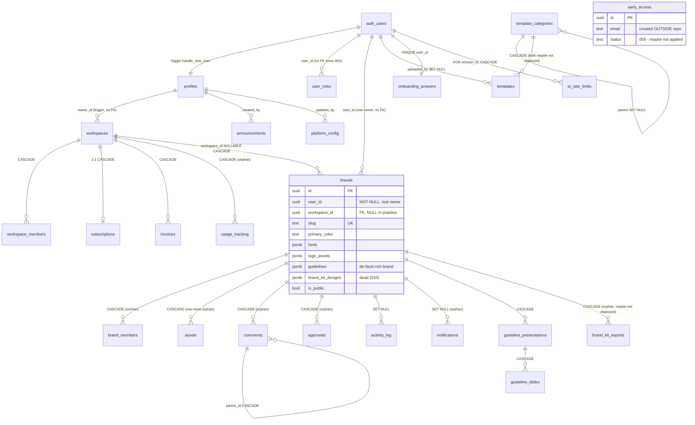

# 06 — Database & Auth

> Phase B3 audit · written 2026-08-08 · READ-ONLY, repo-only evidence.
> Sources: `supabase/migrations/*` (26 files + 1 down), `supabase/functions/*` (12 functions),
> `src/integrations/supabase/types.ts` (generated types), and grep of runtime callers in `src/` +
> `landingpage/src/`. **The live database (project `ciojgoozobzbeglwdxcz`, `supabase/config.toml:1`)
> was NOT queried. Every statement about what actually exists in production is UNVERIFIABLE from
> the repo and tagged as such.** Claims tagged VERIFIED (path:line) / INFERRED / UNKNOWN /
> CONFLICTING EVIDENCE.

---

## 1. Migration chronology

26 migration files in `supabase/migrations/`. Only `down/010_brand_kit_premium.down.sql` exists as
a rollback. Eras map to `00-REPOSITORY-TRUTH.md` §6.

### Era 1 — Lovable scaffold era (2025-08-19 → 2025-10-19), 16 files

Auto-generated (UUID-suffixed filenames). Heavily duplicated — several pairs are byte-similar
retry artifacts of failed runs.

| # | File (short) | What it does | Flags |
|---|---|---|---|
| 1 | `20250819211249` | Creates `onboarding_answers`, `brands` (legacy 10-col shape), `set_updated_at()`, private `brand-assets` bucket, owner-only (`user_id = auth.uid()`) RLS on everything + owner-only storage policies | Baseline. VERIFIED |
| 2 | `20250905210043` | Seeds 5 demo brands + 1 onboarding_answers row for `hamza2007ezzat@gmail.com` | Data-only. If the user didn't exist, `user_id` subselect returns NULL → NOT NULL violation → whole migration fails. UNKNOWN whether it applied |
| 3 | `20250905210159` | **Duplicate of #2 minus the onboarding row** — same 5 brands again | Retry artifact. If both applied: 10 duplicate demo-brand rows. CONFLICTING EVIDENCE (can't tell from repo which ran) |
| 4 | `20250905213158` | Creates `profiles`, `app_role` enum (`admin,user`), `user_roles`, `has_role()`, `handle_new_user()` trigger (profile + role, hardcoded admin for hamza email), admin-OR-owner brands policies | **Contains invalid SQL**: `CREATE POLICY brands_select_policy … FOR SELECT … WITH CHECK (…)` (line ~86) — SELECT policies cannot have WITH CHECK; this migration aborts in Postgres. VERIFIED (file text) |
| 5 | `20250905213225` | **Corrected duplicate of #4** (`WITH CHECK` → `USING`) | The retry that presumably succeeded. INFERRED |
| 6 | `20250905213241` | Re-hardens `has_role` / `handle_new_user` with `search_path = ''` | |
| 7 | `20250905213314` | Re-hardens `set_updated_at` with `SECURITY DEFINER, search_path = ''` | Later silently reverted by migration 009 — see §1.4 |
| 8 | `20250916220237` | Inserts demo brand with `id = 'demo-brand-1'` (**text into UUID PK — fails**) + policies letting ALL authenticated users SELECT/UPDATE it | Broken. VERIFIED (type mismatch in file) |
| 9 | `20250916220302` | Byte-duplicate of #8 | Broken retry |
| 10 | `20250916220322` | Fixed version: demo brand `550e8400-e29b-41d4-a716-446655440000` + "viewable/editable by all authenticated users" policies | **Overly permissive policies never dropped by any later migration** |
| 11 | `20250916220410` | Near-duplicate of #10 with differently-named policies ("Demo brands viewable by all") | If both applied: two permissive policy pairs on the same row |
| 12 | `20250920212142` | Adds `brands.slug` + `generate_brand_slug()` + auto-slug trigger + UNIQUE + NOT NULL | |
| 13 | `20250920212201` | Byte-duplicate of #12 (would fail on duplicate column) | Retry artifact |
| 14 | `20250920212224` | Hardens slug functions (`SECURITY DEFINER, search_path = public`) | |
| 15 | `20251017184543` | 4 storage policies on `brand-assets` keyed on `brands.user_id` via first path segment | Superseded-but-not-dropped by 001 — see §3.3 |
| 16 | `20251019001701` | Creates `guideline_presentations` + `guideline_slides` (user_id-scoped RLS, indexes, triggers) | |

### Era 2 — backend-system era (2026-04-12 → 04-16), migrations 001–006

Hand-written, numbered, mostly idempotent.

| # | File | What it does | Flags |
|---|---|---|---|
| 001 | `20260412000000_001_workspaces_and_rls.sql` (805 lines) | Re-creates `profiles`/`user_roles`/`guideline_*`/slug infra **with IF NOT EXISTS guards** ("may have been created by an earlier migration **on a previous project**" — line 119), then: `workspace_role` enum, `workspaces`, `workspace_members`, `brand_members`, `assets`; expands `brands` (+`workspace_id, logo_assets, strategy, guidelines, is_public, public_url, custom_domain`); helper fns `is_workspace_member`, `is_brand_member`, `get_brand_workspace_id`; auto-workspace-on-signup trigger; full RLS rewrite for brands/storage/guidelines | **Reworks era-1 wholesale.** The "previous project" comment is strong evidence the live DB is a *different Supabase project* than the one era-1 ran against → era-1 duplicates may be moot on live. `handle_new_user` REPLACED to insert profiles only — **no `user_roles` row for normal users anymore** (era-1 version inserted `role='user'`). New `user_roles` (001:90-95) **drops the `UNIQUE(user_id, role)`** constraint the era-1 table had. VERIFIED |
| 002 | `..._002_comments_approvals_activity_notifications.sql` | Creates `comments`, `approvals`, `activity_log` (append-only), `notifications` + brand-membership RLS | `notifications_insert WITH CHECK (true)` — any authed user can insert notifications for anyone. VERIFIED (002:~186) |
| 003 | `..._003_subscriptions_billing.sql` | `subscriptions` (1:1 workspace), `invoices`, `usage_tracking`; SELECT-only for clients, writes = service_role only; backfills free sub for existing workspaces | No trigger creates a subscription for NEW workspaces — `stripe-checkout` upserts on demand and `check-plan-limit` defaults to `'free'` when no row (`check-plan-limit/index.ts:78`). VERIFIED |
| 004 | `..._004_super_admin.sql` | `is_super_admin()` (checks `user_roles.role='admin'`), blanket `admin_*_all` policies on every table, seeds admin role for `brandingos.ai@gmail.com` + `hamza2007ezzat@gmail.com`, `check_admin_email()` trigger on profiles | Hardcoded emails in DDL. VERIFIED |
| 005 | `..._005_early_access_admin.sql` | ALTERs `early_access` (+`status`, `admin_notes`) + admin ALL policy | **`early_access` is never CREATEd in any repo migration** — it was created outside the repo (landing page / dashboard; `landingpage/README.md:81` says "Create `early_access` table"). If it didn't exist, 005 fails. Generated types LACK these two columns → CONFLICTING EVIDENCE that 005 ever applied (see §2.3) |
| 006 | `..._006_admin_panel_upgrade.sql` | Recreates `app_role` as 4-tier (`super_admin/admin/moderator/user`), migrates hardcoded admins to `super_admin`, repoints `is_super_admin()` at `'super_admin'`, adds `is_admin_or_above()`/`is_moderator_or_above()`, profiles +`status/admin_notes/suspension_reason/last_sign_in`, creates `announcements`, `platform_config` | **Reworks 004**: anyone left with role `'admin'` after 006 is no longer super admin. VERIFIED |

### Era 3 — onboarding/AI era (2026-04-20 → 04-27), 007–008

| # | File | What it does | Flags |
|---|---|---|---|
| 007 | `..._007_onboarding_v3.sql` | `onboarding-scratch` private bucket + policies; `onboarding_rate_limits` table (deny-all client RLS) | Scratch SELECT/DELETE policies have **no ownership predicate** despite `_own` names — any authed user can read/delete any session's scratch files (007:29-43). VERIFIED |
| 008 | `..._008_ai_rate_limits.sql` | Creates `ai_rate_limits` (user XOR session identity, IP cap, token/cost columns, deny-all RLS), backfills from and **DROPs `onboarding_rate_limits`** | Explicit rework of 007. VERIFIED |

### Era 4 — Phase 4 / brand-kit premium (2026-05-04 → 05-12), 009–010

| # | File | What it does | Flags |
|---|---|---|---|
| 009 | `..._009_templates_phase_4.sql` | `template_categories`, `templates` (source-discriminated, premium fields), conditional ALTER of `designs` (IF EXISTS — **no migration creates `designs`**, so this is a no-op), `profiles.is_admin BOOLEAN`, RLS incl. anon read of public templates | File header admits: production adapter swaps in "once the user runs `npx supabase db push`" → **009 was authored as not-yet-pushed**. Also **redefines `set_updated_at()` WITHOUT `SECURITY DEFINER`/pinned `search_path`** (009:~152), silently reverting the 2025-09-05 hardening. VERIFIED |
| 010 | `..._010_brand_kit_premium.sql` | `brands.brand_kit_designs JSONB` + `brand_kit_exports` snapshot table; owner-only RLS **via `brands.user_id`** (ignores workspace model) | Zero runtime readers/writers of either (grep). VERIFIED |

### 1.4 Migrations that contradict/rework earlier ones (summary)

1. **001 reworks all of era 1** (policies, triggers, `handle_new_user`, storage) and its comments imply era 1 ran on a *different project*. — VERIFIED text, UNKNOWN live effect
2. **006 reworks 004's role model** (enum recreated, `is_super_admin` semantics change). — VERIFIED
3. **008 drops 007's table.** — VERIFIED
4. **009 un-hardens `set_updated_at`** (search_path mutable again, the exact issue 20250905213314 fixed). — VERIFIED
5. **001 drops only the 2025-08-19 storage policy names**, not the 2025-10-17 ones — if era 1 applied to this project, user_id-based and membership-based storage policies coexist (permissive OR). — INFERRED
6. Era-1 duplicate pairs (§1 rows 2/3, 4/5, 8/9, 10/11, 12/13) are internal contradictions: at most one of each pair can have applied cleanly. — VERIFIED (file text), UNKNOWN (live)

---

## 2. Table inventory & generated-types drift

### 2.1 Tables defined by repo migrations (current end-state)

| Table | PK | FKs (cascade) | JSONB fields | Notable indexes |
|---|---|---|---|---|
| `profiles` | id (== auth.users.id; FK only in era-1 version, **001 version has NO FK**) | — | — | idx_profiles_status |
| `user_roles` | id | user_id (era-1: FK auth.users CASCADE; 001: **no FK, no UNIQUE(user_id,role)**) | — | — |
| `brands` | id | workspace_id → workspaces CASCADE | `fonts`, `logo_assets`, `guidelines`, `brand_kit_designs` (dead) | slug UNIQUE, idx_brands_workspace |
| `workspaces` | id | — (owner_id no FK) | `settings` | slug UNIQUE |
| `workspace_members` | id | workspace_id → workspaces CASCADE | — | UNIQUE(workspace_id,user_id) |
| `brand_members` | id | brand_id → brands CASCADE | — | UNIQUE(brand_id,user_id) |
| `assets` | id | brand_id → brands CASCADE | `metadata` | GIN(tags) |
| `comments` | id | brand_id → brands CASCADE; parent_id → comments CASCADE | — | (brand,page_key), thread |
| `approvals` | id | brand_id → brands CASCADE | — | (brand,status) |
| `activity_log` | id | brand_id → brands **SET NULL** | `metadata` | (brand,created_at DESC) |
| `notifications` | id | brand_id → brands SET NULL | — | partial unread idx |
| `subscriptions` | id | workspace_id → workspaces CASCADE, UNIQUE(workspace_id) | — | stripe_customer idx |
| `invoices` | id | workspace_id → workspaces CASCADE | — | (workspace,created DESC) |
| `usage_tracking` | id | workspace_id → workspaces CASCADE | — | UNIQUE(ws,metric,period_start) |
| `guideline_presentations` | id | brand_id → brands CASCADE | `theme_settings`, `slides`, `export_settings` | brand, user, published |
| `guideline_slides` | id | presentation_id → g_p CASCADE | `content`, `custom_styles` | UNIQUE(presentation,order) (2025 version only) |
| `announcements` | id | created_by → profiles | — | active idx |
| `platform_config` | key (TEXT) | updated_by → profiles | `value` | — |
| `onboarding_answers` | id | — (UNIQUE user_id) | `answers` | — |
| `ai_rate_limits` | id (BIGSERIAL) | user_id → auth.users CASCADE | — | 3 partial idx + XOR check |
| `template_categories` | id | parent → self SET NULL | — | parent, display_order |
| `templates` | id | category → t_c CASCADE; uploaded_by/approved_by → auth.users SET NULL | `document` | source, GIN(tags), partial status |
| `brand_kit_exports` | id | brand_id → brands CASCADE; created_by → auth.users SET NULL | `bindings_snapshot`, `brand_snapshot`, `doc_snapshots` | (brand,created DESC) |
| `early_access` | — **never created in repo** | — | — | 005 adds status/created idx |

Dropped: `onboarding_rate_limits` (007 → dropped by 008).
Phantom: `designs` — referenced conditionally by 009, never created, absent from types. Designs
live in localStorage (`LocalDesignStorage`, `boot.ts:98` even when authed). — VERIFIED

### 2.2 What code stuffs into the JSONB fields

- **`brands.guidelines`** — the de-facto rich brand store (per 05 §R2). Onboarding-v4 writes
  `guidelines.{strategy, voiceAndTone, aboutSections, colorPalette}` (SetUpScreen), because the
  table has no columns for colorSystem/typography/accent/neutrals; `migrateBrandToCurrent`
  re-derives the v3 shape from this JSONB on every authed read (`brands.supabase.ts`,
  `migrateSchema.ts`). Also carries `guidelines.logoSystem` and `guidelines.typography`
  (string weights — the 46ffb41 coercion bug source). — VERIFIED (05 doc; spot-checked
  `src/shared/services/brands.supabase.ts:126-140` whitelist)
- **`brands.fonts`** — `{primary, secondary}` legacy pair (plus era-1 demo rows with 6 keys).
- **`brands.logo_assets`** — logo variant URL map written at create (`brands.supabase.ts:90-105`).
- **`brands.brand_kit_designs`** — nothing writes it. Dead column. — VERIFIED (grep: zero src hits)
- **`guideline_presentations.slides`** — full slide array from `presentations.supabase.ts`
  (used by `presentationsStore`, `CanvasGuidelinesEditor`). The separate `guideline_slides`
  table gets rows too (6 `.from('guideline_slides')` call sites in the same service).
- **`onboarding_answers.answers`** — whole onboarding store snapshot (`onboarding.supabase.ts`
  via `onboardingStore.syncToSupabase`).
- **`platform_config.value`** — maintenance_mode / registration_enabled / feature_overrides
  (adminService).
- **`templates.document`** — BrandOSDocument; only the Local (localStorage) adapter is live.

### 2.3 Generated types vs migrations (drift)

`src/integrations/supabase/types.ts` lists exactly 20 tables (lines 17–918):
activity_log, announcements, approvals, assets, brand_members, brands, comments, early_access,
guideline_presentations, guideline_slides, invoices, notifications, onboarding_answers,
platform_config, profiles, subscriptions, usage_tracking, user_roles, workspace_members, workspaces.

**In migrations but NOT in types** (types stale relative to 008/009/010, OR those migrations
were never pushed when types were generated):
- `ai_rate_limits` (008)
- `template_categories`, `templates` (009)
- `brand_kit_exports`, `brands.brand_kit_designs` (010)
- `profiles.is_admin` (009)
- `early_access.status`, `early_access.admin_notes` (005) ← **the anomaly**

**In types but NOT created by any migration**: `early_access` (created outside the repo).

Dating the snapshot: types INCLUDE 006's additions (profiles.status/admin_notes/suspension_reason/
last_sign_in at types.ts:722-731; announcements; platform_config; 4-tier `app_role` enum at
types.ts:996) but EXCLUDE 005's `early_access.status/admin_notes` (types.ts:410-448) even though
005 predates 006. If types were generated from the live DB after 006, **migration 005 had not been
applied to live at that moment** (plausible cause: `early_access` lives with different columns, or
005 errored). — CONFLICTING EVIDENCE; live state UNKNOWN.

Consequences if the types snapshot reflects live prod today:
- `adminService.ts` early-access status updates write a nonexistent column → runtime failure. — INFERRED
- `useIsAdmin` (`src/shared/hooks/useIsAdmin.ts:53`) selects `profiles.is_admin` which wouldn't
  exist → error → `isAdmin:false` → `/admin/templates/queue` locked for everyone. — INFERRED
- Templates/brand-kit-exports tables absent → consistent with those features running on
  localStorage adapters only (`boot.ts:60,102`). — VERIFIED that only Local adapters are registered

---

## 3. RLS & storage

### 3.1 Per-table RLS status (per final migration state)

Every repo-defined table has RLS ENABLED. Policy quality varies:

| Table | Policies | Concerns |
|---|---|---|
| profiles | select own; **`profiles_select_by_member` USING (true)** (001:29-32); update own; admin ALL | **Every authenticated user can read every profile row — emails, status, suspension_reason, admin_notes.** VERIFIED |
| user_roles | select own; admin ALL (004) | 006 removed nothing; fine |
| brands | select: own-legacy OR workspace-viewer OR is_public; **anon select where is_public** (001:590-593); insert own/editor; update own/brand-editor; delete own/brand-admin; admin ALL; **era-1 leftovers: demo brand `550e8400-…` SELECT+UPDATE by ALL authenticated users** (two policy pairs, never dropped) | Demo-brand write-for-everyone is the standout, IF era-1 ran on this project. UNKNOWN |
| workspaces / workspace_members | member-scoped; admin ALL | wm_insert allows self-insert as 'owner' (001:554) — any user can insert themselves as owner into… only rows they specify; combined with `is_workspace_member` check it's for the signup trigger; a user could insert an 'owner' row for an arbitrary workspace_id? No — WITH CHECK requires `user_id = auth.uid() AND role='owner'`, workspace_id unconstrained → **a user CAN add themselves as owner-member of any workspace they know the UUID of.** — VERIFIED (001:548-555). Real escalation path |
| brand_members | brand-member scoped | OK |
| assets | brand-member scoped | OK |
| comments | member select/insert, author-or-editor update | OK |
| approvals | member scoped | OK |
| activity_log | member-or-own select; insert own; no update/delete | append-only, good |
| notifications | select/update/delete own; **insert WITH CHECK (true)** | any authed user can create notifications for any user. VERIFIED (002) |
| subscriptions / invoices / usage_tracking | SELECT only (member / admin); writes service-role only | Good |
| guideline_presentations/slides | own-or-brand-member | OK |
| announcements | admin manage; authed read active | OK |
| platform_config | super_admin manage; **all authed read** | includes feature_overrides — low risk |
| onboarding_answers | own CRUD (era 1) | OK |
| ai_rate_limits | deny-all clients | Good |
| template_categories | **anon read (true)** | intended |
| templates | anon read public+approved; owner CRUD | **No admin UPDATE policy** — the 4.4 approve/reject queue can't work through RLS as authed user; needs service role or `is_admin` policy that doesn't exist in SQL. Moot while adapter is Local. — VERIFIED |
| brand_kit_exports | select/insert via `brands.user_id` only | ignores workspace membership — model inconsistency |
| early_access | Repo defines only `admin_early_access_all` (005). The anon-INSERT-only policy CLAUDE.md describes was created outside the repo — **UNVERIFIABLE**. `landingpage/src/lib/supabase.ts` + `src/domains/landing/lib/earlyAccess.ts` insert as anon; `adminService` + `admin-invite` fn read it |

### 3.2 Storage buckets

- **`brand-assets`** (private, created 20250819 + re-asserted 001:229-231). Final policies
  (001:675-717): read=brand viewer, insert/update=editor, delete=admin, keyed on first path
  segment cast to brand UUID. Era-1 policy sets (20250819 owner-based → dropped by 001;
  **20251017 user_id-based → NOT dropped by 001**) may coexist. — VERIFIED text / UNKNOWN live
- **`onboarding-scratch`** (private, 007). insert: any authed with a folder; **select/delete:
  any authed user, no ownership check** (007:29-43). Client code never touches it — only Edge
  Functions with service role (`finalize-onboarding-assets`, `cleanup-onboarding-scratch`).
  The authed-role policies are both too broad and unused. — VERIFIED
- `upload-ai-reference` fn writes `ai-references/{userId}/…` **inside `brand-assets`** via
  service role because the first-segment-must-be-brand-UUID policy can't express it
  (`upload-ai-reference/index.ts:4-17,96-104`); serves signed URLs. — VERIFIED

### 3.3 Edge Functions security notes

- **`finalize-onboarding-assets`** (`index.ts:7-27`): service role, **no auth check, no
  ownership validation of `brandId` or `sessionId`**, CORS-open. Anyone who knows/guesses a
  sessionId can move files into any brand's asset folder. — VERIFIED
- `cleanup-onboarding-scratch`: service-role janitor, 24h purge, cron. Benign.
- AI functions (`ai-apply-command`, `ai-generate-image`, `generate-description`,
  `fetch-url-preview`, `upload-ai-reference`) share `_shared/rate_limit.ts` → `ai_rate_limits`
  (session/user/IP caps, cost tracking). — VERIFIED
- Stripe trio: `stripe-checkout` (creates customer + checkout session, upserts subscription,
  price IDs from `STRIPE_PRICE_PRO`/`STRIPE_PRICE_AGENCY` env), `stripe-portal`,
  `stripe-webhook` (verifies `STRIPE_WEBHOOK_SECRET`; handles created/updated/deleted,
  invoice paid → `invoices` upsert, payment_failed → `past_due`). Plans: free/pro/agency. — VERIFIED
- `admin-invite`: reads `user_roles` (caller must be admin) + `early_access`; invites via
  service role. — VERIFIED
- `check-plan-limit`: counts `brands`, `workspace_members`, `assets` sizes against plan limits;
  reads `subscriptions`; missing row → `'free'` (`index.ts:78`). Note it counts usage live —
  `usage_tracking` is NOT consulted. — VERIFIED

---

## 4. Auth lifecycle

Signup chain (per final migration state):
1. `auth.users` INSERT → trigger `on_auth_user_created` → `handle_new_user()` (001:40-66):
   upserts `profiles` only. **Does NOT insert a `user_roles` row** (the era-1 version did;
   001 replaced it). Normal users therefore have zero `user_roles` rows. — VERIFIED
2. `profiles` INSERT → `trg_new_user_workspace` (001:451-455): creates personal workspace
   (slug from email prefix) + `workspace_members` owner row. — VERIFIED
3. `profiles` INSERT → `trg_check_admin_email` (004, updated 006): inserts `role='super_admin'`
   for the two hardcoded emails (`brandingos.ai@gmail.com`, `hamza2007ezzat@gmail.com`). — VERIFIED
4. No subscription row is created at signup; `stripe-checkout` upserts one on first checkout,
   `check-plan-limit`/`billing.ts` default to free when absent. — VERIFIED

Client-side sign-in (`src/features/auth/hooks/useAuth.ts`):
- `SIGNED_IN` handler: `reconfigureForAuth(true)` → `signIn` → **`localStorage.removeItem('brandos:brands')`
  at line 296** → role/status checks → `migrateLocalStorageToSupabase()` at line 307.
  `localStorage-migration.ts:46` reads `brandos:brands` — **which was just deleted**. Any brand
  created anonymously (guest onboarding) is destroyed before the migration util can upload it.
  This confirms 05's "anonymous-onboarding wipe bug". — VERIFIED (useAuth.ts:296 vs 307;
  localStorage-migration.ts:13,46). (The initial-session path `onSignedInUser` at 179-197 does
  NOT wipe — only the live SIGNED_IN event does.)
- `checkPlatformRole` (useAuth.ts:87-108): reads `user_roles` with `.maybeSingle()` + 3s abort;
  any error/missing row → `'user'`. Because 001 dropped `UNIQUE(user_id,role)`, a user with two
  role rows makes `maybeSingle` error → silently demoted to `'user'`. — VERIFIED/INFERRED
- `checkAccountStatus` (111-137): reads `profiles.status`; suspended/banned → signOut + toast;
  **fail-open** (`return true` on any error). — VERIFIED
- `updateLastSignIn` writes `profiles.last_sign_in`. — VERIFIED
- DEV bypass (`DEV_AUTH_BYPASS` + localStorage flag, useAuth.ts:161-167): seeds a fake session
  with `platformRole='super_admin'`, skips Supabase entirely. Client-side only, but worth noting.

Brand ownership model: **dual and half-used.** `brands.user_id` NOT NULL (personal owner) +
optional `workspace_id`. `SupabaseBrandsService.create` always sets `user_id`, sets
`workspace_id` only if `input.workspaceId` is passed (`brands.supabase.ts:79,90`) — and no
caller passes it (grep: `workspaceId` appears only inside the service itself). **In practice
every brand is a legacy personal brand (`workspace_id NULL`)**; the workspace/brand_members
collaboration model exists in SQL but is bypassed by the app. Workspaces themselves ARE used —
`workspaceStore.loadAll()` on sign-in feeds `usePermissions`/`usePlanGate`/plans page, and
Stripe subscriptions hang off the workspace. — VERIFIED

Plan/subscription fields: `subscriptions.plan` ('free'|'pro'|'agency'), read by
`src/shared/services/billing.ts` (imported by module registry, plan gates, templates
marketplace, onboarding dropzone) and by admin panel. Stripe artifacts: `stripe_customer_id`,
`stripe_subscription_id`, `invoices.stripe_invoice_id`, env-configured price IDs. — VERIFIED

---

## 5. Two permission truths

| Truth | Written by | Read by | Gates |
|---|---|---|---|
| **`user_roles.role`** (4-tier enum) | DB triggers (hardcoded emails), `admin-invite` fn, adminService role management | `checkPlatformRole` → `sessionStore.platformRole`; SQL `is_super_admin()`/`is_admin_or_above()` inside ~18 admin RLS policies | The whole `/admin` panel + all admin RLS |
| **`profiles.is_admin`** (boolean, migration 009) | Nothing in the app ("set true via direct DB" — 009 comment) | `useIsAdmin` hook only | `/admin/templates/queue` (Phase 4.4) |

They are entirely disjoint: a `super_admin` in `user_roles` is NOT `is_admin` in profiles and
vice versa. `is_admin` is absent from generated types, has no RLS policy referencing it, and no
write path — the templates approval queue is gated on a column that (per the types snapshot)
may not even exist in prod. Confirms and sharpens 05 §10's "two admin truths". — VERIFIED

---

## 6. Tables with zero (or near-zero) runtime readers/writers

Grep basis: `.from('<table>')` across `src/`, `supabase/functions/`, `landingpage/src/`, plus
DI-consumer tracing (`SERVICE_KEYS` resolution).

**Absolute orphans — zero `.from()` call sites anywhere:**
- `brand_members` — RLS helpers reference it in SQL, no app code ever writes a row → the
  per-brand override tier is dead weight. VERIFIED
- `usage_tracking` — even `check-plan-limit` counts live instead. VERIFIED
- `template_categories`, `templates` — Supabase adapter never written; `LocalTemplatesService`
  is registered for BOTH guest and authed (`boot.ts:60,102`). VERIFIED
- `brand_kit_exports` + `brands.brand_kit_designs` — migration 010 shipped, feature stayed in
  the alternate UI/localStorage. VERIFIED

**Registered-but-unconsumed adapters (table has code, code has no callers):**
`SupabaseAssetsService` (assets), `SupabaseCommentsService`, `SupabaseApprovalsService`,
`SupabaseNotificationsService` are registered in `reconfigureForAuth` (boot.ts:93-96) but **no
component ever resolves `SERVICE_KEYS.ASSETS/COMMENTS/APPROVALS/NOTIFICATIONS`** (grep: only
`SERVICE_KEYS.WORKSPACES` is consumed, via `workspaceStore.ts:14`). The only writers to
`comments`/`approvals`/`notifications` are the one-shot `localStorage-migration.ts` inserts.
The features' UI stores (commentsPanel, approvalsStore) run on localStorage/`activityService`.
So: **comments, approvals, notifications = write-once-at-migration, read-never.** — VERIFIED
(`assets` additionally counted by `check-plan-limit` and written by DAM via `storage.supabase.ts`?
No — `storage.supabase.ts` touches only the *bucket*, not the `assets` table. The table row-store
is orphaned; files live in the bucket.)

**Live tables (for contrast):** brands, profiles, user_roles, workspaces, workspace_members,
subscriptions, invoices (webhook-write/admin-read), activity_log (activityService has 6+
importers), guideline_presentations/slides (presentationsStore), onboarding_answers
(onboardingStore), announcements/platform_config/early_access (adminService), ai_rate_limits
(edge fns). — VERIFIED

This confirms 03/04's orphan claims and adds `brand_members` + `usage_tracking` to the list.
The onboarding-scratch bucket is likewise client-orphaned (zero src references; only edge
functions touch it) — the v3 scratch pipeline was abandoned by onboarding-v4. — VERIFIED

---

## 7. ER diagram (repo schema end-state: migrations ∪ generated types)

(`early_access` floats — no FK to anything. `designs` intentionally omitted: never created.)

---

## 8. Product domain vs database model — mismatch list

| # | Product reality (per 03/04/05) | Database model | Verdict |
|---|---|---|---|
| 1 | Rich v3 Brand (colorSystem, typography, logoSystem, brandAssets, decks…) is the product's core object | `brands` has 2 color columns + 3 JSONBs; the rich brand rides inside `guidelines` JSONB and is re-derived per read; update whitelist drops 11 v3 fields | Schema is 2 generations behind the domain model |
| 2 | Designs/variants/Chronicle guidelines are the flagship editor output | No `designs` table at all (009 alters it IF EXISTS); `IDesignStorage` = localStorage even authed | Single-device product data; biggest durability gap |
| 3 | Templates marketplace (Phase 4) shipped in UI | `templates`/`template_categories` SQL authored but adapter is Local; types say tables absent from live | DB shape exists on paper only |
| 4 | Solo-founder, personal-brand usage | Full multi-tenant workspace + brand_members + per-brand role override + usage metering | Over-modeled; `brand_members`/`usage_tracking` never touched, `workspace_id` never set on brands |
| 5 | Collaboration features (comments/approvals/notifications) are localStorage demos | Fully-built Supabase tables + RLS, adapters registered, zero consumers | Built backend for features the frontend never wired |
| 6 | Admin = 4-tier platform roles panel + a separate templates queue | Two disjoint truths: `user_roles.role` (RLS-integrated) vs `profiles.is_admin` (no RLS, no writer, maybe undeployed) | Needs consolidation before any public launch |
| 7 | Onboarding-v4 with brand-vision local classifier is the active frontier | DB still carries v3 artifacts (scratch bucket + policies, `onboarding_answers` one-row blob) | v3 leftovers; scratch pipeline abandoned client-side |
| 8 | Billing: free/pro/agency via Stripe | Sound service-role-only write model; but plan gates count live rows and ignore `usage_tracking` | Table orphaned by its own consumer |

---

## 9. Cannot verify from repo (explicit)

1. Which migrations actually ran on live project `ciojgoozobzbeglwdxcz` — especially whether the
   era-1 (Lovable) files ever ran there at all (001's "previous project" comment suggests not),
   and whether 005/008/009/010 have been pushed. The generated-types snapshot implies 006 yes,
   005/008/009/010 no — but the snapshot itself is of unknown date.
2. Live `early_access` DDL + its anon-INSERT-only RLS (created via dashboard; CLAUDE.md claim).
3. Whether the permissive demo-brand policies and the 20251017 user_id storage policies exist on
   live (they do in the files; drops for them were never authored).
4. Actual storage bucket contents/policies as deployed, Stripe price IDs, and all Edge Function
   env/secrets.
5. Whether `handle_new_user`'s final live definition is 001's (no user_roles insert) — it depends
   on migration application order actually executed.

## 10. Contradictions found

1. **Types vs migrations**: types include 006 columns but not 005's `early_access` columns —
   impossible if migrations applied in order and types were generated after 006. (§2.3)
2. **CLAUDE.md** documents only `profiles.is_admin`; the operative admin system is
   `user_roles` + `is_super_admin()` policies. (§5, confirms 05 §10)
3. **009 vs 20250905213314**: `set_updated_at()` hardening silently reverted. (§1.4)
4. **Policy names vs behavior**: `scratch_select_own`/`scratch_delete_own` have no ownership
   predicate; `profiles_select_by_member` is actually select-by-anyone. (§3)
5. **`wm_insert_admin` escape hatch**: any user can insert themselves as `owner` member of any
   workspace UUID they learn — contradicts the membership model's intent. (§3.1)
6. **Era-1 duplicate/broken migrations** cannot all have applied; the repo's migration history
   is not a faithful record of any single database's history. (§1)

## 11. Open questions

1. Was the live project reset between era 1 and era 2 (001's "previous project" comment)? If so,
   should the 16 era-1 files be archived out of `migrations/` to make `db push` deterministic?
2. Which admin truth survives: `user_roles` (RLS-integrated) or `profiles.is_admin` (Phase 4.4)?
   (Same as 05 open question 5 — this audit adds: `is_admin` has no writer and maybe no column.)
3. Is the workspace/brand_members collaboration tier a roadmap item or removable? Nothing sets
   `brands.workspace_id`; `brand_members` has zero writers; yet Stripe billing keys off workspaces.
4. Should `comments`/`approvals`/`notifications`/`assets`(table) be wired (consumers exist as
   localStorage stores) or dropped? The migration util still inserts into them once per user.
5. Who is supposed to fix the sign-in wipe (`useAuth.ts:296` delete before `:307` migrate)? It
   negates the entire `migrateLocalStorageToSupabase` brands path.
6. `finalize-onboarding-assets` needs an ownership check before any public launch — is the v3
   scratch pipeline even kept, given onboarding-v4 doesn't call it?
