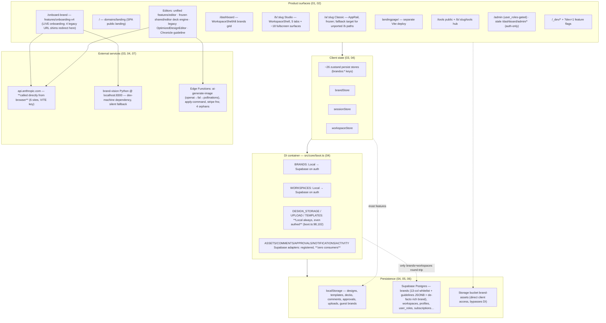
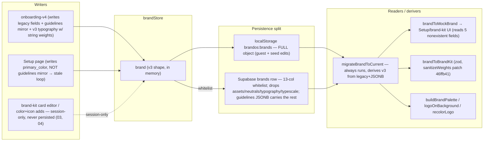
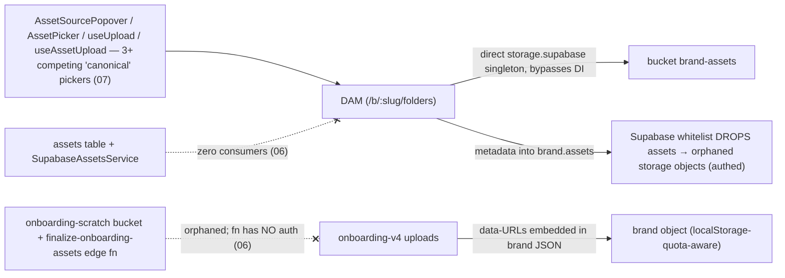
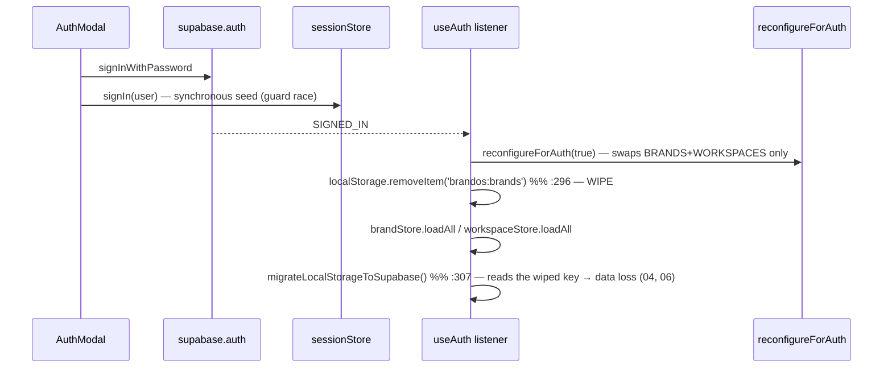
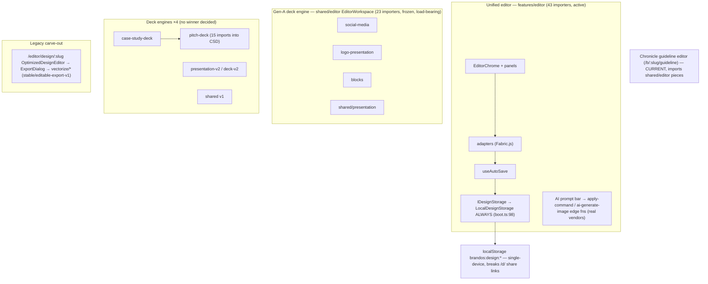

# 10 — Current System Map

> Consolidated from audits 00–09. This is the architecture that **exists on 2026-08-08**
> (baseline `new-ui` @ `46ffb41`), not a desired architecture. Every box below is backed
> by the referenced audit doc; nothing here is aspirational.

## 1. Whole-system map

Key structural facts (all VERIFIED in the cited audits):

- **Two persistence worlds.** Only brands + workspaces reach Supabase for authenticated
  users; designs, templates, uploads, decks, comments, approvals live in localStorage for
  everyone (04 §DI-reality, 03 §3). Public share routes (`/d/…`, bento) therefore only
  resolve in the creator's browser (03 §10).
- **The backend is one architecture ahead of the client**: tables + adapters exist for the
  localStorage-only features, registered in DI but never consumed (03, 06 §10).
- **The rich brand is `brands.guidelines` JSONB**, not the "canonical" v3 fields; v3 is
  re-derived per load by `migrateBrandToCurrent` (05 §2–4).

## 2. Brand data — representations and flow

Divergence points (05): whitelist drop (CRITICAL), stale `primary_color` vs
`guidelines.colorPalette` loop, string-vs-number font weights (producer still writes
strings), voice written to `voiceAndTone.voice` but read from `guidelines.voice`, logo
slot vocabularies with a polarity flip between resolvers.

## 3. Assets

## 4. Authentication & permissions

- Roles: `user_roles.role` → platformRole → `/admin` + ~18 RLS policies; `profiles.is_admin`
  → `useIsAdmin` → templates queue. No writer for `is_admin` exists; column possibly never
  deployed (06 §9, 05 §10).
- RLS holes verified: `wm_insert_admin` self-owner insert into any workspace;
  `profiles_select_by_member USING (true)`; era-1 demo brand updatable by all (06 §5).
- Dev-bypass login is compile-time gated (`import.meta.env.DEV`) — cannot ship (04 §2).

## 5. Design / editor system

Note: `EditorWorkspace` has exactly one implementation (`shared/editor/EditorWorkspace.tsx:177`);
`features/guidelines/editor` re-exports it (corrected in 03/07). The real naming trap is
`WorkspaceShellAlt.tsx` exporting a component named `WorkspaceShell`.

## 6. What "current" means per layer (synthesis)

| Layer | Current (active frontier) | Frozen but load-bearing | Legacy/orphaned |
|---|---|---|---|
| Onboarding | `features/onboarding-v4` + brand-vision | — | 4 URL shim families; v3 scratch backend |
| Workspace | `/dashboard` brands grid | WorkspaceShellAlt | orphaned `pages/dashboard` v5 chain |
| Brand home | Studio `/b/:slug` | Classic `/a/:slug` (fallback) | `/dashboard/brand/:slug` redirects |
| Brand kit | `features/brand-kit` (Studio) | `features/brandkit` domain layer (45 importers); `brand-kit-alt` (load-bearing in Studio settings!) | — |
| Guidelines | Chronicle (`features/guideline`) | legacy `features/guidelines` hub/canvas (Supabase-backed!) | brand-guides deck; blocks (UNKNOWN) |
| Editor | unified `features/editor` | `shared/editor` deck engine; vectorize export | OptimizedDesignEditor route |
| Decks | — (no winner) | all 4 engines frozen since 2026-05-19 | — |
| Persistence | Supabase: brands+workspaces only | localStorage: everything else | 6 zero-reader tables; 5 unconsumed adapters; 4 orphan edge fns |
| Auth | supabase.auth + sessionStore | user_roles RBAC | profiles.is_admin (no writer) |
