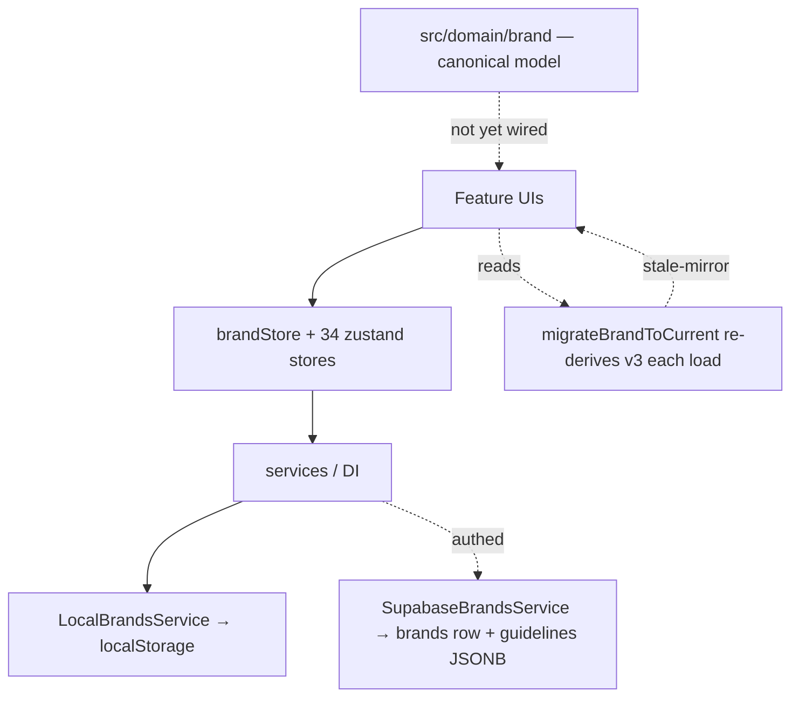
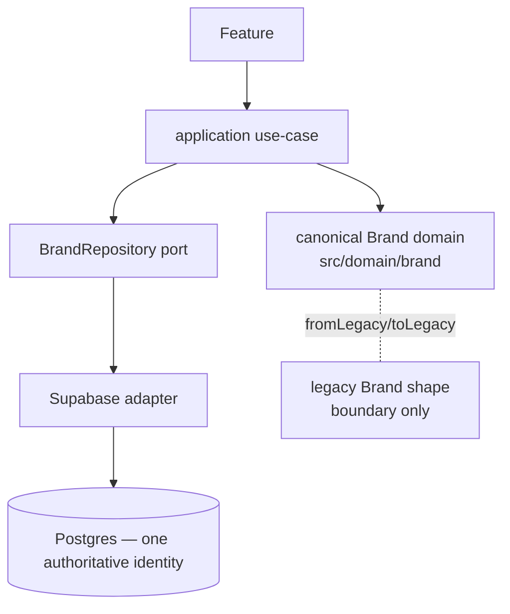

# BrandingOS — Execution Control Center

_Quick status page. Updated after every stage. Detailed docs live in
`docs/codebase-intelligence/` (audit), `docs/target-architecture/` (design),
`docs/phase-2/` (execution)._

## Current Position

> **Status vocabulary (corrected 2026-08-10):**
> **FOUNDATION COMPLETE** = contracts/impl/tests exist but **no production path consumes them**.
> **MIGRATION COMPLETE** = a real product path uses the new architecture AND its legacy path is
> no longer authoritative. "Complete" is never used loosely. A prior report over-claimed Stage 2D
> as complete — corrected below.

- [x] Phase 0 — Audit
- [x] Phase 1 — Target Architecture + Owner Decisions
- [x] Stage 1 — Safety (security migrations **011/012 DEPLOYED to production 2026-08-09**)
- [x] Stage 2A — Canonical Brand identity — **FOUNDATION COMPLETE**, now consumed live
- [x] Stage 2B — Canonical Brand persistence — migration **013 (`brands.identity`) DEPLOYED 2026-08-09**; identity blob now written+read live
- [x] Stage 2C — Asset / Logo / Font — **FOUNDATION COMPLETE** (no live consumer)
- [x] Stage 2D — Color System migration — **CODE MIGRATION COMPLETE; 013 DEPLOYED.** ColorsTab +
      Setup + ui-color-system write one canonical path (`changeBrandColors`); accent/neutrals now
      durably persist for authed via the identity blob (verified by reload tests).

### Brand System Finalization (2026-08-09) — post-013-deploy

Production migrations **011, 012, 013 confirmed remote** (via `supabase migration list --linked`);
009/010 confirmed absent. With 013 live:

- **Identity blob persistence LIVE.** `Brand.identity` (+`identitySchemaVersion`) carries the full
  canonical identity through the service layer → the `brands.identity` column (authed) /
  localStorage (guest). `toLegacyBrandPatch` emits it; `SupabaseBrandsService` maps the column.
- **Authed accent/neutrals data-loss CLOSED.** Those have no scalar column and were silently dropped
  on save for authed users; `fromLegacyBrand` now backfills them from the blob on read. Backfill is
  strictly **legacy-first (`base ?? blob`)** — a present legacy value (incl. Brand Board's
  accent/neutrals scalars) always wins, so a lagging blob can never revert any writer; it only
  recovers data the transport dropped. (Also backfills numeric font weights + rich voice.)
- **Strategy migrated to canonical.** New `changeBrandStrategy` use-case; StrategyTab reads canonical
  strategy and writes through it. `guidelines.strategy` remains the shared read-home so the
  still-legacy Setup surface stays consistent (no divergence, no revert). vision/values/positioning
  now survive reload with full fidelity.

### Finalization Batch 2 — THE AUTHORITY FLIP (2026-08-09)

The migration bridge (`base ?? blob` legacy-first backfill) is replaced by a hard flip: once a
brand carries a canonical identity blob, **the blob is the authority** and legacy fields are
one-way projections.

- **Flip mechanism.** `migrateBrandToCurrent` → new `hydrateFromCanonicalIdentity(brand)` runs on
  EVERY brand read. When `brand.identity` exists at the current schema version, it **hydrates**
  (overwrites) the brand's legacy/v3 fields — colorSystem, primaryColor/secondary/accent, neutrals,
  typography, fonts, tone, and `guidelines.strategy` — FROM the blob. So every reader (canonical-first
  AND direct `brand.primaryColor`/`guidelines.strategy` readers) sees canonical, and a stale legacy
  scalar can NEVER override it. A brand with no blob still bootstraps from legacy (unchanged).
  Logos are intentionally NOT hydrated (logo subsystem not yet canonical).
- **All CURRENT writers migrated to canonical ops** (so the blob is always current):
  - **Setup** (`setup.tsx`) — color → `changeBrandColors`, fonts (incl. uploaded files) →
    `changeBrandTypography`, tone → `changeBrandVoiceTone`, strategy(+about) → `changeBrandStrategy`.
    Only name/logos/publicUrl fall through to legacy `updateBrand`.
  - **Brand Board** (`BrandBoardPage.tsx`) — color + fonts → canonical ops; only `uiStyle` legacy.
  - **Typescale tool** (`brandStore.setTypescale`) — families → `changeBrandTypographyFamilies`.
  - **Brand Board LogosPanel** — now stages logos through `stageLogoAssignment` (proper `LogoRef
    {assetId}` + `brandAssets`), replacing the divergent URL-shaped `logoSystem` write.
- **`changeBrandStrategy`** extended with `aboutSections`; **`changeBrandTypography`** added (families
  + uploaded font files, so files reach the blob and survive hydration).
- **Guidelines is no longer identity persistence.** `guidelines.strategy` is hydrated from the blob
  on read (a projection). Onboarding-v4 create still writes legacy scalars/guidelines — that is the
  BOOTSTRAP path for brands that have no blob yet (safe: no blob ⇒ no flip).

## Brand System Migration — final subsystem status

| Subsystem | Status |
|---|---|
| **Color** (primary/secondary/accent/neutrals) | **CANONICAL — authority flipped.** One write (`changeBrandColors`); all CURRENT writers (ColorsTab, ui-color-system, Setup, Brand Board) route through it; blob wins on read. |
| **Typography** (families + uploaded files) | **CANONICAL — authority flipped.** `changeBrandTypography` (families + files); writers TypographyTab/Setup/Brand Board/Typescale canonical. (Numeric weights still have no editor — net-new.) |
| **Voice** (tone) | **CANONICAL — authority flipped** for the editable field (tone). Rich voice (do/don't/examples) persists in the blob but has **no editor** (net-new). |
| **Strategy** (mission/vision/values/positioning/about) | **CANONICAL — authority flipped.** `changeBrandStrategy`; StrategyTab + Setup both canonical; `guidelines.strategy` is a hydrated projection. |
| **Logo** | **PARTIAL — the one remaining vertical.** Refs (`logoSystem`) persist via the blob; the ONE staging authority (`stageLogoAssignment`) now used by Brand Board too. **BLOCKER:** durable **Asset RECORDS** (`brandAssets[]`) have no DB column — ids are re-derived from URL hashes on read, so "assetId is the durable ref" is not yet true. Closing it needs a `brand_assets` column (new migration, owner-deploy) or an AssetRepository over the existing `assets` table. Logos are NOT flipped, so they read from their always-current legacy home — safe. |
| **Canonical persistence** | Facade repository (`BRAND_REPOSITORY`) over the service layer, identity-column-backed (`brands.identity`, 013 DEPLOYED). Guest round-trips via localStorage. |

### Authority metrics — BEFORE → AFTER (the flip)

| Subsystem | CURRENT write authorities BEFORE | AFTER |
|---|---|---|
| Color | 5 (ColorsTab, ui-color-system, Setup, **Brand Board**, onboarding) — diverging | **1 canonical** (`changeBrandColors`) + onboarding-bootstrap |
| Typography | 5 (TypographyTab, Setup, **Brand Board**, **Typescale**, onboarding) | **1 canonical** (`changeBrandTypography`) + onboarding-bootstrap |
| Voice (tone) | 3 (VoiceTab, **Setup**, onboarding) | **1 canonical** (`changeBrandVoiceTone`) + onboarding-bootstrap |
| Strategy | 3 (StrategyTab, **Setup**, onboarding) | **1 canonical** (`changeBrandStrategy`) + onboarding-bootstrap |
| Logo | 4+ (LogosPanel divergent, LogoExportPanel, useAssetUpload, onboarding) | 1 staging authority (`stageLogoAssignment`); **records not yet durable — PARTIAL** |
| Read authority | legacy-first / v3-first mix | **identity blob wins on read** (`hydrateFromCanonicalIdentity`) |

**Legacy fields are now one-way projections** (written by `toLegacyBrandPatch`, hydrated from the blob
on read). No CURRENT surface writes a migrated identity field as an authority; onboarding-v4 create is
the only remaining legacy identity writer and it is the BOOTSTRAP path (fires only when no blob exists).

### B5 — remaining compatibility projections (kept, each with a deletion condition)

Nothing from this batch was DELETED (the writers were re-routed, not removed); the reduction is in
**authorities**, not files. These one-way projections remain and are intentional:

| Projection | Consumer | Reason kept | Deletion condition |
|---|---|---|---|
| Legacy scalars (`primaryColor`/`secondaryColor`/`fonts`/`tone`/`strategy`) | Frozen editors (`features/editor`, Classic `/a`), brand-consistency engine, render surfaces reading `brand.tone`/`primaryColor` | Many un-migrated + frozen readers | All readers read canonical `identity`/`colorSystem`/`typography` |
| `guidelines.strategy` (hydrated) | Setup `brandToMockBrand`, case-study-deck, social-media, brand-kit-cosmos, Classic guidelines (frozen) | Shared read-home + frozen consumers | Those readers read canonical `strategy` directly |
| `guidelines.colorPalette`/`voiceAndTone`/`logoSystem` | onboarding-v4 create (bootstrap), `ColorSystemModule` names, variant-studio, Classic (frozen) | Onboarding bootstrap + frozen | Onboarding create migrates to canonical + Classic retired |
| `logo`/`logoAssets`/`logoSystem` legacy mirror | All logo readers via `useBrandLogo` fallback | Logo subsystem not yet canonical | Logo durable Asset records land (Logo PARTIAL closes) |
| `BrandServiceRepository` facade (vs direct `SupabaseBrandRepository`) | `BRAND_REPOSITORY` DI | Inherits seed-brand handling + rich logo mapping the direct adapter lacks | Direct adapter gains seed handling + durable asset records |
| onboarding-v4 create legacy writes | Brand creation | Bootstrap for brands with no blob | Onboarding writes through canonical ops (net-new; safe as-is because no blob ⇒ no flip) |

## Current Architecture (as-is)

## Target Architecture (to-be)

## Current Source of Truth

| Concept | Today (legacy) | Canonical (new, `src/domain/brand`) |
|---|---|---|
| Brand identity | scattered: v3 fields + scalars + `guidelines` JSONB mirror (drifts) | `CanonicalBrand.identity` (one typed aggregate) |
| Color | `primaryColor` / `colorSystem` / `guidelines.colorPalette` | `identity.colors` (ColorSystem, roles) |
| Logo | `logo` / `logoAssets` / `logoSystem` / `guidelines.logoSystem` | `identity.logos` (LogoSystemRefs → asset ids) |
| Typography | `fonts` / `typography` / `guidelines.typography` (string weights!) | `identity.typography` (numeric weights) |
| Strategy/Voice | `strategy` / `tone` / `guidelines.strategy` / `voiceAndTone` | `identity.strategy` / `identity.voice` (unified) |

> Stage 2A builds the canonical column; it is **not yet wired** into read/write paths
> (that's 2B/2D). Legacy remains the live source of truth until then.

## BRAND SYSTEM: PARTIAL — one blocker (Logo durable Asset records)

Completion standard (2026-08-09, post-flip):

| ✔ | Criterion |
|---|---|
| ✅ | Color canonical (authority flipped) |
| ✅ | Typography canonical (families + uploaded files) |
| ✅ | Strategy canonical (flipped) |
| ✅ | Voice canonical for all editable fields (tone; rich voice = net-new, no editor) |
| ❌ | **Logo canonical** — refs persist via the blob, but durable Asset RECORDS don't |
| ✅ | Setup current identity writes canonical |
| ✅ | Brand Kit current identity writes canonical (N/A — Brand Kit is read-only/toast-only, no identity writes) |
| ✅ | Authenticated identity server-backed (`brands.identity`, 013 deployed) |
| ✅ | Canonical persisted identity wins after migration (the flip) |
| ✅ | Legacy fields cannot overwrite canonical data (hydration on read) |
| ✅ | Guidelines is not identity persistence (hydrated projection) |
| ❌ | **Asset refs for Logo are durable** — ids re-derived from URL hashes on read |
| ✅ | No competing current-product Brand write authority (color/typo/voice/strategy = 1 each; logo = 1 staging authority) |
| ✅ | Adversarial review clean (one StrategyTab revert risk found + fixed + re-verified) |
| ✅ | Tests / build / type gates green |

**Verdict: PARTIAL.** 13/15 met. The two open items are BOTH the Logo subsystem, blocked on the same
thing: **durable Asset records have no persistence home**. `brands` has no `brand_assets` column, so
`brandAssets[]` is re-derived from URL hashes on every read — meaning "assetId is the durable ref" is
not yet true. Closing it needs EITHER a new additive `brands.brand_assets` JSONB column (a migration
014, owner-deployed like 013) OR an `AssetRepository` over the existing `public.assets` table. Both are
a focused vertical of their own; not startable safely in-session without the migration deploy. Logos
are deliberately NOT flipped, so they read from their always-current legacy home — nothing is at risk
today.

## Other open items

- **Security migrations 011/012/013 — DEPLOYED to production 2026-08-09** (confirmed remote;
  009/010 absent). S1 CLOSED.
- **Real RBAC review** beyond the single `is_admin` boolean — still open (debt #1).
- **GitHub token** — removed from local config; **owner must revoke/rotate** it (still open).

## Current Technical Debt Baseline (frozen, ratcheted)

- TypeScript errors: **322** (frozen `.typecheck-baseline.txt`; CI blocks *new* errors).
- Circular deps: **10** (frozen `.madge-cycles-baseline.txt`).
- Unit/adapter tests: **1213 pass / 1 pre-existing fail** (`recolorLogo.test.ts`, backlog U1).
- Browser E2E: environmental block (Playwright headless-shell version mismatch).
- Lint: 0 errors / 228 warnings. Build: green.

## What Changed This Run

- Committed the accepted Phase-0/1 + Stage-1 baseline (docs + security migrations + CI gate).
- **Stage 2A:** `src/domain/brand/` canonical model — `CanonicalBrand`/`BrandIdentity` aggregate
  reusing the v3 value objects; zod boundary validation; `fromLegacyBrand` (fixes stale-mirror) +
  `toLegacyBrandPatch`; 16 tests. Adversarially reviewed.
- **Stage 2B:** `BrandRepository` port + pure row mappers + In-memory & Supabase adapters +
  additive migration 013 (`brands.identity` JSONB). Reads prefer stored identity (no
  re-derivation); writes are validated + server-backed; guidelines mirror untouched. Round-trip
  proven by unit tests + a real-PostgreSQL (PGlite) integration harness. Zero regressions; type
  baseline unchanged.

- **Stage 2C:** `src/domain/asset/` — canonical `Asset` (adds owner + lifecycle to the v3
  BrandAsset shape); ONE `classifyAsset` boundary; `LogoRef→Asset` / `FontToken→Asset` resolvers;
  `legacy-url:` ref minting. 13 tests. Existing classification sites → backlog B9–B11.
- **Stage 2D:** `src/application/brand/changeBrandColor.ts` — the canonical Color-System command,
  proven end-to-end (intent → use-case → canonical → repository → reload → same value; second
  consumer reads canonical; stale mirror cannot resurrect). 6 tests. Live-UI cutover + legacy
  removal deferred (deploy-gated on migration 013). Zero regressions.

## Next Stage (NOT started this run)

Autonomous window ends at 2D. Next is the **live cutover of the Color slice** once migration 013 is
deployed (register a `BrandRepository` in DI; point Brand Kit color save at `changeBrandColor`;
remove the legacy color write path), then subsequent identity subsystems (logo, typography) and the
asset-feature migration (backlog B9–B11). None of these are begun here.
