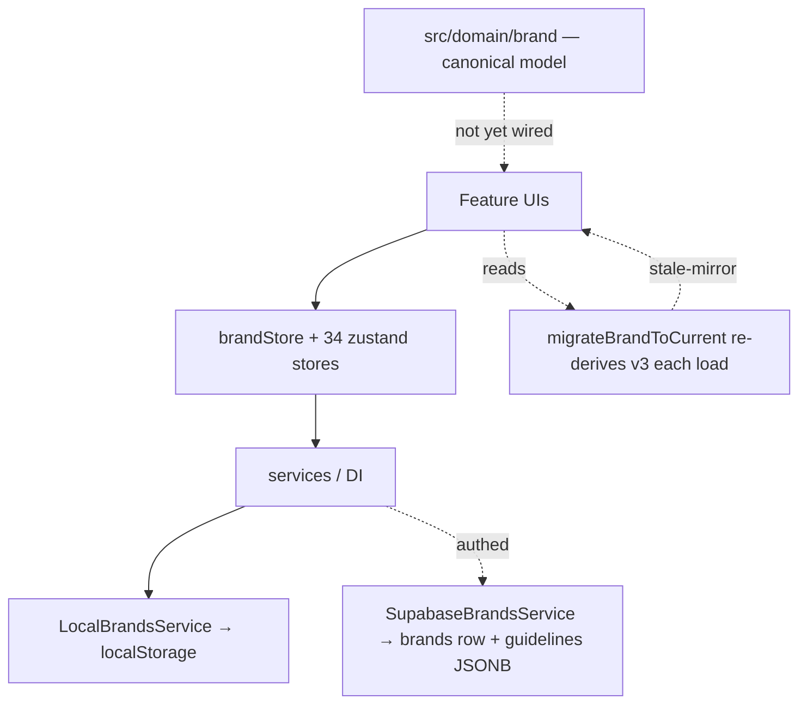
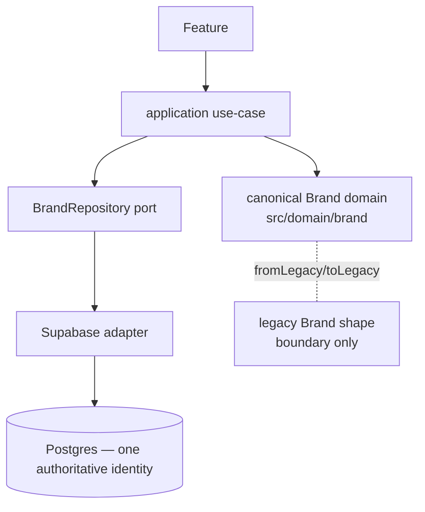

# BrandingOS — Execution Control Center

_Quick status page. Updated after every stage. Detailed docs live in
`docs/codebase-intelligence/` (audit), `docs/target-architecture/` (design),
`docs/phase-2/` (execution)._

## Current Position

- [x] Phase 0 — Audit
- [x] Phase 1 — Target Architecture + Owner Decisions
- [~] Stage 1 — Safety (7/8 gates PASS; **S1 = deploy 011/012 to prod BLOCKED on owner access**)
- [x] Stage 2A — Canonical Brand foundation
- [ ] Stage 2B — Canonical Brand persistence / repository
- [ ] Stage 2C — Asset / Logo / Font foundation
- [ ] Stage 2D — First feature migration (candidate: Color System in Brand Kit)

## Current Architecture (as-is)

## Target Architecture (to-be)

## Current Source of Truth

| Concept | Today (legacy) | Canonical (new, `src/domain/brand`) |
|---|---|---|
| Brand identity | scattered: v3 fields + scalars + `guidelines` JSONB mirror (drifts) | `CanonicalBrand.identity` (one typed aggregate) |
| Color | `primaryColor` / `colorSystem` / `guidelines.colorPalette` | `identity.colors` (ColorSystem, roles) |
| Logo | `logo` / `logoAssets` / `logoSystem` / `guidelines.logoSystem` | `identity.logos` (LogoSystemRefs → asset ids) |
| Typography | `fonts` / `typography` / `guidelines.typography` (string weights!) | `identity.typography` (numeric weights) |
| Strategy/Voice | `strategy` / `tone` / `guidelines.strategy` / `voiceAndTone` | `identity.strategy` / `identity.voice` (unified) |

> Stage 2A builds the canonical column; it is **not yet wired** into read/write paths
> (that's 2B/2D). Legacy remains the live source of truth until then.

## Current Blockers

- **S1 (production security deploy of migrations 011/012)** — BLOCKED: no production
  DB/management access in the execution environment. Fully prepared + pre-prod-verified;
  runbook at `docs/phase-2/security-deploy/03-PRODUCTION-RUNBOOK.md`. Owner action.
- **GitHub token** — removed from local config; **owner must revoke/rotate** it.

## Current Technical Debt Baseline (frozen, ratcheted)

- TypeScript errors: **324** (frozen `.typecheck-baseline.txt`; CI blocks *new* errors).
- Circular deps: **10** (frozen `.madge-cycles-baseline.txt`).
- Unit tests: **1164 pass / 1 pre-existing fail** (`recolorLogo.test.ts`).
- Browser E2E: environmental block (Playwright headless-shell version mismatch).
- Lint: 0 errors / 228 warnings.

## What Changed This Run

- Committed the accepted Phase-0/1 + Stage-1 baseline (docs + security migrations + CI gate).
- **Stage 2A:** new `src/domain/brand/` canonical model — `CanonicalBrand`/`BrandIdentity`
  aggregate reusing the correct v3 value objects; zod boundary validation; `fromLegacyBrand`
  (fixes the stale-mirror precedence) + `toLegacyBrandPatch`; 13 passing tests. Zero
  regressions; type baseline unchanged.

## Next Stage

**2B — Canonical Brand persistence.** Introduce a `BrandRepository` port + Supabase/local
adapters that round-trip the canonical identity (write→persist→read→same meaning), with the
canonical model as the write source and no stale-mirror overwrite. Additive migrations only;
no destructive column removal. Prod deploy stays gated on S1.
