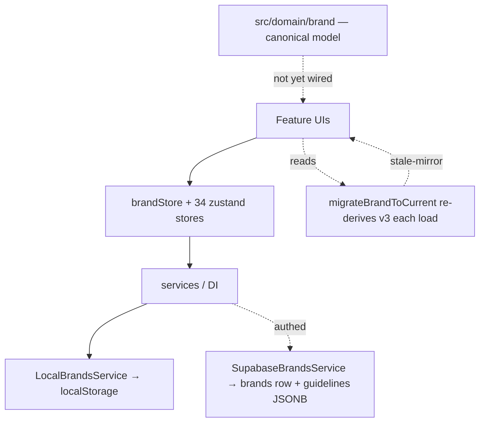
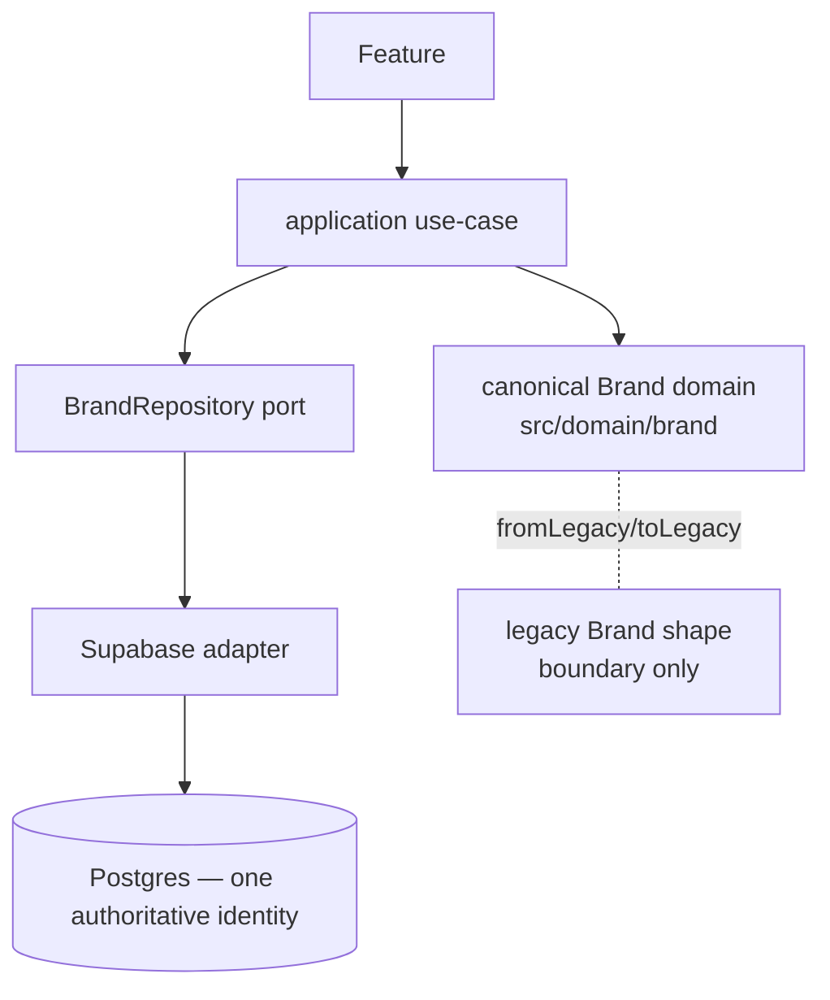

# BrandingOS — Execution Control Center

_Quick status page. Updated after every stage. Detailed docs live in
`docs/codebase-intelligence/` (audit), `docs/target-architecture/` (design),
`docs/phase-2/` (execution)._

## Current Position

> **Status vocabulary (corrected 2026-08-10):**
> **FOUNDATION COMPLETE** = contracts/impl/tests exist but **no production path consumes them**.
> **MIGRATION COMPLETE** = a real product path uses the new architecture AND its legacy path is
> no longer authoritative. "Complete" is never used loosely. A prior report over-claimed Stage 2D
> as complete — corrected below.

- [x] Phase 0 — Audit
- [x] Phase 1 — Target Architecture + Owner Decisions
- [x] Stage 1 — Safety (security migrations **011/012 DEPLOYED to production 2026-08-09**)
- [x] Stage 2A — Canonical Brand identity — **FOUNDATION COMPLETE**, now consumed live
- [x] Stage 2B — Canonical Brand persistence — migration **013 (`brands.identity`) DEPLOYED 2026-08-09**; identity blob now written+read live
- [x] Stage 2C — Asset / Logo / Font — **FOUNDATION COMPLETE** (no live consumer)
- [x] Stage 2D — Color System migration — **CODE MIGRATION COMPLETE; 013 DEPLOYED.** ColorsTab +
      Setup + ui-color-system write one canonical path (`changeBrandColors`); accent/neutrals now
      durably persist for authed via the identity blob (verified by reload tests).

### Brand System Finalization (2026-08-09) — post-013-deploy

Production migrations **011, 012, 013 confirmed remote** (via `supabase migration list --linked`);
009/010 confirmed absent. With 013 live:

- **Identity blob persistence LIVE.** `Brand.identity` (+`identitySchemaVersion`) carries the full
  canonical identity through the service layer → the `brands.identity` column (authed) /
  localStorage (guest). `toLegacyBrandPatch` emits it; `SupabaseBrandsService` maps the column.
- **Authed accent/neutrals data-loss CLOSED.** Those have no scalar column and were silently dropped
  on save for authed users; `fromLegacyBrand` now backfills them from the blob on read. Backfill is
  strictly **legacy-first (`base ?? blob`)** — a present legacy value (incl. Brand Board's
  accent/neutrals scalars) always wins, so a lagging blob can never revert any writer; it only
  recovers data the transport dropped. (Also backfills numeric font weights + rich voice.)
- **Strategy migrated to canonical.** New `changeBrandStrategy` use-case; StrategyTab reads canonical
  strategy and writes through it. `guidelines.strategy` remains the shared read-home so the
  still-legacy Setup surface stays consistent (no divergence, no revert). vision/values/positioning
  now survive reload with full fidelity.

## Brand System Migration (Batch A)

| Subsystem | Status |
|---|---|
| **Color** (primary/secondary/accent/neutrals) | **CODE MIGRATION COMPLETE** — one canonical write (`changeBrandColors`) for both live surfaces (ColorsTab + Setup); reads canonical; stale mirror can't resurrect. Accent/neutrals full-fidelity authed persistence needs 013. |
| **Typography** (families) | **CODE MIGRATION COMPLETE** — TypographyTab + Setup write canonical `typography`; paint-path reader repointed. Weights/uploaded-fonts/type-scale = not persisted today (foundation/net-new). |
| **Voice** (tone) | **CODE MIGRATION COMPLETE** for the editable field (tone). Rich voice (do/don't/examples) has **no editor** → FOUNDATION only. |
| **Strategy** | **CODE MIGRATION COMPLETE** — `changeBrandStrategy` use-case; StrategyTab reads canonical + writes through it. vision/values/positioning persist with full fidelity (013 blob + shared `guidelines.strategy` home). Setup still writes the same `guidelines.strategy` home (consistent; full canonical-authority for Setup deferred with its own migration). |
| **Logo** | **FOUNDATION + PARTIAL** — a canonical write path already exists (`logoSystem`+`brandAssets` via `stageLogoAssignment`); no active bug; `classifyAsset` **unwired**; onboarding writes legacy (minted at read). Full through-repository migration needs Asset persistence. **NOT migrated — the remaining Brand-System vertical.** Logos deliberately kept on their always-current legacy home (the blob does not read logos), so nothing is at risk. |
| **Canonical persistence** | Facade repository (`BRAND_REPOSITORY`) over the service layer, **now identity-column-backed**: canonical writes persist the full `identity` blob to `brands.identity` (013, DEPLOYED); reads backfill blob-only fields legacy-first. Guest round-trips the blob via localStorage. |
| **Legacy authority removal** | Color: ColorsTab scalar-only write removed; `buildColorSystem` mirror-preference removed; `mergeColorSystem` + `ColorPaletteEditor` deleted (type debt 324→322). Ongoing. |

### Authority metrics — BEFORE → AFTER (this batch)

| Metric | Before | After |
|---|---|---|
| Authoritative COLOR write paths | 2 (ColorsTab scalar-only + Setup) diverging | **1** (`changeBrandColors`) |
| Authoritative TYPOGRAPHY-family write paths | 2 (TypographyTab `fonts` + Setup `typography`) | **1** canonical (`typography`; `fonts` = one-way projection) |
| Paint-path readers on legacy-only fields | `brandTokenStyle` (fonts/primaryColor) | **canonical-first** |
| Stale-mirror override on color reload | yes (`buildColorSystem` preferred guidelines) | **eliminated** |
| Legacy Brand files/functions removed | — | `ColorPaletteEditor`, `mergeColorSystem`; type debt −2 |
| Remaining compatibility projections | — | 3 (see COMPATIBILITY-LEDGER: C1 scalar mirror, C2 `buildColorSystem` derive, C3 facade) |
| Exact blockers | — | migration 013 (accent/neutrals/typography-files/strategy-full full-fidelity authed persistence); prod access |

## Current Architecture (as-is)

## Target Architecture (to-be)

## Current Source of Truth

| Concept | Today (legacy) | Canonical (new, `src/domain/brand`) |
|---|---|---|
| Brand identity | scattered: v3 fields + scalars + `guidelines` JSONB mirror (drifts) | `CanonicalBrand.identity` (one typed aggregate) |
| Color | `primaryColor` / `colorSystem` / `guidelines.colorPalette` | `identity.colors` (ColorSystem, roles) |
| Logo | `logo` / `logoAssets` / `logoSystem` / `guidelines.logoSystem` | `identity.logos` (LogoSystemRefs → asset ids) |
| Typography | `fonts` / `typography` / `guidelines.typography` (string weights!) | `identity.typography` (numeric weights) |
| Strategy/Voice | `strategy` / `tone` / `guidelines.strategy` / `voiceAndTone` | `identity.strategy` / `identity.voice` (unified) |

> Stage 2A builds the canonical column; it is **not yet wired** into read/write paths
> (that's 2B/2D). Legacy remains the live source of truth until then.

## Current Blockers

- **Security migrations 011/012/013 — DEPLOYED to production 2026-08-09** (confirmed remote;
  009/010 absent). S1 CLOSED.
- **Real RBAC review** beyond the single `is_admin` boolean — still open (debt #1).
- **GitHub token** — removed from local config; **owner must revoke/rotate** it (still open).
- **Logo vertical** — the last un-migrated Brand-System subsystem (needs Asset persistence +
  onboarding write migration). Safe today (logos read from their legacy home, not the blob).
- **Setup full canonical-authority** — Setup still writes `guidelines.strategy` directly (shared,
  consistent home). Flipping strategy to blob-authority is gated on migrating Setup's read+write.

## Current Technical Debt Baseline (frozen, ratcheted)

- TypeScript errors: **322** (frozen `.typecheck-baseline.txt`; CI blocks *new* errors).
- Circular deps: **10** (frozen `.madge-cycles-baseline.txt`).
- Unit/adapter tests: **1213 pass / 1 pre-existing fail** (`recolorLogo.test.ts`, backlog U1).
- Browser E2E: environmental block (Playwright headless-shell version mismatch).
- Lint: 0 errors / 228 warnings. Build: green.

## What Changed This Run

- Committed the accepted Phase-0/1 + Stage-1 baseline (docs + security migrations + CI gate).
- **Stage 2A:** `src/domain/brand/` canonical model — `CanonicalBrand`/`BrandIdentity` aggregate
  reusing the v3 value objects; zod boundary validation; `fromLegacyBrand` (fixes stale-mirror) +
  `toLegacyBrandPatch`; 16 tests. Adversarially reviewed.
- **Stage 2B:** `BrandRepository` port + pure row mappers + In-memory & Supabase adapters +
  additive migration 013 (`brands.identity` JSONB). Reads prefer stored identity (no
  re-derivation); writes are validated + server-backed; guidelines mirror untouched. Round-trip
  proven by unit tests + a real-PostgreSQL (PGlite) integration harness. Zero regressions; type
  baseline unchanged.

- **Stage 2C:** `src/domain/asset/` — canonical `Asset` (adds owner + lifecycle to the v3
  BrandAsset shape); ONE `classifyAsset` boundary; `LogoRef→Asset` / `FontToken→Asset` resolvers;
  `legacy-url:` ref minting. 13 tests. Existing classification sites → backlog B9–B11.
- **Stage 2D:** `src/application/brand/changeBrandColor.ts` — the canonical Color-System command,
  proven end-to-end (intent → use-case → canonical → repository → reload → same value; second
  consumer reads canonical; stale mirror cannot resurrect). 6 tests. Live-UI cutover + legacy
  removal deferred (deploy-gated on migration 013). Zero regressions.

## Next Stage (NOT started this run)

Autonomous window ends at 2D. Next is the **live cutover of the Color slice** once migration 013 is
deployed (register a `BrandRepository` in DI; point Brand Kit color save at `changeBrandColor`;
remove the legacy color write path), then subsequent identity subsystems (logo, typography) and the
asset-feature migration (backlog B9–B11). None of these are begun here.
