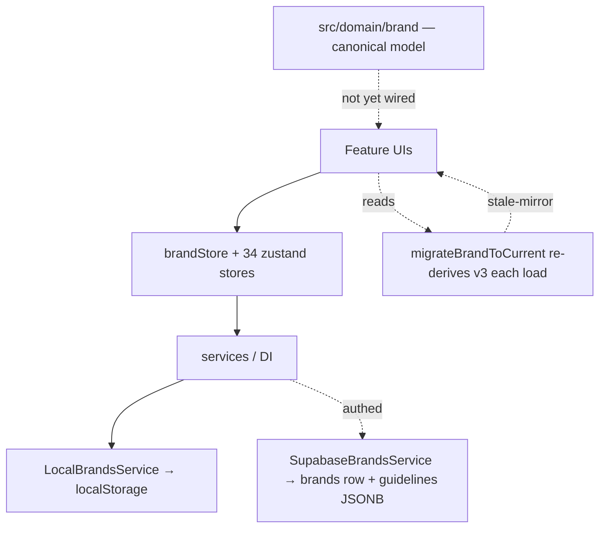
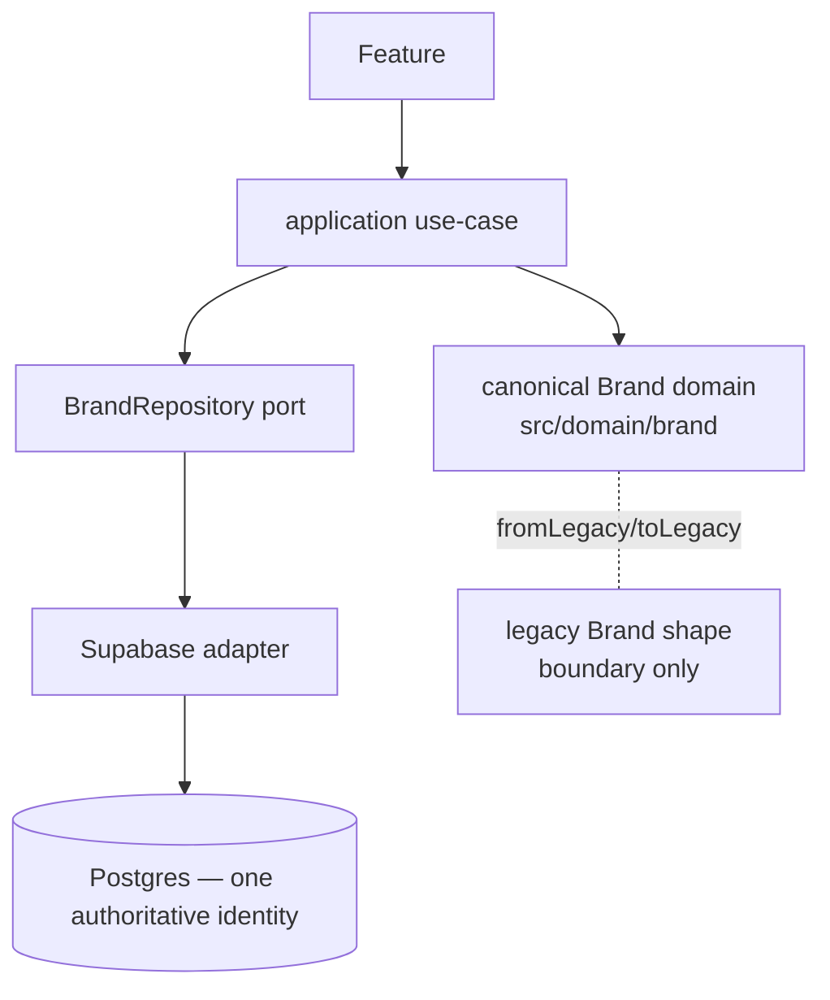

# BrandingOS — Execution Control Center

_Quick status page. Updated after every stage. Detailed docs live in
`docs/codebase-intelligence/` (audit), `docs/target-architecture/` (design),
`docs/phase-2/` (execution)._

## Current Position

> **Status vocabulary (corrected 2026-08-10):**
> **FOUNDATION COMPLETE** = contracts/impl/tests exist but **no production path consumes them**.
> **MIGRATION COMPLETE** = a real product path uses the new architecture AND its legacy path is
> no longer authoritative. "Complete" is never used loosely. A prior report over-claimed Stage 2D
> as complete — corrected below.

- [x] Phase 0 — Audit
- [x] Phase 1 — Target Architecture + Owner Decisions
- [~] Stage 1 — Safety (7/8 gates PASS; **S1 = deploy 011/012 to prod BLOCKED on owner access**)
- [x] Stage 2A — Canonical Brand identity — **FOUNDATION COMPLETE** (no live consumer)
- [x] Stage 2B — Canonical Brand persistence/repository — **FOUNDATION COMPLETE** (not wired into DI/app; schema 013 deploy-pending)
- [x] Stage 2C — Asset / Logo / Font — **FOUNDATION COMPLETE** (no live consumer)
- [x] Stage 2D — Color System migration — **CODE CUTOVER COMPLETE / PRODUCTION CUTOVER: partial.**
      The real dedicated color editor (Settings dialog **ColorsTab**, reachable via Identity →
      Colors → Edit) now reads canonical `colorSystem` and writes through `changeBrandColors` →
      `BrandRepository` (wired into the real DI). The root stale-mirror bug is fixed at source
      (`buildColorSystem` prefers the fresh scalar). **Guest = production-complete today** (no DB
      change needed — color rides existing columns). **Authed = server-backed + verified**, works
      today via existing `primary_color`/`secondary_color` columns; full-fidelity identity-column
      persistence lands with migration 013 (deploy-gated). Setup + Brand Kit card editor are
      separate color surfaces (Setup writes a consistent representation; card editor is toast-only)
      — next to migrate, tracked in the backlog.

## Current Architecture (as-is)

## Target Architecture (to-be)

## Current Source of Truth

| Concept | Today (legacy) | Canonical (new, `src/domain/brand`) |
|---|---|---|
| Brand identity | scattered: v3 fields + scalars + `guidelines` JSONB mirror (drifts) | `CanonicalBrand.identity` (one typed aggregate) |
| Color | `primaryColor` / `colorSystem` / `guidelines.colorPalette` | `identity.colors` (ColorSystem, roles) |
| Logo | `logo` / `logoAssets` / `logoSystem` / `guidelines.logoSystem` | `identity.logos` (LogoSystemRefs → asset ids) |
| Typography | `fonts` / `typography` / `guidelines.typography` (string weights!) | `identity.typography` (numeric weights) |
| Strategy/Voice | `strategy` / `tone` / `guidelines.strategy` / `voiceAndTone` | `identity.strategy` / `identity.voice` (unified) |

> Stage 2A builds the canonical column; it is **not yet wired** into read/write paths
> (that's 2B/2D). Legacy remains the live source of truth until then.

## Current Blockers

- **S1 (production security deploy of migrations 011/012)** — BLOCKED: no production
  DB/management access in the execution environment. Fully prepared + pre-prod-verified;
  runbook at `docs/phase-2/security-deploy/03-PRODUCTION-RUNBOOK.md`. Owner action.
- **GitHub token** — removed from local config; **owner must revoke/rotate** it.

## Current Technical Debt Baseline (frozen, ratcheted)

- TypeScript errors: **324** (frozen `.typecheck-baseline.txt`; CI blocks *new* errors).
- Circular deps: **10** (frozen `.madge-cycles-baseline.txt`).
- Unit tests: **1164 pass / 1 pre-existing fail** (`recolorLogo.test.ts`).
- Browser E2E: environmental block (Playwright headless-shell version mismatch).
- Lint: 0 errors / 228 warnings.

## What Changed This Run

- Committed the accepted Phase-0/1 + Stage-1 baseline (docs + security migrations + CI gate).
- **Stage 2A:** `src/domain/brand/` canonical model — `CanonicalBrand`/`BrandIdentity` aggregate
  reusing the v3 value objects; zod boundary validation; `fromLegacyBrand` (fixes stale-mirror) +
  `toLegacyBrandPatch`; 16 tests. Adversarially reviewed.
- **Stage 2B:** `BrandRepository` port + pure row mappers + In-memory & Supabase adapters +
  additive migration 013 (`brands.identity` JSONB). Reads prefer stored identity (no
  re-derivation); writes are validated + server-backed; guidelines mirror untouched. Round-trip
  proven by unit tests + a real-PostgreSQL (PGlite) integration harness. Zero regressions; type
  baseline unchanged.

- **Stage 2C:** `src/domain/asset/` — canonical `Asset` (adds owner + lifecycle to the v3
  BrandAsset shape); ONE `classifyAsset` boundary; `LogoRef→Asset` / `FontToken→Asset` resolvers;
  `legacy-url:` ref minting. 13 tests. Existing classification sites → backlog B9–B11.
- **Stage 2D:** `src/application/brand/changeBrandColor.ts` — the canonical Color-System command,
  proven end-to-end (intent → use-case → canonical → repository → reload → same value; second
  consumer reads canonical; stale mirror cannot resurrect). 6 tests. Live-UI cutover + legacy
  removal deferred (deploy-gated on migration 013). Zero regressions.

## Next Stage (NOT started this run)

Autonomous window ends at 2D. Next is the **live cutover of the Color slice** once migration 013 is
deployed (register a `BrandRepository` in DI; point Brand Kit color save at `changeBrandColor`;
remove the legacy color write path), then subsequent identity subsystems (logo, typography) and the
asset-feature migration (backlog B9–B11). None of these are begun here.
