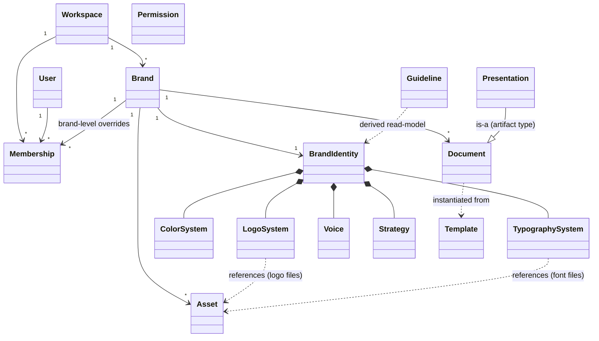
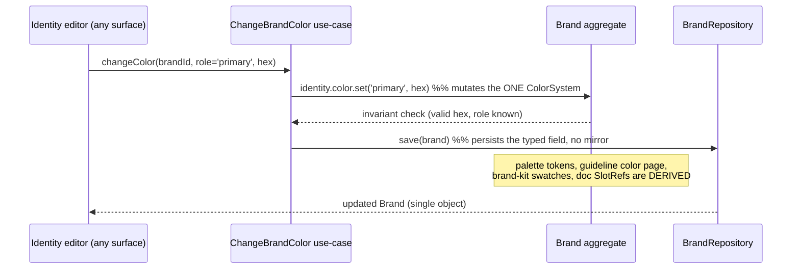
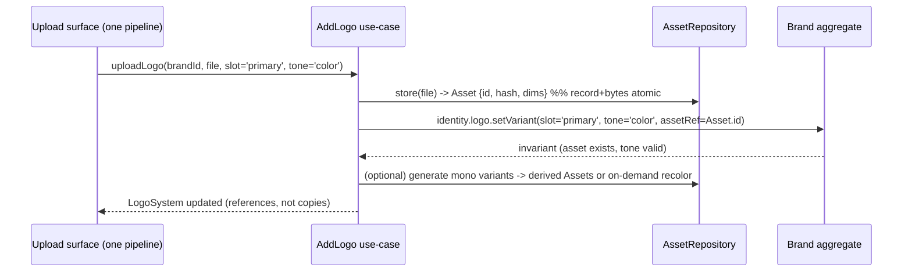

# 01 — Canonical Domain Model

> Batch 2. The future business/domain model, designed **independently** of React, Supabase,
> Zustand, localStorage, and current DB columns. Persistence/compatibility is deliberately absent
> here — it belongs to 03 (database) and 04 (migration). Everything here is **PROPOSAL** unless it
> cites current code as **VERIFIED** context.
>
> The north star: **exactly one canonical representation** for Brand, Logo System, Color System,
> Typography, and Assets — directly fixing the multiple-simultaneously-authoritative
> representations catalogued in `05-SOURCE-OF-TRUTH.md`.

> **Owner-decision amendments (2026-08-09) — apply when reading this doc** (authoritative text in
> `05-OWNER-DECISIONS.md`):
> - **D3 / C9:** "one canonical representation" means **one authoritative *domain* representation
>   with no mirror** — it does **not** mandate one physical JSONB blob. Identity sub-systems may be
>   typed sub-entities persisted in normalized structures and/or bounded JSONB (an engineering
>   choice, see 03). The invariant is *no duplicated writable copy* + explicit stored schema version.
> - **D1 / C3:** **Guideline is a stored artifact, not a zero-storage read-model.** Correct §7 and
>   the SoT table below: a Guideline is a `Document` (artifact_type=guideline) that *references*
>   live identity for its brand pages **plus** an authored overlay (custom pages, prose, order). It
>   never holds a canonical copy of logo/color/typography.
> - **D8 / C8:** identity→document propagation is **explicit/opt-in** ("refresh brand styles" per
>   document), never automatic reactive rewrite (§6). AI is consumed as **task-level capabilities**,
>   not vendor/model names.
> - **D5:** anonymous onboarding produces a **temporary versioned local/session draft** that is
>   **atomically claimed** into the canonical Brand on sign-in; the draft is deleted only *after*
>   successful server persistence (no destructive cleanup before a successful claim).

## 0. The one rule that dissolves the 05 problems

> **Store the identity once, in typed fields. Derive everything else. Never mirror.**

Audit 05 (VERIFIED) found the *de-facto* persisted brand is the `brands.guidelines` JSONB blob,
while the "canonical" v3 fields are re-derived each load — producing stale-mirror loops (a Setup
color edit reverts because the loader prefers the un-updated JSONB mirror; 11 §4). The target
**eliminates the mirror entirely**: the Brand Identity is the single typed source; the Guideline
document, the Brand-Kit view, palette tokens, and exports are all **derived read-models**, never
alternate writable copies.

## 1. Aggregates & entities (overview)

**Aggregate roots** (consistency boundaries): `Workspace`, `Brand`, `Document`, `Template`,
`Asset`. `BrandIdentity` and its sub-objects (`LogoSystem`, `ColorSystem`, `TypographySystem`,
`Voice`, `Strategy`) are **value objects owned by the `Brand` aggregate** — they have no identity
of their own and are only mutated through the Brand. `Guideline` is a **derived read-model**, not
a stored aggregate (see §7).

---

## 2. Entity specifications

Each: **Responsibility · Identity · Ownership · Lifecycle · Relationships · Mutable · Derived ·
Invariants.**

### Workspace (aggregate root)
- **Responsibility:** tenant boundary + billing unit + membership container.
- **Identity:** `workspaceId` (uuid). `slug` unique, human-facing.
- **Ownership:** an owning `User` (`ownerId`); self-owned.
- **Lifecycle:** created on signup (personal workspace) or explicitly; deleted only by owner
  (cascades brands).
- **Relationships:** has many `Membership`, many `Brand`, one `Subscription/plan`.
- **Mutable:** name, slug, logo, settings, plan.
- **Derived:** seat usage, brand count (vs plan limits).
- **Invariants:** exactly one `owner` membership; slug globally unique; every brand belongs to
  exactly one workspace.

### User
- **Responsibility:** an authenticated person (identity + profile).
- **Identity:** `userId` (uuid, = auth identity). `email` unique.
- **Ownership:** self.
- **Lifecycle:** created by auth signup → triggers personal workspace + owner membership.
- **Relationships:** many `Membership`; many owned `Workspace`.
- **Mutable:** displayName, avatar, preferences.
- **Derived:** effective roles (from memberships + platform role).
- **Invariants:** email unique; a `platformRole` (user/admin) distinct from workspace roles (§ Permissions).

### Membership (relationship entity)
- **Responsibility:** binds a `User` to a `Workspace` (and optionally to a specific `Brand`) with
  a `role`.
- **Identity:** `(workspaceId, userId)` unique; optional `brandId` for brand-level override.
- **Ownership:** the workspace.
- **Lifecycle:** created by owner-bootstrap or admin-invite; deleted by admin (never the owner row).
- **Relationships:** → Workspace, → User, → optional Brand.
- **Mutable:** role (except cannot set/seize `owner` — enforced, see 12/03).
- **Derived:** effective capability (role → permissions).
- **Invariants:** role ∈ {owner, admin, editor, exporter, viewer}; exactly one owner per
  workspace; brand override, if present, narrows/widens within the same workspace only.

### Brand (aggregate root — the heart)
- **Responsibility:** owns one canonical `BrandIdentity` and all brand-scoped content (assets,
  documents, publications).
- **Identity:** `brandId` (uuid). `slug` unique **within workspace** (see §8 — resolves the
  underscore/hyphen dialect split from 07).
- **Ownership:** a `Workspace`.
- **Lifecycle:** created via onboarding (AI-derived identity) or blank; archived/deleted with
  cascade.
- **Relationships:** 1–1 `BrandIdentity`; many `Asset`, `Document`, `Membership` overrides,
  `Publication`.
- **Mutable:** name, slug, identity (via identity commands), visibility.
- **Derived:** completeness score; public URL; brand palette tokens; guideline read-model.
- **Invariants:** always has a `BrandIdentity` (possibly partial); `schemaVersion` explicit and
  stored (no per-load migration — fixes 05 §3).

### BrandIdentity (value object, owned by Brand) — **the single source of truth**
- **Responsibility:** the complete, typed brand identity. **This is the object that changes when a
  user edits any identity attribute.**
- **Identity:** none (value object; identified by its Brand).
- **Composition:** `LogoSystem`, `ColorSystem`, `TypographySystem`, `Voice`, `Strategy`.
- **Mutable:** only via typed identity commands on the Brand aggregate.
- **Derived:** nothing stored twice. Palette tokens, guideline pages, brand-kit cards, and exports
  are read-models computed from this.
- **Invariants:** no field of BrandIdentity is duplicated anywhere else in the system; there is no
  parallel "guidelines" copy of colors/logos/typography.

### LogoSystem (value object) — **canonical logo representation**
- **Responsibility:** the brand's logo in all its variants.
- **Model (PROPOSAL):** a set of **logo slots** with a fixed, single vocabulary (resolves the 4
  disagreeing slot vocabularies in 05 §Logo): `primary`, `secondary`, `icon`/`mark`,
  `wordmark`, plus tone variants `{ color, mono-black, mono-white }` per slot.
  - Each concrete variant is a **reference to an `Asset`** (the stored file) + metadata
    `{ tone, background-affinity }`. **Stored once** (the Asset); recolored/mono variants are
    either (a) stored derived Assets (if user-edited) or (b) computed on demand by `recolorLogo`.
- **Derived:** "best logo for background X" — computed by the single `logoOnBackground` resolver
  (VERIFIED mandatory helper), never re-implemented.
- **Invariants:** every slot variant points at a valid Asset; tone labels drive contrast
  selection (one polarity convention — fixes the light/dark flip in 05 §Logo).

### ColorSystem (value object) — **canonical color representation**
- **Responsibility:** brand colors by **role**.
- **Model:** typed roles `primary`, `secondary`, `accent`, `neutrals[]`, each a `ColorToken`
  `{ hex, rgb, name?, usage? }`. **This is the only place a brand color is authoritative.**
- **Derived:** the full surface palette (`brandPalette` tokens: page/surface/elevated/subtle/
  brand/inverted) is **computed** by `buildBrandPalette` (VERIFIED mandatory helper). Contrast
  decisions go through the one contrast module (fixes the ~15 contrast impls / 3 formulas in 07).
- **Invariants:** `primary` required once identity is "complete"; palette is never stored, always
  derived; a single color engine owns all hex/HSL math (resolves 07's 3-engine split — **PRODUCT
  DECISION REQUIRED**: which engine survives).

### TypographySystem (value object) — **canonical typography representation**
- **Responsibility:** brand fonts + scale.
- **Model:** `heading` and `body` font families, each `{ family, source, weights: number[],
  fontFile?: AssetRef }`; a `typescale` (role → size/line-height).
- **Mutable:** families, weights (**typed as `number[]`** — fixes the string-weight drift that
  46ffb41 only patched at one consumer; 05 §Typography), scale.
- **Derived:** CSS variables / `@font-face` for rendering.
- **Invariants:** weights are numbers at the domain boundary (parsing/coercion happens once, at
  ingestion, not scattered); uploaded font files are `Asset`s referenced here (not inlined).

### Voice & Strategy (value objects)
- **Responsibility:** brand voice/tone and strategy (mission, audience, positioning).
- **Model:** structured `Voice { tone, doList, dontList, sample }`, `Strategy { mission, vision,
  audience, positioning, values[] }`. (Fixes 05's "voice written to `voiceAndTone.voice`, read
  from `guidelines.voice`, UI renders `brand.tone`" three-way split — **one field, one path**.)
- **Invariants:** single canonical field per concept; UI reads what writers write.

### Asset (aggregate root) — **canonical asset representation**
- **Responsibility:** any stored binary the brand owns (uploaded logo, photo, font file,
  AI-generated image, exported artifact).
- **Identity:** `assetId` (uuid) + content hash (dedup).
- **Ownership:** a `Brand` (some workspace-level later).
- **Lifecycle:** uploaded/generated → stored → referenced → (soft) deleted; orphan-swept.
- **Relationships:** referenced by LogoSystem, TypographySystem, Documents; grouped by folder/tag.
- **Mutable:** metadata (name, folder, tags), not bytes (new version = new Asset or explicit
  version chain).
- **Derived:** thumbnails, dimensions, dominant colors.
- **Invariants:** **the record and the bytes are one atomic thing** — an asset is never "bytes in
  a bucket with no record" (fixes 04/11: authed DAM upload orphaned the file because the record
  was dropped by the brand whitelist). Store once; variants reference.

### Document (aggregate root) — **canonical design/deliverable representation**
- **Responsibility:** an editable brand deliverable (design, social post, presentation, mockup,
  guideline-instance).
- **Identity:** `documentId` (uuid), `slug` within brand.
- **Ownership:** a `Brand`.
- **Lifecycle:** created (blank / from template / from AI) → edited (autosave) → published/exported
  → archived.
- **Model:** `{ artifactType, canonical scene-graph, brandRefs (SlotRefs into identity),
  thumbnail }`. Brand tokens in the doc are **references**, not baked copies, so an identity change
  can propagate (see §6).
- **Mutable:** scene-graph, name; via editor commands.
- **Derived:** thumbnail, export renditions.
- **Invariants:** persisted server-side and cross-device (fixes 04: designs were localStorage-only
  → `/d/` shares broken); `artifactType` selects the editor adapter (02 Batch 4).

### Template (aggregate root)
- **Responsibility:** a **brand-agnostic** starting point for a Document.
- **Identity:** `templateId`, category, source `{ curated | ai | user_uploaded }`, visibility.
- **Lifecycle:** authored / saved-from-document (`convertToTemplate` replaces literal brand values
  with `SlotRef`s) → moderated (if public) → instantiated.
- **Relationships:** instantiated into `Document` (`applyBrandToDocument` binds SlotRefs to a
  brand's identity).
- **Invariants:** contains **no** concrete brand values — only SlotRefs + neutral defaults;
  round-trips (instance→template→instance) are lossless.

### Guideline (derived read-model — **not a stored aggregate**)
- **Responsibility:** the brand-guideline document (cover, logo, color, typography, voice pages).
- **Model:** **projected** from `BrandIdentity` (+ optional authored annotations stored as a thin
  overlay, not a copy of identity).
- **Invariants:** guideline colors/logos/type are **always** the live identity — there is no
  writable `guidelines.colorPalette` that can drift (the root cause in 05/11 §4). If a user
  "edits the guideline's primary color," the command edits `ColorSystem`, and the guideline
  re-projects.

### Presentation / Deck (artifact type of Document)
- **Responsibility:** slide-based deliverables.
- **Model:** a `Document` with `artifactType = presentation`, rendered by the presentation editor
  adapter. **PRODUCT DECISION REQUIRED** (00 §H): whether the 4 legacy engines collapse into this
  one adapter or one engine is chosen. Domain-wise it is one entity regardless.

### Permission (policy, not stored entity)
- **Responsibility:** decide if `User` may do `Action` on `Resource`.
- **Model:** derived from workspace `Membership.role` (+ optional brand override) + `platformRole`
  + resource visibility (public read). Enforced **server-side** (RLS + use-case guards), never
  trusted from the client (03 authz section).
- **Invariants:** authorization cannot rely on frontend checks; owner protection and no
  cross-tenant escalation (per migration 011 / doc 12).

---

## 3. The single-source-of-truth table (the deliverable of Batch 2)

| Concept | ONE canonical home | Derived read-models (never writable copies) |
|---|---|---|
| Brand identity | `Brand.identity` (typed value object) | guideline pages, brand-kit cards, exports |
| Logo | `LogoSystem` slots → `Asset` refs | on-bg logo pick, recolored/mono variants |
| Color | `ColorSystem` roles (`ColorToken`) | `brandPalette` surface tokens, contrast decisions |
| Typography | `TypographySystem` (numeric weights, font `Asset` refs) | CSS vars / `@font-face` |
| Assets | `Asset` (record+bytes atomic, content-hash dedup) | thumbnails, variants |
| Voice/Strategy | single typed fields on identity | guideline voice/strategy pages |
| Documents | `Document` (server-persisted scene-graph) | thumbnails, export renditions |

This table is the contract 03 (database) and 04 (migration) must honor.

---

## 4. Scenario — user changes the brand primary color (PROPOSAL)

- **What canonical object changes:** `Brand.identity.colorSystem.primary`. Nothing else.
- **What persists:** that typed field (03 decides column vs JSONB; either way it is the *only*
  writable copy).
- **What is derived:** `brandPalette` surface tokens; the guideline color page; brand-kit
  swatches; any Document referencing the primary SlotRef.
- **How consumers get the update:** they read the identity (or a query/read-model over it). No
  consumer holds a private copy. **The 05/11 stale-mirror revert is structurally impossible** —
  there is no `guidelines.colorPalette` to fall back to.

## 5. Scenario — user uploads a logo (PROPOSAL)

- **What the Asset is:** the uploaded file as a first-class `Asset` (id + content hash), stored
  **once**, record and bytes atomic.
- **What links it to LogoSystem:** an `AssetRef` in the `primary/color` slot — a reference, not an
  embedded data-URL (fixes onboarding-v4 embedding data-URLs in brand JSON — 03/04).
- **How variants are represented:** tone variants `{color, mono-black, mono-white}` per slot;
  either stored derived Assets (if hand-edited) or computed by `recolorLogo`. Contrast-appropriate
  selection is always via `logoOnBackground`.
- **Stored once vs derived:** the source file is stored; recolors/mono/thumbnails are derived.

## 6. How an identity change reaches Brand Kit, Guidelines, Templates, Editor, Exports

Because every surface consumes **references/read-models** over the one identity:

- **Brand Kit** renders the identity directly (view) or issues identity commands (edit) — same
  object, no session-only overlay (fixes 03's session-only adds that never persist).
- **Guidelines** re-projects from identity on read (§7) — always current.
- **Templates** hold `SlotRef`s; instantiation binds them at apply-time; a later identity change
  re-binds on next open (or via an explicit "refresh brand" command).
- **Editor/Documents** hold `SlotRef`s in the scene-graph; a brand-token change propagates to open
  docs via the token layer.
- **Exports** are pure functions of identity + document at export time.

## 7. What is stored vs derived (explicit, to prevent regression)

- **Stored:** Workspace, Membership, Brand + typed identity, Asset (record+bytes), Document,
  Template, Publication, authored guideline annotations (thin overlay only).
- **Derived (never persisted as a writable copy):** brand palette tokens, guideline pages,
  brand-kit cards, logo-on-background choices, contrast results, thumbnails, export renditions,
  completeness scores, effective permissions.

## 8. Ambiguities eliminated (traceability to 05/07)

| 05/07 finding | Target resolution |
|---|---|
| `guidelines` JSONB is de-facto truth; v3 re-derived each load → stale loops | Identity is the one typed source; guideline is a derived read-model; no mirror |
| 4 logo slot vocabularies + polarity flip | one slot vocabulary + one tone/polarity convention; `logoOnBackground` is the only resolver |
| string vs number font weights | numeric weights at the domain boundary; coercion once at ingestion |
| voice written/read/rendered in 3 places | one `Voice` value object; one read/write path |
| assets `[]` on authed save; bytes orphaned | Asset record+bytes atomic; identity holds refs |
| 3 color engines / 15 contrast impls | one color engine (**decision required**) + one contrast module |
| 2 slug dialects | slug canonicalized (hyphen) + unique within workspace (03 detail) |
| designs localStorage-only | Document persisted server-side, cross-device |

## 9. Cross-check against Phase 0

Every "current" claim above cites a Phase-0 audit (05, 07, 03, 04, 11); every design choice is
tagged PROPOSAL or PRODUCT DECISION REQUIRED. The model does **not** design around the legacy
schema (per Batch-2 instruction) — compatibility is 04's job. Open product decisions from 00
(deck engine, approvals, analytics, marketplace, anonymous onboarding, legacy guideline data) and
the color-engine choice are surfaced, not silently resolved.
