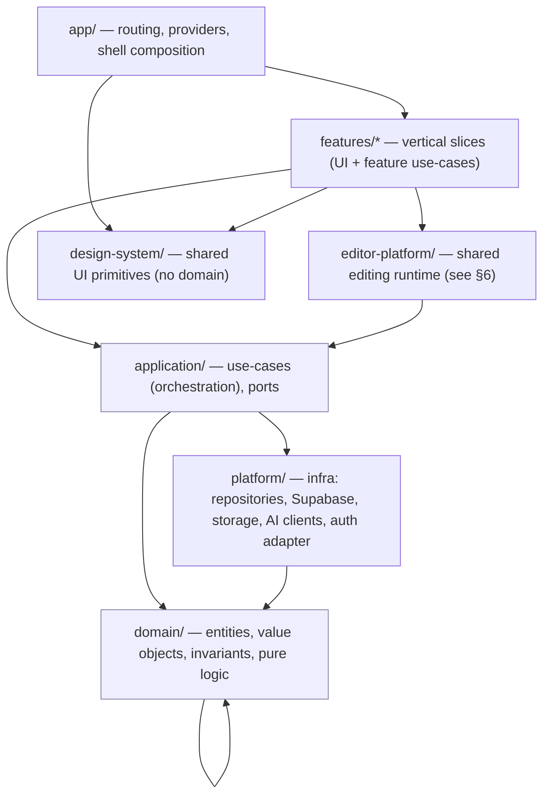
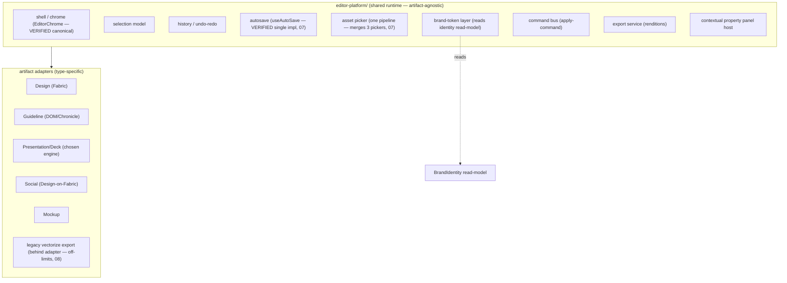

# 02 — Target Software Architecture

> Batches 3 (architecture) + 4 (editor platform) + the CodeMap control plane. **PROPOSAL**
> throughout; current-state claims cite Phase-0 audits. Designed for BrandingOS specifically —
> not textbook Clean Architecture for its own sake. The goal is that a future developer (human or
> Claude session) can answer, in seconds: *Where does this feature belong? Where is this data
> stored? What is the source of truth? What API do I call? Can I import this module? Does this
> already exist? What breaks if I change this?*

## 0. What the architecture must fix (from Phase 0, VERIFIED)

- 168 cross-feature import statements / 41 edges; worst `brand-kit→brandkit` (36),
  `pitch-deck→case-study-deck` (24) (09). → needs **feature isolation + public APIs**.
- 21 `shared/→features` inversions; core contracts import feature types; `shared/` is a 46.9k-LOC
  dumping ground holding whole features (09). → needs a **real dependency direction + a rule for
  what may live in shared**.
- No boundary tooling; the only lint rule (fabric) has 3 dead ignore paths (09). → needs
  **enforced import boundaries + cycle checks in CI**.
- Type gate is a no-op; 324 real errors; strict flags off (05/09/11). → needs a **strictness
  strategy with a real gate**.
- Two persistence worlds, source-of-truth drift, session-only writes (04/05). → needs **one data
  path: use-case → repository → infra**, and a clear **server-state vs editor-state** split.

## 1. Layers & dependency direction (PROPOSAL)

A **pragmatic** layered model — chosen because BrandingOS's core pain is *source-of-truth and
coupling*, which layered dependency-inversion directly addresses — but deliberately lighter than
full Clean Architecture (no ceremony where it doesn't pay).



**Dependency rule (enforced, §7):** arrows point **down only**. `domain/` depends on nothing.
`application/` depends on `domain/` (+ port interfaces). `platform/` implements ports, depends on
`domain/`. `features/` and `editor-platform/` depend on `application/` (never directly on
`platform/` or another feature's internals). `app/` composes. **`design-system/` and `domain/`
never import from `features/`** (this is the inversion 09 flagged).

Why not "App→Feature→UseCase→Domain→Repo→Infra" verbatim: adopted in spirit, but (a) `platform/`
implements ports beside `application/` rather than as a lower layer features reach through, and
(b) `editor-platform/` is a first-class peer of `features/`, because the ~14-editor problem (00 §I)
is a missing *platform*, not a missing feature.

## 2. What belongs where

### `domain/` (pure, framework-free)
- Entities/value objects from `01-DOMAIN-MODEL.md`; invariants; pure calculations (color engine,
  contrast, logo resolution, palette derivation, slug canonicalization).
- **Never:** React, Supabase, Zustand, `fetch`, `localStorage`, `import.meta.env`.
- VERIFIED precedent: `src/core` and `features/brandkit/engine` are already React-free (09) — keep
  that discipline and make it the rule.

### `application/` (use-cases + ports)
- One use-case per meaningful user action (`ChangeBrandColor`, `AddLogo`, `SaveDocument`,
  `CreateBrandFromOnboarding`, `InviteMember`). Orchestrates domain + ports; owns transactions.
- **Ports** (interfaces): `BrandRepository`, `AssetRepository`, `DocumentRepository`,
  `TemplateRepository`, `AuthGateway`, `AiGateway`, `StorageGateway`. (Formalizes the existing DI
  `SERVICE_KEYS` idea — 04 — but with real interfaces and no leaking of feature types into ports,
  which 09 flagged.)
- **Validation** lives here (input) and in `domain/` (invariants). Not in components.

### `platform/` (infrastructure — the only place that talks to the outside world)
- Repository implementations (Supabase + a Local fallback), storage, AI clients (server-proxied —
  §5), auth adapter, mappers between DB rows and domain objects.
- **The only layer allowed to import `@/integrations/supabase` or call `localStorage`.** This
  single rule kills the "component persists directly" bypass class (04) — enforced in §7.

### `features/*` (vertical slices)
- A feature = the UI + thin feature-level orchestration for one product capability (00 §3):
  `brand-identity`, `brand-kit`, `guideline`, `assets`, `templates`, `content`, `onboarding`,
  `workspace`, `admin`, `tools`, `public-portal`.
- A feature owns: its routes, components, feature hooks, and a **public API** (`features/x/index.ts`)
  — the *only* import surface other features/app may use.
- A feature may depend on: `application/`, `design-system/`, `editor-platform/`, and other
  features **only via their public API** (and preferably not at all — prefer composition in `app/`).
- **Never:** import another feature's internal file; hold business rules that belong in
  `domain/`; talk to `platform/` directly.

### `editor-platform/` — see §6.

### `design-system/` (shared UI primitives)
- Buttons, dialogs, popovers, `PageHeader`, layout shells, tokens. Pure presentation.
- **Never:** brand/domain logic, data fetching, feature imports. (Fixes 09: `shared/presentation`
  and `shared/editor` are feature code masquerading as shared — those move to `editor-platform/`.)

### What must **NEVER** live in shared/design-system (explicit)
- Anything that imports `features/*` (the 21 inversions — 09).
- Anything brand-specific, persistence-specific, or artifact-specific.
- "Misc" utils with feature knowledge. If it needs a feature, it is not shared.

## 3. How features communicate (PROPOSAL)

1. **Preferred: no direct feature→feature imports.** Compose at the `app/` layer; share data via
   `application/` use-cases and query read-models.
2. **When a feature genuinely needs another's capability:** call its **public API** only
   (`features/x/index.ts`), never internals. The `brand-kit → brandkit` 36-edge coupling (09)
   becomes: brand-kit UI depends on `application/` brand use-cases + `domain/`, not on another
   feature's guts.
3. **Cross-cutting data (current brand, session):** provided by `app/` context over
   `application/` queries, not by features reaching into each other's stores.
4. **Events (later, if needed):** a lightweight domain-event bus in `application/` for
   side-effects (e.g. "BrandIdentityChanged" → invalidate read-models). Not required day one.

## 4. State management (PROPOSAL) — the server-state vs editor-state split

The audit found 35 zustand stores (26 persisted) outweighing the DI container (09), and
persistence smeared across UI. Target separates three state kinds:

| State kind | Tool | Rule |
|---|---|---|
| **Async server state** (brands, assets, documents, templates, members) | a query cache (e.g. TanStack Query) over `application/` use-cases | Never hand-rolled in zustand; caching/invalidation is the cache's job; the source of truth is the server |
| **Local editor state** (scene-graph in-edit, selection, history, tool mode) | `editor-platform/` runtime store (ephemeral, per-document) | Lives only while editing; commits via `SaveDocument` use-case (autosave) |
| **Local UI state** (prefs, open panels, toggles) | small zustand slices | UI-only; the interface preference (`brandos:ui-preference`) is the model (VERIFIED live) |

This directly removes the "session-only writes that never persist" class (03/04): editor state is
*explicitly* ephemeral and commits through a use-case, instead of accidental overlays.

## 5. Cross-cutting concerns

- **Data access:** only `platform/` repositories. Use-cases depend on ports. Fixes the direct-
  Supabase-in-components bypass (04).
- **Validation:** input validation in use-cases; invariant validation in domain. One schema per
  concept (resolves duplicated Brand/MockBrand/zod shapes — 05).
- **Business rules:** in `domain/` only. No rules in components (09).
- **Errors:** typed `Result`/exceptions at the use-case boundary; features render error states;
  no swallowed catches masking data loss (04 found silent drops).
- **Auth/permissions:** enforced **server-side** (RLS + use-case guards). The client may *reflect*
  permissions but never *enforce* them. Two admin systems (05/06) collapse to one (03). RLS
  containment from doc 12 is the first instance of this principle.
- **AI/secret handling:** all model calls go through a **server proxy** (Edge Function / `AiGateway`
  port). **No `VITE_ANTHROPIC_API_KEY` in the browser** — closes the widening exposure (10/11);
  the 6 browser call sites become one `AiGateway`. This also dedupes the 5 `ANTHROPIC_API_URL`
  consts / 3 hard-coded model IDs (07). Model-ID policy: **PRODUCT DECISION REQUIRED** (07).

## 6. Editor Platform (Batch 4) — the missing abstraction

The ~14 editors + 4 deck engines (00 §H/§I) are **one platform + many artifact adapters**, not 14
products and not one giant component. Design the **contract**, not the implementation.



**Platform contract (each adapter implements):**
- `mount(container, doc, ctx)` / `unmount()`.
- `getSelection()` / `setSelection()` → feeds the shared selection model + contextual props.
- `applyCommand(cmd)` → mutate scene-graph (shared command bus + history).
- `serialize()` / `deserialize(doc)` → canonical `Document` scene-graph (server-persisted).
- `describeSelection()` → declarative descriptor the shared **contextual property panel** renders
  (this is what makes controls change by selected element — the Canva/Figma feel).
- `renderThumbnail()` / `export(format)`.
- `capabilities` → which shared panels apply (text, image, brand-token, layout…).

**Rendering engines stay implementation details behind adapters.** Fabric (Design/Social), DOM
(Guideline/Chronicle), the chosen deck engine, and the frozen `vectorize` export (08 — live domain
under legacy UI, do not delete) each sit behind the adapter contract. **Do not force every artifact
onto one engine** — the contract, not the canvas, is the unification.

**Migration note:** `EditorChrome` + `useAutoSave` are already the canonical shared pieces
(VERIFIED, 07); the platform formalizes what partially exists rather than inventing new.
Deck-engine choice (00 §H) is the gating **PRODUCT DECISION**.

## 7. Architectural enforcement (the guardrails Phase 0 found missing)

| Guardrail | Mechanism | Fixes |
|---|---|---|
| **Real type gate** | fix `typecheck` to `tsc -p tsconfig.app.json --noEmit`; add to CI; burn down 324 errors in tranches; then enable `strictNullChecks`/`noImplicitAny` incrementally per-folder | 05/09/11 no-op gate |
| **Import boundaries** | `eslint-plugin-boundaries` (or `import/no-restricted-paths`): domain↛everything, shared↛features, feature↛feature-internals, only platform↛supabase/localStorage | 168 cross-feature imports, 21 inversions, direct-persistence bypass (09/04) |
| **Public-API only** | features expose `index.ts`; lint bans deep imports `@/features/x/**` except `@/features/x` | 36-edge brand-kit coupling (09) |
| **Cycle checks** | `madge --circular` (or `dpdm`) in CI; fail on new cycles | 10 cycles today (09) |
| **RLS assertions** | run `supabase/tests/*.sql` against a shadow DB in CI (seeded by doc 12's test) | RLS holes (06/12) |
| **No browser secrets** | lint rule banning `VITE_*` secret names in `features/`/`app/`; AI only via `AiGateway` | 10/11 key exposure |
| **Architecture manifest check** | `npm run codemap:check` (§8) fails CI on new violations | no living enforcement (09) |

Strictness strategy is **incremental, not big-bang**: turn the gate on in report-only mode first
(CI annotates, doesn't block), burn down by folder starting at `domain/`/`application/`, then flip
to blocking. This avoids a 324-error wall stopping all work.

## 8. CodeMap — developer-only control plane (PROPOSAL; design only, not built)

A **living architecture dashboard** generated from the codebase, replacing stale docs. It answers
the seven developer questions (§intro) from generated manifests, not prose.

### Generated manifests (`.codemap/`, git-ignored or committed for diffing)
```
.codemap/
  routes.json                 # every route → component → shell → auth → scope → generation
  features.json               # feature → public API exports, owned routes, stores, use-cases
  dependencies.json           # module graph: cross-feature edges, inversions, cycles
  services.json               # ports + implementations + which are consumed (flags orphans, 04)
  database.json               # tables, columns, RLS policies, FKs (parsed from migrations)
  domain.json                 # entities/value-objects, invariants, source-of-truth map (from 01)
  architecture-violations.json# boundary breaks, cycles, deep imports, direct-persistence, browser secrets
  legacy-candidates.json      # multi-signal dead-code flags (formalizes audit 08's method)
  migration-progress.json     # per-stage status from 04 (checkbox source of truth)
  ownership.json              # feature → owner / status (current/legacy/experiment)
```

### Scripts
- `npm run codemap:scan` — static analysis (ts-morph/AST for imports & exports; parse
  `supabase/migrations/*` for `database.json`; parse the router for `routes.json`) → writes
  manifests.
- `npm run codemap:check` — asserts manifests against rules (no new violations, no orphan services
  introduced, no cross-feature deep imports); non-zero exit in CI. This is the enforcement in §7.

### Dashboard (later) — drill-down
```
Product Feature → Route → UI component → Use-case(s) → Domain entity → Repository/port → DB table
```
Rendered from the manifests (Mermaid + a small internal `/_codemap` dev route), so the map is
**generated, never hand-maintained**. Migration progress (04) and legacy candidates (08) surface
as live views instead of documents that rot.

**Scope discipline:** design only. Building `codemap:scan`/`check` is an early Stage-B-of-Phase-2
task (04 stage 1), because the enforcement it provides is what keeps the migration honest.

## 9. Answering the seven developer questions (acceptance criteria)

| Question | Answered by |
|---|---|
| Where does this feature belong? | §2 placement rules + `features.json` |
| Where is this data stored? | 01 §3 SoT table + `database.json` + `domain.json` |
| What is the source of truth? | 01 §3 (one canonical home per concept) |
| What API should I call? | `application/` use-cases; feature public APIs (`features.json`) |
| Can I import this module? | §7 boundary lint + `dependencies.json` (deep-import ban) |
| Does this already exist? | `features.json` + `services.json` + `domain.json` |
| What breaks if I change this? | `dependencies.json` reverse edges + CodeMap drill-down |

## 10. Cross-check against Phase 0

Boundary rules target the exact coupling numbers in 09; the persistence rule targets 04; the
secret rule targets 10/11; the editor platform targets 00 §H/§I and reuses the VERIFIED canonical
pieces (EditorChrome, useAutoSave); enforcement targets the guardrail gaps in 09. Open decisions
(deck engine, color engine, model-ID policy) are flagged, not assumed. No implementation is
proposed here beyond contracts and tooling shape.
