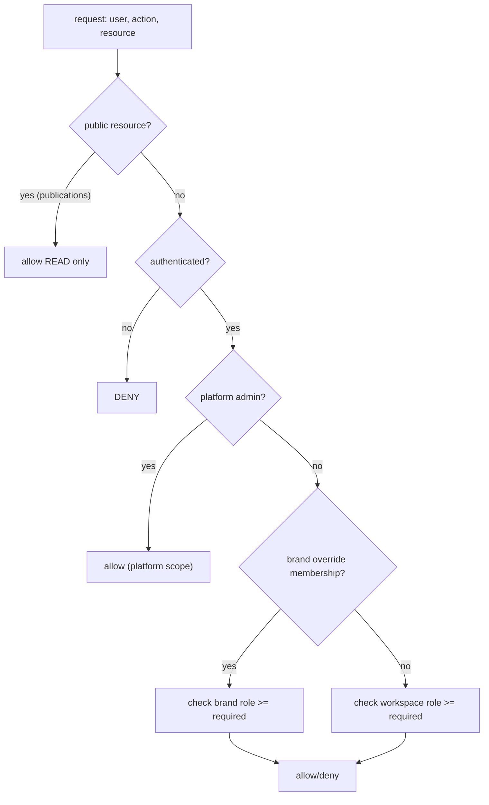

# 03 — Target Database

> Batch 5. Designed from the domain model (`01-DOMAIN-MODEL.md`) and persistence requirements —
> **not** from the current Supabase schema (which 06 showed is not a faithful history and drifts
> from the domain). **PROPOSAL** throughout. Compatibility with existing data is 04's job, not
> this document's.

## 0. Persistence-boundary principles (why each table/JSONB choice is made)

1. **One writable copy per concept** (from 01 §3). The current DB's fatal flaw was *two* brand
   representations (scalar columns + `guidelines` JSONB) that drift (05/11). Here, each concept
   has exactly one home.
2. **JSONB only for cohesive value objects read/written as a whole** (brand identity, document
   scene-graph). **Normalized tables for anything queried, listed, joined, permission-checked, or
   deduped** (assets, members, templates metadata). This is the deliberate boundary the task asks
   for — not "JSONB for everything" (today's brand) nor "a table per field."
3. **The record and its bytes are atomic** — an Asset row always corresponds to a stored object;
   no "bytes in a bucket, metadata dropped" (fixes 04/11 orphaned DAM uploads).
4. **Authorization lives in the database** (RLS + SECURITY DEFINER helpers), never only in the
   client (06 principle; 12 is the first fix).
5. **No table exists just because a domain object exists** — `Guideline` is a *derived* read-model
   (01 §7), so it gets **no table**; it projects from `brand.identity`.

## 1. ERD (target)

```mermaid
erDiagram
  WORKSPACES ||--o{ WORKSPACE_MEMBERS : has
  WORKSPACES ||--o{ BRANDS : owns
  WORKSPACES ||--|| SUBSCRIPTIONS : billed_by
  USERS ||--o{ WORKSPACE_MEMBERS : joins
  USERS ||--o{ BRAND_MEMBERS : overrides
  BRANDS ||--o{ BRAND_MEMBERS : has
  BRANDS ||--o{ ASSETS : owns
  BRANDS ||--o{ DOCUMENTS : owns
  BRANDS ||--o{ PUBLICATIONS : exposes
  TEMPLATES ||--o{ DOCUMENTS : instantiated_into
  TEMPLATE_CATEGORIES ||--o{ TEMPLATES : groups
  DOCUMENTS ||--o{ COMMENTS : annotated_by
  DOCUMENTS ||--o{ APPROVALS : reviewed_by
  USERS ||--o{ PLATFORM_ROLES : granted

  WORKSPACES {
    uuid id PK
    text slug UK
    uuid owner_id FK
    text name
    jsonb settings
    timestamptz created_at
  }
  WORKSPACE_MEMBERS {
    uuid id PK
    uuid workspace_id FK
    uuid user_id FK
    workspace_role role
    uuid invited_by
  }
  BRANDS {
    uuid id PK
    uuid workspace_id FK
    text slug
    text name
    jsonb identity
    int identity_schema_version
    boolean is_public
    text public_slug UK
  }
  BRAND_MEMBERS {
    uuid id PK
    uuid brand_id FK
    uuid user_id FK
    workspace_role role
  }
  ASSETS {
    uuid id PK
    uuid brand_id FK
    text kind
    text storage_path
    text content_hash
    jsonb meta
  }
  DOCUMENTS {
    uuid id PK
    uuid brand_id FK
    uuid template_id FK
    text artifact_type
    text slug
    jsonb scene_graph
    text thumbnail_asset
    timestamptz updated_at
  }
  TEMPLATES {
    uuid id PK
    uuid category_id FK
    text source
    text visibility
    text moderation_status
    jsonb body
  }
  PUBLICATIONS {
    uuid id PK
    uuid brand_id FK
    text kind
    text public_slug UK
    uuid document_id FK
  }
  COMMENTS { uuid id PK; uuid document_id FK; uuid author_id FK; text body }
  APPROVALS { uuid id PK; uuid document_id FK; uuid reviewer_id FK; text status }
  SUBSCRIPTIONS { uuid id PK; uuid workspace_id FK; text plan; text stripe_customer }
  PLATFORM_ROLES { uuid user_id PK; text role }
  ACTIVITY { uuid id PK; uuid workspace_id FK; uuid actor_id; text verb; jsonb data }
```

## 2. Table specifications

For each: **Purpose · Key columns · PK/FK · Ownership · Indexes · Cascade · Uniqueness · RLS intent.**

### `workspaces`
- **Purpose:** tenant + billing boundary. **Cols:** id, slug, owner_id, name, settings jsonb.
- **PK** id; **owner_id** → users. **Ownership:** owner_id. **Idx:** unique(slug).
- **Cascade:** delete → brands, members. **Unique:** slug global.
- **RLS:** SELECT if member; UPDATE if workspace-admin; DELETE if owner; INSERT if `owner_id = auth.uid()`.

### `workspace_members`
- **Purpose:** user↔workspace role. **Cols:** workspace_id, user_id, role (enum), invited_by.
- **PK** id; FKs → workspaces, users. **Idx:** unique(workspace_id, user_id); idx(user_id).
- **Cascade:** workspace delete → members. **RLS:** the **fixed** policies from migration 012 —
  SELECT if fellow member; INSERT if workspace-admin OR (self + `role='owner'` +
  `is_workspace_owner(workspace_id)`); UPDATE if admin AND target/new `role<>'owner'`; DELETE if
  admin AND `role<>'owner'`. (Carry the 011/12 fix forward as the baseline, not the vulnerable 001.)

### `brands` — **the identity home**

> **REVISED per Owner Decision 3 (2026-08-09):** "inside Brand" means **conceptual ownership +
> consistency, NOT database monolithism.** The earlier draft mandated a single `identity` JSONB
> blob; the owner explicitly rejected that framing. Identity remains **one authoritative domain
> representation**, but its physical storage is an **engineering decision**: typed sub-systems
> (LogoSystem, ColorSystem, TypographySystem, Voice, Strategy) may be persisted in appropriate
> normalized structures and/or bounded JSONB where each genuinely fits — chosen per sub-system, not
> as one all-or-nothing blob. The two non-negotiables survive unchanged: **(a) exactly one writable
> copy per identity concept (no mirror), and (b) an explicit stored `identity_schema_version` (no
> per-load migration).**

- **Purpose:** a brand + its **one authoritative** identity representation. **Cols:** id,
  workspace_id, slug, name, identity storage (see box above — normalized sub-tables and/or bounded
  JSONB per sub-system; not mandated as a single blob), `identity_schema_version int` (explicit,
  stored — fixing 05 §3), is_public, public_slug.
- **PK** id; FK workspace_id → workspaces. **Ownership:** workspace. **Idx:** unique(workspace_id,
  slug) — slug unique **within workspace** (01 §8); unique(public_slug) where is_public; idx(workspace_id).
- **Cascade:** workspace delete → brands → (assets, documents, members, publications).
- **RLS:** SELECT if brand/workspace member (via `is_brand_member(id,'viewer')`) OR is_public;
  INSERT/UPDATE if `is_brand_member(id,'editor')`; DELETE if admin.
- **Storage-boundary guidance (engineering, per D3):** prefer normalized structure where a sub-
  system is queried/joined/permission-checked or has independent update cadence; use bounded JSONB
  only for a cohesive sub-object read/written whole and never queried inside; **validate every
  identity write against one schema at the repository boundary** (challenge C9). The 05 failure was
  *duplication*, not JSONB per se — the invariant to preserve is "one writable copy," regardless of
  the normalized/JSONB split chosen. **Assets/font/logo files are never inlined** — they are
  `assets` rows referenced by id (fixes data-URL embedding, 03/04).

### `brand_members`
- **Purpose:** optional per-brand role override within a workspace. **Cols:** brand_id, user_id, role.
- **RLS:** managed by brand/workspace admin; **add a `WITH CHECK`** to `bm_update` (the hardening
  item deferred from 12 §6). No owner tier at brand level.

### `assets`
- **Purpose:** every stored binary (logo file, photo, font, AI image, export). **Cols:** brand_id,
  kind, storage_path, content_hash, meta jsonb (dims, dominant colors, folder, tags).
- **PK** id; FK brand_id. **Idx:** idx(brand_id, kind); unique(brand_id, content_hash) for dedup.
- **Cascade:** brand delete → assets (+ storage cleanup job). **RLS:** by `is_brand_member`.
- **Atomicity:** created only together with the storage object; orphan-sweep for failures.

### `documents` — **designs/deliverables, server-persisted (cross-device)**
- **Purpose:** editable brand deliverables. **Cols:** brand_id, template_id?, artifact_type, slug,
  `scene_graph jsonb` (opaque to DB, owned by the editor adapter), thumbnail_asset, updated_at.
- **PK** id; FKs brand_id, template_id. **Idx:** unique(brand_id, slug); idx(brand_id, artifact_type).
- **Cascade:** brand delete → documents → comments/approvals. **RLS:** by `is_brand_member`
  (viewer read / editor write); public read only via a `publications` row.
- **JSONB rationale:** scene-graph is an editor-owned document format; the DB never queries inside
  it. This fixes 04 (designs were localStorage-only → `/d/` shares broken).

### `templates` + `template_categories`
- **Purpose:** brand-agnostic starting points + taxonomy. **Cols (templates):** category_id,
  source (curated/ai/user_uploaded), visibility, moderation_status, `body jsonb` (SlotRef-based,
  no concrete brand values — 01). **RLS:** public/curated readable by all authed; user_uploaded
  readable by owner + moderators; write by owner; moderation by platform admin.
- **Note:** replaces the localStorage `LocalTemplatesService` default (04) with the real backing.

### `publications`
- **Purpose:** the *explicit* public exposure of a brand/guideline/document (the only way public
  read is granted). **Cols:** brand_id, kind (portal/guideline/design/deck), public_slug, document_id?.
- **RLS:** SELECT to `anon` by public_slug; write by brand editor. **Fixes** the ad-hoc public
  surfaces + the `brands.workspace_id`-leak-to-anon that fed the escalation (12): public reads go
  through a purpose-built row exposing only what's intended, not the whole brand row.

### `comments`, `approvals`, `activity`
- **Purpose:** collaboration + audit. **PRODUCT DECISION REQUIRED** (00 §17): build these only if
  collaboration is kept. Today they are localStorage stores with unconsumed adapters + write-only
  migration inserts (04/06) — do **not** replicate that. If kept: normalized, RLS by document/
  workspace membership, and actually read back (unlike today).

### `subscriptions`, `platform_roles`
- **subscriptions:** one per workspace (Stripe). **platform_roles:** the **single** admin system
  (`user_id → role`), replacing the two disjoint systems (`user_roles` vs `profiles.is_admin` —
  05/06). **PRODUCT DECISION REQUIRED:** which of the two current systems is authoritative during
  migration (04).

## 3. Authorization from first principles (PROPOSAL)



- **Workspace roles** (single enum, ordered): `owner > admin > editor > exporter > viewer`.
  Ownership is immutable through normal policies (12).
- **Brand override:** `brand_members` may narrow/widen a specific user on a specific brand within
  their workspace; resolved by `is_brand_member` (brand row first, workspace fallback).
- **Public resources:** only via `publications` rows (anon SELECT by slug). No table leaks internal
  ids to anon (closes the `workspace_id` leak — 12).
- **Platform/admin:** one `platform_roles` table; RLS references it for admin-wide access
  (replaces the dual system).
- **Enforcement:** RLS + SECURITY DEFINER helpers (`is_workspace_member`, `is_workspace_owner`,
  `is_brand_member`) — carry the **fixed** versions from 011/12. Use-cases add app-level checks,
  but the DB is the last line and cannot be bypassed by a client. **Authorization never relies on
  frontend checks** (the explicit requirement).

## 4. Helper functions (carry forward, hardened)
- `is_workspace_member(ws, min_role)`, `is_workspace_owner(ws)` (new in 012), `is_brand_member(brand,
  min_role)` — all `SECURITY DEFINER, STABLE, SET search_path=''`. These are the vetted building
  blocks; the target keeps them and forbids inline cross-table subqueries in policies (which caused
  the chicken-and-egg bug fixed in 12).

## 5. Indexes, cascades, uniqueness (summary)
- Unique: workspaces.slug (global); brands(workspace_id, slug); brands.public_slug; assets(brand_id,
  content_hash); documents(brand_id, slug); workspace_members(workspace_id, user_id);
  publications.public_slug.
- Cascade deletes flow workspace → brand → {assets, documents, members, publications} → {comments,
  approvals}; storage cleanup via a scheduled job (not cron-in-DB).
- Every FK indexed; membership tables indexed on both user_id and the parent id (authz hot paths).

## 6. Domain ↔ DB mapping (contract for 04)
| Domain (01) | Storage |
|---|---|
| Brand + BrandIdentity/Logo/Color/Type/Voice/Strategy | `brands` row + one `identity` jsonb (+ version) |
| Asset | `assets` row + storage object (atomic) |
| Document/Presentation/Social/Mockup/Guideline-instance | `documents` row (`artifact_type`, `scene_graph`) |
| Guideline (read-model) | **no table** — projected from `brands.identity` |
| Template | `templates` (+ `template_categories`), SlotRef body |
| Workspace/User/Membership | `workspaces`, auth users, `workspace_members` (+ `brand_members`) |
| Permission | RLS policies + helpers (no table beyond roles) |
| Publication (public exposure) | `publications` |

## 7. Cross-check against Phase 0
- Removes the dual brand representation (05/11) → one `identity` jsonb, versioned, no mirror.
- Documents/templates become server-backed (04).
- Assets atomic (04/11). Public read via `publications`, not brand-row leakage (12).
- One admin system, one role enum, RLS-enforced with the 012 fixes (05/06/12).
- No table for derived Guideline (01 §7). Collaboration/analytics tables gated on the product
  decisions from 00. Nothing designed for legacy-schema compatibility (that is 04).
