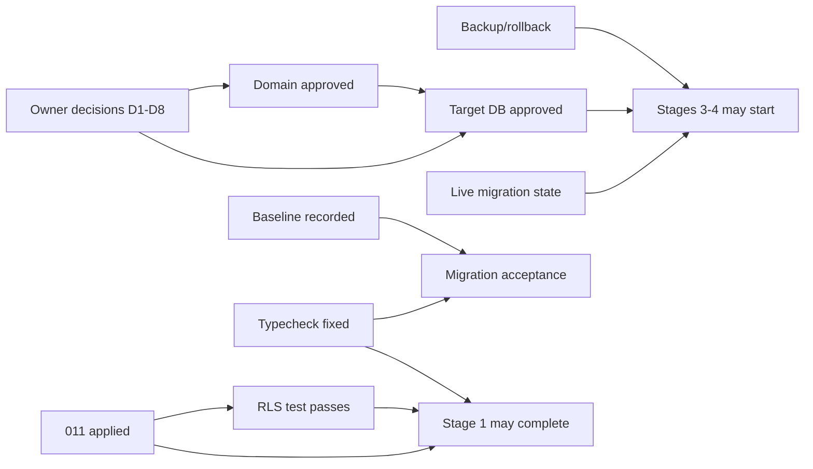

# 06 — Phase-2 Entry Gates

> **Control checklist only.** Phase 2 (implementation/migration) must NOT begin until every
> **required** gate is `PASS`. Statuses are honest as of 2026-08-09 against baseline
> `new-ui @ 46ffb41`. A gate is never marked PASS to make the list look done — evidence or a
> concrete command backs each status.
>
> Status vocabulary: **PASS · FAIL · BLOCKED · NOT YET CHECKED**.
> (FAIL = checked and not satisfied; BLOCKED = cannot be satisfied until a prerequisite/owner
> action; NOT YET CHECKED = not yet run in a way that would produce evidence.)

## Overall verdict

**PHASE 2 STATUS: BLOCKED (re-evaluated 2026-08-09 after owner decisions).** The **product and
domain gates now PASS** — all 8 owner decisions are resolved (`05-OWNER-DECISIONS.md` → "Owner
Answers — RESOLVED"), and the canonical Brand/Identity/Asset model + target DB direction are
approved (with the D3 "not a monolithic blob" and D1/C3 "guideline is a stored artifact"
modifications folded into 01/03). **Remaining blockers are Security, Database-state, and
Engineering only:** migration 011 not applied, RLS test not run, adjacent P0/P1 dispositions
incomplete, live prod migration state unverified, no backup/rollback plan, and the typecheck gate
still a no-op. Phase 2 cannot begin until the Stage-1 minimum set (below) is PASS.

---

## SECURITY

| # | Gate | Status | Evidence / how to satisfy |
|---|---|---|---|
| S1 | Migration 011 applied to the intended environment(s) | **FAIL** | The migration file is untracked and undeployed (`git status` shows `??`; VERIFIED). Satisfy: commit → `supabase db push` to staging then prod → confirm the two `workspace_members` policies + `is_workspace_owner` exist. |
| S2 | RLS verification test executed successfully | **NOT YET CHECKED** | `supabase/tests/011_workspace_member_escalation.test.sql` is written and self-asserting but not run (no local Postgres/psql this session; 12 §7). Satisfy: `supabase db reset` on a shadow DB → `psql "$DB_URL" -f supabase/tests/011_…sql` → expect `✓ ALL 011 RLS ASSERTIONS PASSED`, exit 0. |
| S3 | Adjacent P0/P1 security findings have explicit disposition | **BLOCKED (partial)** | (c) browser AI keys → **now dispositioned** by Owner Decision 8 (server-side gateway, no client secrets; remediate in Stage 1). Still open: (a) `profiles_select_by_member USING(true)` email exposure (11 §8) — needs an explicit owner/eng disposition (tighten to workspace-peers vs accept); (b) `finalize-onboarding-assets` authenticated IDOR (11 §9) — delete-or-lock (08/12), not yet confirmed; (d) `bm_update` missing WITH CHECK (12 §6) — deferred to target authz (D-Perms). Satisfy: (a), (b), (d) each get an APPROVED remediation or explicit accept. |

## PRODUCT

| # | Gate | Status | Evidence / how to satisfy |
|---|---|---|---|
| P1 | All blocking Owner Decisions resolved | **PASS** | All 8 resolved 2026-08-09 (`05-OWNER-DECISIONS.md` → "Owner Answers — RESOLVED"): D1 approved-w/clarification, D2 approved-w/modification, D3 approved-w/modification, D4 approved, D5 approved (mechanism modified), D6 capability approved (microservice rejected for now), D7 approved-w/modification, D8 approved-w/clarification. Modifications folded into 01/03. |

## DOMAIN

| # | Gate | Status | Evidence / how to satisfy |
|---|---|---|---|
| D-1 | Brand / Identity / Asset canonical model approved | **PASS** | Owner approved D1/D3/D4; the model's modifications (D3 "one authoritative representation, not a monolithic blob"; D1/C3 "guideline is a stored artifact referencing live identity"; C8 explicit opt-in re-bind; C9 schema-validated writes) are folded into 01 (amendment banner) and 03 (brands section). |
| D-2 | No unresolved dual-source-of-truth design | **PASS** | Owner Decision 1 explicitly forbids duplicated editable canonical identity state across Setup/Brand Kit/Guidelines; the target has exactly one authoritative representation per concept (01 §3) with no mirror. |

## DATABASE

| # | Gate | Status | Evidence / how to satisfy |
|---|---|---|---|
| DB1 | Current **live production** migration state verified | **NOT YET CHECKED** | Repo cannot prove whether migrations 008–010 are applied (11 §11 — generated types omit their objects, but that is consistent with either "unapplied" or "types not regenerated"). Satisfy: `supabase migration list --linked` (or the `to_regclass(...)` query in 11 §11). **Hard prerequisite for Stages 3–4.** |
| DB2 | Target DB model approved | **PASS (direction)** | Owner approved D3/D4; `03-TARGET-DATABASE.md` updated so identity storage is "one authoritative representation, normalized and/or bounded JSONB per sub-system — not a single blob," with repository-boundary schema validation. Caveat: the exact normalized-vs-JSONB split per sub-system is an engineering detail to finalize in Stage 2/3 (does not block Phase 2 start). |
| DB3 | Backup / rollback plan established | **NOT YET CHECKED** | No backup/restore + rollback runbook exists yet for the identity/persistence migration (Stages 3–5). Satisfy: a written plan (pre-migration snapshot, dual-write window, reversible backfill, restore procedure) approved by owner/ops. |

## ENGINEERING

| # | Gate | Status | Evidence / how to satisfy |
|---|---|---|---|
| E1 | Baseline build / test / type state recorded | **PARTIAL** | **Type: recorded** — `npm run typecheck` exits 0 but checks nothing; real project `tsc -p tsconfig.app.json --noEmit` = **324 errors** (VERIFIED 2026-08-09; codes TS2769×132, TS2339×50, …). **Build/test: NOT YET CHECKED** — `npm run build`, `npm run test` (3 vitest projects incl. Playwright browser) not run this session. Satisfy: record pass/fail + counts for build, unit, adapter, and browser projects. |
| E2 | Typecheck gate fixed BEFORE it is relied on for migration acceptance | **FAIL** | Script is still `tsc --noEmit` against the `files: []` solution config (VERIFIED). Satisfy (Stage 1): point it at `tsconfig.app.json`, add to CI report-only, then burn down before making it a migration acceptance criterion. **Do not accept any migration slice on a green no-op gate.** |
| E3 | Migration test strategy established | **PARTIAL** | The RLS-assertion pattern exists (`supabase/tests/011…`); the round-trip persistence test intent is specified (04 Stage 3) but no harness is built. Satisfy: a documented strategy — unit (domain), round-trip (repository ↔ DB), RLS (shadow DB), and E2E per feature — wired into CI. |

## MIGRATION

| # | Gate | Status | Evidence / how to satisfy |
|---|---|---|---|
| M1 | First migration slice fully defined (start · target · bridge · rollback · completion · deletion) | **PASS (design-level)** | `04-MIGRATION-STRATEGY.md` Stage 1 (safety + gates) is fully specified with changes/untouched/bridge/rollback/done-when; the delete-first set has codemap-gated deletion criteria (04 §1). Caveat: "PASS" means *defined*, not *started*; it activates only after S1–E3 above. The **first data-moving slice** (Stage 3/4) additionally requires DB1 + DB3. |

---

## Gate dependency map (what unblocks what)

## Minimum set to unblock Stage 1 (safety + gates)
S1, S2, S3, E1, E2 — plus P1 does **not** block Stage 1 (Stage 1 is gates/security only, no product
behavior). Stages 2+ require the owner decisions and DB1/DB2/DB3.

## Notes
- No gate here was implemented merely to pass. Several are deliberately FAIL/NOT-YET-CHECKED because
  the corresponding work is Phase-2 and must not be started yet.
- This checklist is the authority for "may Phase 2 begin?" — it should be re-evaluated (not rewritten)
  as each gate is satisfied, ideally surfaced via `migration-progress.json` (02 §8 CodeMap).
